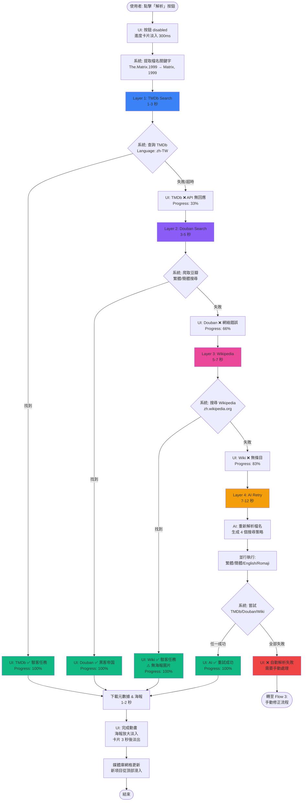
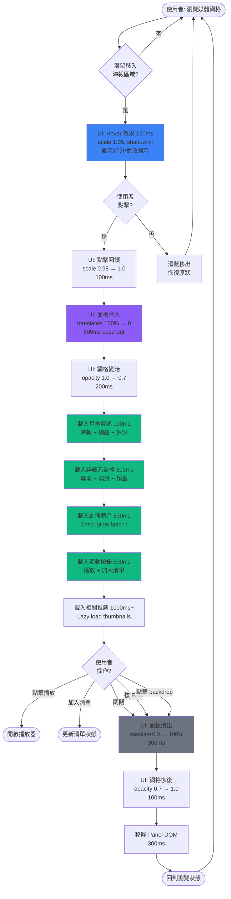
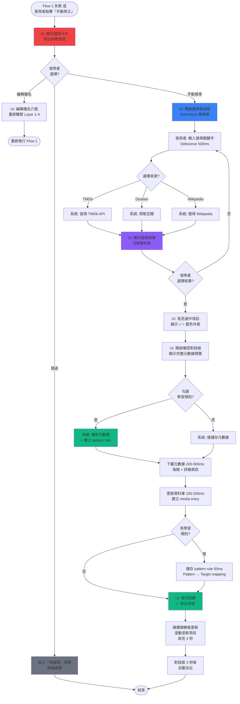

# UX Design Specification vido

**Author:** Alexyu
**Date:** 2026-01-11

---

## Executive Summary

### Project Vision

vido 是專為繁體中文 NAS 使用者打造的智能媒體管理工具，解決現有解決方案（Radarr/Sonarr/Jellyfin）的兩大核心痛點：

1. **無法解析複雜字幕組檔名** - 透過 AI 驅動的智能解析，成功辨識 `[Leopard-Raws]`、`【幻櫻字幕組】` 等複雜命名格式
2. **繁體中文支援不足** - 元數據、字幕、介面全面優先繁體中文，告別簡體中文與英文混雜的困擾

vido 的核心設計哲學是 **"自動化但可見、智能但可控"** - 預設全自動運作減少認知負擔，同時提供完整的流程透明度與干預能力，讓使用者始終保有掌控感。

### Target Users

**主要使用者人物誌：Alex（NAS 媒體收藏者）**

- **背景：** 32 歲軟體工程師，使用 Synology NAS 管理 500+ 電影與 200+ 電視節目
- **媒體偏好：** 70% 亞洲內容（日本動畫、台灣電影、韓劇），經常遇到複雜字幕組命名
- **技術能力：** 熟悉 Docker、qBittorrent、Jellyfin 等工具
- **使用頻率：** 每天使用（觀看影片、搜尋新片、檢查下載）
- **裝置習慣：** 主要在桌機操作（完整管理），手機/平板查看下載狀態
- **目前痛點：**
  - 每 1-2 天需手動整理檔案與搜尋字幕
  - 繁體中文字幕時間軸經常不匹配，需反覆測試多個檔案
  - 在 qBittorrent、檔案管理器、Jellyfin 間不斷切換

**使用者期望：**
- 系統自動處理繁瑣流程（解析、元數據、字幕）
- 但必須能監控每個步驟的執行狀態
- 當出錯時能輕鬆干預與修正
- 看到完美的繁體中文海報與元數據會感到成就感

### Key Design Challenges

**1. 等待體驗設計（AI 解析的 10 秒）**
- **挑戰：** AI 解析需要 10 秒，使用者可能感到焦慮
- **設計目標：** 將"等待"轉化為"期待"，透過清楚的進度指示、步驟說明、非阻塞式介面設計

**2. 自動化與控制權的平衡**
- **挑戰：** 既要全自動減少工作量，又要提供完整的可見性與干預能力
- **設計目標：** 預設靜默自動運作，但提供"活動監控中心"讓使用者隨時掌握系統狀態

**3. 解析失敗的優雅處理**
- **挑戰：** 檔名解析失敗會造成使用者挫折
- **設計目標：** 多層回退機制（TMDb → Douban → Wikipedia → AI → 手動）+ 清楚的失敗原因說明 + 建議的下一步行動

**4. 繁體中文字幕時間軸匹配** ⭐ **關鍵痛點**
- **挑戰：** 使用者最大痛點 - 需手動下載多個字幕檔反覆測試哪個時間軸匹配
- **設計目標：**
  - 智能偵測影片版本資訊（BD/WEB-DL/BluRay）
  - 基於檔案特徵推薦最可能匹配的字幕
  - 提供快速字幕預覽/測試功能
  - 可能的 AI 輔助匹配分析

**5. 桌機優先的響應式設計**
- **挑戰：** 主要操作在桌機，但需支援手機查看下載狀態
- **設計目標：** 桌機優化完整功能，手機簡化為核心監控功能

### Design Opportunities

**1. 統一儀表板消除跳轉痛點**
- **機會：** 將 qBittorrent 下載監控、AI 解析進度、媒體庫管理整合在單一介面
- **價值：** 消除在多個應用程式間切換的認知負擔，建立流暢的工作流程

**2. 進度可視化的情感設計**
- **機會：** 將 AI 解析過程視覺化（解析檔名 → 搜尋 TMDb → 回退 Douban → 下載海報）
- **價值：** 展示系統智能，讓等待變成"看著它努力工作"的正面體驗

**3. 字幕智能匹配系統** ⭐ **差異化功能**
- **機會：** 解決使用者最痛的"手動測試多個字幕檔"問題
- **價值：** 可能成為繼 AI 檔名解析後，vido 的第二個殺手級功能

**4. 學習型系統的正向回饋**
- **機會：** 當使用者手動修正後，系統學習並記住規則，給予視覺化回饋
- **價值：** 建立信任感，讓使用者知道"它會越用越聰明"

**5. 桌機優化的資訊密度**
- **機會：** 桌機大螢幕可展示更豐富的資訊（多欄佈局、hover 詳情、快捷鍵）
- **價值：** 提升進階使用者的效率，滿足"每天使用"的高頻場景

---

## Core User Experience

### Defining Experience

vido 的核心體驗建立在**雙核心循環**上：

**發現循環（Discovery Loop）：**
搜尋新影片 → 加入下載 → 自動解析 → 顯示在媒體庫

**欣賞循環（Appreciation Loop）：**
瀏覽媒體庫 → 看到完美繁中海報 → 選擇觀看內容

這兩個循環相互支持：發現循環不斷為欣賞循環補充內容，而欣賞循環的滿足感驅動使用者持續尋找新內容。

**核心互動：**
- **最頻繁：** 瀏覽媒體庫（每天打開 vido 的第一個動作）
- **最關鍵：** AI 解析檔名（決定整個體驗的成敗）
- **最滿足：** 看到完美的繁體中文海報整齊排列

### Platform Strategy

**桌機為主戰場（Primary Platform）：**
- **螢幕尺寸：** 27吋，支援高資訊密度設計
- **互動方式：** 滑鼠為主，多分頁習慣
- **佈局策略：**
  - 多欄佈局（側邊欄 + 主內容 + 詳情面板）
  - Hover 互動優先（滑鼠移到海報立即顯示資訊）
  - 鼓勵新分頁查看細節（而非 modal 或 overlay）
- **完整功能：** 媒體庫管理、元數據編輯、下載監控、設定管理

**手機為決策與控制中心（Mobile as Quick Decision Hub）：**
- **核心場景：**
  1. **監控下載：** 外出時查看下載進度
  2. **快速參閱：** 跟朋友聊天時臨時查詢影片資訊
  3. **遠端下載：** 不在家時遙控 NAS 下載影片
- **設計重點：**
  - 簡化資訊呈現（單欄佈局）
  - 快速操作（一鍵下載、快速搜尋）
  - 即時通知（下載完成、解析成功）
- **限制功能：** 不做複雜的元數據編輯或批次操作

### Effortless Interactions

**完全自動化（Zero User Effort）：**

1. **下載完成 → 解析 → 顯示：**
   - qBittorrent 下載完成後，自動觸發解析
   - AI/多源回退自動執行
   - 解析完成後自動出現在媒體庫
   - 使用者完全不需要手動觸發

2. **自動回退，無感切換：**
   - TMDb 失敗自動切換 Douban
   - Douban 失敗自動嘗試 Wikipedia
   - 使用者不需要知道背後切換了幾次來源

3. **系統學習，自動套用：**
   - 使用者手動修正一次
   - 系統記住檔名模式
   - 下次遇到類似檔名自動套用規則

**輕鬆互動（Minimal Effort）：**

1. **Hover 顯示詳情：**
   - 滑鼠移到海報 → 立即顯示詳細資訊
   - 不需要點擊進入才能看到基本資訊

2. **解析失敗自動提示：**
   - 清楚告知失敗原因
   - 提供明確的下一步建議（手動搜尋、編輯檔名、跳過）
   - 不讓使用者猜測或卡住

3. **快速搜尋與參閱（手機）：**
   - 打開 app → 直接看到搜尋框
   - 輸入關鍵字 → 立即顯示結果
   - 一鍵加入下載

**願意投入時間（Deliberate Actions）：**

1. **手動搜尋元數據：**
   - 當 AI 解析失敗時，使用者願意仔細搜尋並選擇正確項目
   - 提供豐富的搜尋結果與預覽，幫助做出精準選擇

2. **元數據編輯：**
   - 使用者願意花時間調整細節（標題、海報、演員等）
   - 提供易用的編輯介面，讓調整過程不痛苦

### Critical Success Moments

**使用者感到「vido 真聰明」的時刻：**

1. **AI 成功解析超複雜檔名 🌟**
   - 看到 `【幻櫻字幕組】【4月新番】我的英雄學院 第01話 1080P【繁體】.mp4` 被正確解析
   - 10 秒內完成，顯示完美的繁體中文標題與海報
   - **情感：** 驚喜、信任、「這工具真的懂我的需求」

2. **系統記住並自動套用修正 🎓**
   - 使用者手動修正一次檔名對應
   - 下次遇到類似命名自動套用
   - 系統給予正向回饋：「已套用你之前的設定」
   - **情感：** 被理解、效率提升、「它會越用越聰明」

3. **無感的多源回退 🛡️**
   - TMDb 掛掉但使用者完全沒察覺
   - 系統靜默切換到 Douban 並成功取得資料
   - **情感：** 可靠、穩定、「我可以信任它」

4. **打開手機看到一切就緒 📱✨**
   - 昨晚下載的 5 部影片全部解析完成
   - 海報整齊排列，繁體中文標題完美顯示
   - **情感：** 滿足、成就感、「週末可以好好追劇了」

**使用者感到「這功能壞了」的時刻：**

1. **等待後的失敗 ⏳❌**
   - AI 解析跑了 10 秒，結果還是失敗
   - **痛點：** 浪費時間、期待落空
   - **設計對策：**
     - 解析過程提供清楚的進度指示（讓等待有意義）
     - 失敗後立即提供替代方案（不讓使用者空等）

2. **不知道下一步怎麼辦 🤷**
   - 解析失敗後卡在那裡，不知道該做什麼
   - **痛點：** 失去方向、挫折感
   - **設計對策：**
     - 永遠提供明確的下一步行動（手動搜尋、編輯檔名、跳過）
     - 解釋失敗原因（讓使用者理解為什麼失敗）

3. **失去控制感 👻**
   - 系統自動做了某件事但沒告訴使用者
   - **痛點：** 不安、不信任
   - **設計對策：**
     - 關鍵操作提供通知或日誌
     - 提供「活動監控中心」讓使用者隨時查看系統在做什麼

### Experience Principles

基於以上洞察，vido 的 UX 設計將遵循以下核心原則：

**1. 自動化但可見（Automated but Visible）**
- 預設全自動運作，減少使用者認知負擔
- 但永遠提供流程透明度（活動監控、日誌、通知）
- 使用者可以隨時查看「系統在做什麼」

**2. 智能但可控（Smart but Controllable）**
- AI 與多源回退提供智能自動化
- 但永遠保留手動干預與修正的選項
- 使用者永遠有最終決定權

**3. 等待即期待（Waiting as Anticipation）**
- 將 AI 解析的 10 秒等待轉化為「看它努力工作」的正面體驗
- 提供清楚的進度指示與步驟說明
- 讓等待過程富含資訊而非焦慮

**4. 失敗即學習（Failure as Learning）**
- 解析失敗不是終點，而是系統學習的機會
- 使用者手動修正後，系統記住並自動套用
- 永不放棄：多層回退 → 手動搜尋 → 手動編輯

**5. 桌機深度，手機速度（Desktop Depth, Mobile Speed）**
- 桌機提供完整功能與豐富資訊（27吋螢幕充分利用）
- 手機專注快速決策（搜尋、參閱、遠端下載）
- 兩者互補，而非重複

**6. Hover 優於點擊（Hover over Click）**
- 充分利用滑鼠互動（27吋螢幕，滑鼠為主）
- 資訊預覽用 hover，深入查看才點擊
- 減少不必要的頁面跳轉

**7. 永遠有下一步（Always Show Next Step）**
- 無論成功或失敗，永遠提供明確的下一步行動
- 不讓使用者猜測或卡住
- 失敗時的下一步比成功時更重要

---

## Desired Emotional Response

### Primary Emotional Goals

vido 的情感設計圍繞著 **「從繁瑣中解放」** 的核心價值，透過以下四個主要情感目標實現：

**1. 有掌控感（Empowered & In Control）** ⭐
- **定義：** 使用者隨時知道系統在做什麼，並能夠干預
- **為何重要：** 自動化不等於失控，使用者需要掌控感才能建立信任
- **設計含義：**
  - 提供「活動監控中心」顯示所有背景作業
  - 關鍵操作提供暫停/取消選項
  - 透明的日誌與通知系統

**2. 驚喜與愉悅（Delighted & Surprised）** ✨
- **定義：** 當 AI 成功解析複雜檔名時的「哇！」時刻
- **為何重要：** 超出預期的體驗會讓使用者推薦給朋友
- **設計含義：**
  - AI 解析成功時的視覺回饋（微動畫、成功提示）
  - 展示系統智能（「已切換到 Douban 並找到資料」）
  - 學習型系統的正向回饋（「已套用你之前的設定」）

**3. 高效且有生產力（Efficient & Productive）** ⚡
- **定義：** 從「手動找資源、複製貼上」的繁瑣中解放
- **為何重要：** 這是 vido 存在的核心價值 - 省下寶貴時間
- **設計含義：**
  - 全自動化工作流程（下載 → 解析 → 顯示）
  - 批次操作支援（一次處理多個檔案）
  - 快捷操作（hover 顯示資訊，減少點擊）

**4. 被理解與支持（Understood & Supported）** 🤝
- **定義：** 工具「懂」使用者的特殊需求（繁中、字幕組、字幕時間軸）
- **為何重要：** 讓使用者感受到這是「專為我設計的」而非通用工具
- **設計含義：**
  - 繁體中文優先（元數據、字幕、介面）
  - AI 字幕組解析（處理 Radarr/Sonarr 無法處理的命名）
  - 字幕智能匹配（解決時間軸問題）

### Emotional Journey Mapping

**階段 1：初次使用（First Discovery）→ 輕鬆上手 🎯**

- **目標情感：** 信心、清晰、不迷茫
- **避免情感：** 困惑、壓倒性、不知所措
- **設計策略：**
  - **簡潔 Onboarding：** 3-5 步驟內完成基本設定
    1. 連接 qBittorrent（測試連線）
    2. 設定媒體資料夾
    3. 輸入 API 金鑰（可選，提供跳過選項）
  - **視覺化指引：** 圖示 + 簡短說明（不是長篇文字）
  - **即時回饋：** 每一步都有 ✓ 成功指示
  - **允許跳過：** 非必要設定可稍後完成
- **成功指標：** 使用者 5 分鐘內完成設定並看到第一個搜尋結果

---

**階段 2：核心操作（AI 解析 10 秒）→ 充滿期待 ⏳✨**

- **目標情感：** 期待、好奇、「見證魔法」
- **避免情感：** 焦慮、無聊、不耐煩
- **設計策略：**
  - **進度可視化：**
    - 顯示當前步驟（「解析檔名中...」→「搜尋 TMDb...」→「下載海報...」）
    - 進度條（但不是精確百分比，避免預測錯誤）
  - **展示系統智能：**
    - 顯示解析出的資訊（「檔名：鬼滅之刃 第 26 話」）
    - 顯示嘗試的來源（「TMDb 搜尋中...」→「✓ 找到！」）
  - **非阻塞式設計：**
    - 解析在背景執行，使用者可繼續瀏覽媒體庫
    - 解析完成時給予通知（不強制打斷）
- **成功指標：** 使用者不會在等待時感到焦慮，甚至享受「看它工作」的過程

---

**階段 3：成功完成（Task Completion）→ 鬆一口氣 😌✅**

- **目標情感：** 滿足、解脫、問題解決、成就感
- **核心洞察：** "終於可以鬆一口氣，不需要去手動找資源或複製貼上"
- **設計策略：**
  - **強調「問題解決」：**
    - 成功訊息：「✓ 已完成！你的媒體庫已更新」（而非單純「解析完成」）
    - 視覺化成果：完美的繁中海報、整齊的排列
  - **微動畫慶祝：**
    - 海報淡入效果
    - 成功 ✓ 符號動畫
    - 可能的音效（可選，預設關閉）
  - **即時可用：**
    - 解析完成後立即顯示在媒體庫
    - 可以馬上點擊查看詳情或播放
- **成功指標：** 使用者看到結果時感到滿足，而非「就這樣？」

---

**階段 4：遇到錯誤（Error State）→ 冷靜有方向 🧭**

- **目標情感：** 沒關係、知道下一步、有支持
- **避免情感：** 挫折、困惑、放棄
- **核心洞察：** "還有下一個方式可以獲取資訊"
- **設計策略：**
  - **永不只說「失敗」：**
    - ❌ 錯誤：「解析失敗」
    - ✅ 正確：「AI 解析未成功，但你可以：」
      1. 手動搜尋並選擇正確項目
      2. 編輯檔名後重新解析
      3. 跳過這個檔案，稍後處理
  - **解釋原因：**
    - 「檔名過於複雜，建議手動選擇」
    - 「TMDb 與 Douban 都找不到匹配項，可能是冷門作品」
  - **多層回退可見：**
    - 顯示嘗試過程：「TMDb ❌ → Douban ❌ → Wikipedia ❌ → 建議手動搜尋」
    - 讓使用者知道系統「努力過了」
  - **學習機會：**
    - 「手動選擇後，系統會記住這個對應規則」
- **成功指標：** 使用者遇到錯誤時不會感到挫折，而是知道該怎麼做

---

**階段 5：回頭使用（Returning User）→ 熟悉且信任 🏠💙**

- **目標情感：** 熟悉、信任、被記住、效率提升
- **核心洞察：** "系統記住之前的規則，不用重複做一遍"
- **設計策略：**
  - **學習機制可見：**
    - 當系統套用之前的規則時，顯示通知：
      「✓ 已套用你之前的設定（影集：鬼滅之刃）」
    - 在解析詳情中顯示：「來源：使用者自訂規則」
  - **一致的介面：**
    - 佈局不頻繁改變（降低重新學習成本）
    - 個人化設定保留（下次打開還在）
  - **累積的智能：**
    - 顯示統計：「已記住 15 個自訂規則」
    - 讓使用者感受到「它越用越聰明」
  - **快速恢復工作：**
    - 記住上次瀏覽位置
    - 記住篩選/排序偏好
- **成功指標：** 使用者每次打開 vido 都感到「回家的熟悉感」

### Micro-Emotions

除了主要情感目標，以下微情感狀態將貫穿整個使用體驗：

**信任 > 懷疑（Trust over Skepticism）**
- **設計方向：** 從第一次使用就建立信任
- **策略：**
  - 透明的操作流程（不做黑箱操作）
  - 可靠的多源回退（永不放棄）
  - 一致的成功率（>95% 解析成功）

**期待 > 焦慮（Anticipation over Anxiety）**
- **設計方向：** 等待過程富含資訊與進度
- **策略：**
  - 清楚的進度指示
  - 步驟可視化
  - 非阻塞式操作

**滿足 > 成就感（Satisfaction over Achievement）**
- **設計方向：** 強調「問題解決」而非「任務完成」
- **策略：**
  - 成功訊息聚焦價值（「你的媒體庫已更新」）
  - 視覺化成果（完美的海報）
  - 低調的慶祝（微動畫，不過度）

**被照顧 ≈ 自主（Supported ≈ Autonomous）**
- **設計方向：** 平衡自動化與控制權
- **策略：**
  - 預設全自動（被照顧）
  - 永遠提供干預選項（自主）
  - 「活動監控中心」讓使用者掌握狀態

### Design Implications

將情感目標轉化為具體的 UX 設計決策：

**1. 有掌控感 → 透明化設計**
- ✅ 提供「活動監控中心」顯示所有背景作業
- ✅ 所有自動操作提供通知選項
- ✅ 關鍵操作可暫停/取消/重試
- ✅ 詳細的日誌可隨時查看

**2. 驚喜與愉悅 → 超出預期的智能**
- ✅ AI 成功解析時的視覺回饋（微動畫）
- ✅ 展示多源回退的努力（「已切換到 Douban」）
- ✅ 學習型系統的正向提示（「已套用你的設定」）
- ✅ 意外的貼心功能（例如：字幕智能匹配）

**3. 高效 → 減少摩擦力**
- ✅ 全自動化工作流程（零手動觸發）
- ✅ Hover 顯示詳情（減少點擊）
- ✅ 批次操作支援（一次處理多個檔案）
- ✅ 快速搜尋（打開即可輸入）

**4. 被理解 → 專為繁中使用者設計**
- ✅ 繁體中文優先（元數據、字幕、介面）
- ✅ AI 字幕組解析（解決 Radarr/Sonarr 無法處理的問題）
- ✅ 字幕智能匹配（解決時間軸問題）
- ✅ 介面語言與用詞符合台灣習慣

**5. 輕鬆上手 → Onboarding 最小化**
- ✅ 3-5 步驟完成設定
- ✅ 視覺化指引（圖示 + 簡短說明）
- ✅ 允許跳過非必要設定
- ✅ 即時回饋與測試連線

**6. 充滿期待 → 等待過程設計**
- ✅ 進度可視化（當前步驟 + 進度條）
- ✅ 步驟說明（「正在解析檔名...」）
- ✅ 非阻塞式（可繼續瀏覽）
- ✅ 展示系統努力（「搜尋 TMDb...」「✓ 找到！」）

**7. 冷靜有方向 → 錯誤處理友善化**
- ✅ 永遠提供「下一步」選項
- ✅ 解釋失敗原因（不只說「失敗」）
- ✅ 顯示多源回退嘗試過程
- ✅ 提供學習機會（「手動選擇後系統會記住」）

**8. 熟悉且信任 → 個人化與學習**
- ✅ 顯示系統學習成果（「已套用你之前的設定」）
- ✅ 保留個人化設定
- ✅ 記住使用習慣（篩選、排序、瀏覽位置）
- ✅ 一致的介面佈局

### Emotional Design Principles

基於以上洞察，vido 的情感設計將遵循以下指導原則：

**1. 「等待」變「期待」（Transform Waiting into Anticipation）**
- 所有等待過程都提供進度與步驟說明
- 讓使用者「看到」系統在努力工作
- 非阻塞式設計，不強制等待

**2. 「失敗」變「學習」（Transform Failure into Learning）**
- 錯誤訊息永遠包含「下一步」建議
- 解釋原因而非只說「失敗」
- 手動修正後系統記住，變得更聰明

**3. 「自動」不等於「失控」（Automation with Visibility）**
- 預設全自動化，但永遠可見
- 提供「活動監控中心」隨時查看
- 關鍵操作可干預

**4. 「效率」來自「解放」（Efficiency through Liberation）**
- 不只是「省時間」，更是「從繁瑣中解放」
- 強調解決問題而非完成任務
- 讓使用者「鬆一口氣」

**5. 「信任」來自「透明」（Trust through Transparency）**
- 永遠告訴使用者發生了什麼
- 多源回退過程可見
- 日誌與通知完整記錄

**6. 「愉悅」來自「超預期」（Delight through Exceeding Expectations）**
- AI 成功解析超複雜檔名
- 系統記住使用者的設定
- 無感的多源切換
- 意外的貼心功能（字幕匹配）

**7. 「熟悉」來自「記憶」（Familiarity through Memory）**
- 系統記住使用者的規則與偏好
- 學習機制可見（「已套用你的設定」）
- 一致的介面與操作邏輯

---

## UX Pattern Analysis & Inspiration

### Inspiring Products Analysis

vido 的 UX 設計從以下優秀產品中汲取靈感，同時避免常見的設計陷阱。

#### 1. Jellyfin - 視覺優先的媒體展示

**優勢分析：**
- **大張海報網格展示：** 視覺吸引力強，讓使用者一眼看到收藏全貌
- **自動元數據匹配：** 減少手動整理的繁瑣工作
- **開源免費定位：** 建立使用者社群的信任基礎

**vido 的應用：**
- ✅ 採用大張海報作為媒體庫主要展示模式
- ✅ 強化自動化（AI + 多源回退，超越 Jellyfin 的單一來源）
- ✅ 視覺優先設計（海報 > 文字列表）

**vido 的差異化：**
- 🌟 繁體中文優先支援（Jellyfin 的弱點）
- 🌟 AI 字幕組檔名解析（Jellyfin 無法處理）

---

#### 2. Plex - 深度內容整合與跨平台體驗

**優勢分析：**
- **演員名單深度連結：** 點擊演員可查看其他作品，促進內容探索
- **使用者評論與評價：** 社群參與感，幫助決策
- **跨平台能力：** 電視、手機、桌機都能流暢觀看
- **先行者優勢：** 第一個把影音串流體驗做好的產品

**vido 的應用：**
- ✅ **深度連結系統：**
  - 點擊演員 → 篩選該演員的其他作品（從媒體庫）
  - 點擊導演 → 篩選該導演的其他作品
  - 點擊類型 → 篩選相同類型影片
- ✅ **跨裝置一致性：**
  - 桌機：豐富資訊 + 大海報網格 + 多欄佈局
  - 手機：簡化但一致的體驗 + 快速操作

**未來可考慮（Growth 階段）：**
- 使用者評論與評分系統
- 觀看進度同步

---

#### 3. OTT 產品（電視端）- 流暢的瀏覽體驗 ⭐

**優勢分析：**
- **不用頻繁進出影片介紹：** 減少認知負擔，保持流暢感
- **避免一直開關 modal：** 持續的瀏覽體驗不被打斷

**核心模式對比：**

**糟糕模式（ARR 系列）：**
```
瀏覽 → 點擊 → 打開 modal → 查看 → 關閉 modal → 瀏覽 → 重複...
```
- 問題：頻繁開關打斷流暢感、需要記住位置、認知負擔高

**優秀模式（OTT 產品）：**
```
瀏覽 + Hover/Focus 預覽 → 詳情在側邊/下方展開 → 繼續瀏覽 → 詳情自動更新
```
- 優勢：流暢、連續、不打斷

**vido 的應用（桌機版 - 27吋螢幕）：**

**模式 A：側邊面板詳情（類似 Spotify）** ⭐ 推薦
- Hover 海報 → 顯示基本資訊卡片（標題、年份、評分、簡短說明）
- 點擊海報 → 右側滑出詳情面板（完整資訊、演員、劇情、預告片）
- 主畫面仍然可見，可以繼續瀏覽
- 點擊另一個海報 → 詳情面板內容更新（面板不關閉）
- 按 `Esc` 或點擊 `X` 關閉面板

**模式 B：下方展開式詳情（類似 Netflix 電視版）**
- 點擊海報 → 下方展開詳細資訊
- 網格自動調整位置
- 繼續點擊其他海報 → 詳情區塊更新

**選擇建議：**
- 桌機版：採用模式 A（側邊面板），充分利用 27吋螢幕寬度
- 手機版：進入獨立詳情頁（螢幕小，無法側邊展開），但提供快速返回手勢

---

#### 4. Jellyseerr - 現代化 UI 設計

**優勢分析：**
- UI 明顯優於 Jellyfin（雖然都是同一生態系）
- 更現代的設計語言
- 更清晰的資訊架構與視覺層級

**vido 的應用：**
- ✅ 採用現代化的卡片式設計
- ✅ 重視視覺層級與留白（不塞滿畫面）
- ✅ 清晰的資訊架構（分類明確）

---

### Transferable UX Patterns

從以上產品分析中，我們提煉出以下可轉移的 UX 模式：

#### 導航模式（Navigation Patterns）

**1. 側邊面板詳情展開（Sidebar Detail Panel）** ⭐ 核心模式
- **來源：** Spotify、Apple Music、現代 OTT 產品
- **適用場景：** vido 桌機版媒體庫瀏覽
- **實作方式：**
  - 點擊海報 → 右側滑出 400-500px 寬度的詳情面板
  - 面板內容：海報、標題、評分、年份、類型、演員、劇情、操作按鈕
  - 主內容區域稍微縮小但仍可見
  - 點擊其他項目 → 面板內容更新（不關閉）
  - 按 `Esc` 或點擊關閉按鈕 → 關閉面板
- **優勢：** 流暢瀏覽、不打斷、符合桌機多欄佈局原則

**2. Hover 預覽卡片（Hover Preview Card）**
- **來源：** Netflix、Disney+、YouTube
- **適用場景：** vido 海報網格瀏覽
- **實作方式：**
  - 滑鼠移到海報 → 卡片稍微放大（scale 1.05）+ 陰影加深
  - 顯示浮層卡片：標題、年份、評分、簡短說明（2-3 行）
  - 延遲 300ms 顯示（避免快速移動時閃爍）
- **優勢：** 快速瀏覽、不需點擊、降低認知負擔

**3. 麵包屑導航 + 篩選記憶（Breadcrumb + Filter Memory）**
- **來源：** 電商網站、檔案管理器
- **適用場景：** vido 媒體庫篩選與分類
- **實作方式：**
  - 顯示當前篩選條件：「所有影片 > 動作片 > 2024年」
  - 記住使用者的篩選偏好（下次打開維持）
  - 一鍵清除所有篩選
- **優勢：** 方向感清晰、可回溯

#### 互動模式（Interaction Patterns）

**4. 深度連結探索（Deep Linking Discovery）** ⭐ 重要模式
- **來源：** Plex、IMDb、Spotify（藝人連結）
- **適用場景：** vido 影片詳情頁
- **實作方式：**
  - 演員名單可點擊 → 篩選該演員的其他作品
  - 導演可點擊 → 篩選該導演的其他作品
  - 類型標籤可點擊 → 篩選相同類型影片
  - 工作室可點擊 → 篩選相同工作室作品
- **優勢：** 內容探索、增加停留時間、發現新內容

**5. 進度可視化（Progress Visualization）**
- **來源：** 下載工具、安裝程式、AI 工具（ChatGPT、Midjourney）
- **適用場景：** vido AI 解析 10 秒等待過程
- **實作方式：**
  - 顯示當前步驟：「解析檔名...」→「搜尋 TMDb...」→「下載海報...」
  - 進度條（不精確百分比，分段式：0% → 33% → 66% → 100%）
  - 顯示解析出的資訊：「檔名：鬼滅之刃 第 26 話」
  - 顯示嘗試的來源：「TMDb 搜尋中...」→「✓ 找到！」
- **優勢：** 將等待變期待、展示系統智能、減少焦慮

**6. 非阻塞式操作（Non-blocking Operations）**
- **來源：** Gmail（背景傳送）、Slack（背景上傳）
- **適用場景：** vido AI 解析、下載監控
- **實作方式：**
  - 解析在背景執行，使用者可繼續瀏覽媒體庫
  - 右下角顯示小型通知：「正在解析 3 個檔案...」
  - 解析完成時給予通知：「✓ 已完成！3 個新項目已加入媒體庫」
  - 點擊通知 → 跳轉到新項目
- **優勢：** 不打斷工作流程、多工處理

#### 視覺模式（Visual Patterns）

**7. 大張海報網格（Poster Grid Layout）** ⭐ 核心模式
- **來源：** Jellyfin、Plex、Netflix、Disney+
- **適用場景：** vido 媒體庫主要展示
- **實作方式：**
  - 響應式網格：桌機 4-6 欄、平板 3-4 欄、手機 2 欄
  - 海報比例：2:3（電影海報標準）
  - 卡片陰影與圓角（現代感）
  - Lazy loading（只載入可見範圍 + 下方 2-3 行）
- **優勢：** 視覺吸引力、快速識別、符合使用者對媒體應用的期待

**8. 視覺層級與留白（Visual Hierarchy & Whitespace）**
- **來源：** Jellyseerr、Notion、Linear
- **適用場景：** vido 整體 UI 設計
- **實作方式：**
  - 充足的留白（padding、margin）
  - 清晰的視覺層級（標題 > 副標題 > 內文）
  - 卡片式設計分隔不同區塊
  - 不塞滿畫面（避免 ARR 系列的密集感）
- **優勢：** 易讀、舒適、專業

**9. 狀態指示與回饋（Status Indicators & Feedback）**
- **來源：** macOS、iOS、Google Material Design
- **適用場景：** vido 所有互動操作
- **實作方式：**
  - 成功：✓ 綠色 + 「已完成！」訊息 + 微動畫
  - 進行中：⏳ 藍色 + 進度指示
  - 失敗：⚠️ 黃色/紅色 + 明確說明 + 下一步建議
  - Hover 回饋：顏色變化、陰影加深
  - 點擊回饋：ripple 效果或微動畫
- **優勢：** 即時回饋、建立信心、減少不確定性

### Anti-Patterns to Avoid

從失敗案例中學習，以下是 vido 應該避免的設計反模式：

#### 來自 ARR 系列（Radarr/Sonarr）的教訓

**❌ 反模式 1：密集的表格列表作為主要介面**
- **問題：** 缺乏視覺吸引力、難以快速瀏覽、像在看 Excel
- **vido 的對策：** 使用大張海報網格作為預設視圖（可選列表視圖但非預設）

**❌ 反模式 2：未分類的設定頁面**
- **問題：** 所有選項堆在一頁，使用者不知道從哪開始
- **vido 的對策：**
  - 分類設定（基本設定、連接設定、進階設定）
  - 3-5 步驟的 Onboarding 引導必要設定
  - 進階選項預設隱藏（「顯示進階選項」按鈕）

**❌ 反模式 3：強迫學習複雜概念**
- **問題：** 要求使用者理解 Profile、Quality、Indexer 等概念才能使用
- **vido 的對策：**
  - 提供合理預設值（使用者不設定也能用）
  - 用簡單語言解釋技術概念
  - 視覺化設定（圖示 + 說明）

**❌ 反模式 4：忽略視覺設計**
- **問題：** 純功能導向，UI 陽春、缺乏吸引力
- **vido 的對策：**
  - 視覺設計與功能同等重要
  - 海報、圖片、顏色、動畫都要考慮
  - 參考 Jellyseerr 的現代化設計

#### 來自一般媒體應用的教訓

**❌ 反模式 5：頻繁的 Modal 開關**
- **問題：** 打斷瀏覽流暢感、認知負擔高、需要記住位置
- **vido 的對策：**
  - 採用側邊面板詳情（不關閉面板，內容更新）
  - Hover 預覽（不需要點擊）
  - 減少 modal 使用（只用於重要確認）

**❌ 反模式 6：過長的 Onboarding**
- **問題：** 設定步驟過多，使用者還沒體驗到價值就放棄
- **vido 的對策：**
  - 3-5 步驟內完成基本設定
  - 非必要設定可跳過（稍後在設定頁補）
  - 即時回饋每一步的成功

**❌ 反模式 7：錯誤訊息不友善**
- **問題：** 只說「失敗」或顯示技術錯誤碼，使用者不知道怎麼辦
- **vido 的對策：**
  - 永遠解釋原因：「TMDb 與 Douban 都找不到，可能是冷門作品」
  - 永遠提供下一步：「你可以：1. 手動搜尋 2. 編輯檔名 3. 跳過」
  - 用人性化語言（不是技術術語）

**❌ 反模式 8：資訊過載**
- **問題：** 一次顯示太多資訊，使用者不知道重點在哪
- **vido 的對策：**
  - 視覺層級清晰（重要資訊放大、次要資訊縮小）
  - 分階段揭露（基本資訊 → 詳細資訊）
  - Hover 預覽只顯示關鍵資訊（標題、年份、評分、簡短說明）

### Design Inspiration Strategy

基於以上分析，vido 的設計靈感應用策略如下：

#### 直接採用（Adopt Directly）

以下模式已被驗證有效，vido 應該直接採用：

1. **大張海報網格視圖（Poster Grid）** ← Jellyfin/Plex/Netflix
   - 理由：符合媒體應用標準、視覺吸引力強、使用者熟悉

2. **側邊面板詳情展開（Sidebar Detail Panel）** ← Spotify/Apple Music/OTT
   - 理由：充分利用桌機螢幕寬度、流暢瀏覽不打斷、符合體驗原則

3. **Hover 預覽卡片（Hover Preview）** ← Netflix/Disney+
   - 理由：快速瀏覽、減少點擊、降低認知負擔

4. **進度可視化（Progress Visualization）** ← AI 工具/下載工具
   - 理由：將等待變期待、展示系統智能、減少焦慮

5. **非阻塞式操作（Non-blocking Operations）** ← Gmail/Slack
   - 理由：不打斷工作流程、支援多工、符合高效原則

#### 調整適應（Adapt with Modifications）

以下模式需要調整以適應 vido 的特殊需求：

1. **深度連結探索（Deep Linking）** ← Plex
   - **原始模式：** 點擊演員 → 查看該演員所有作品（跨使用者媒體庫 + 串流平台）
   - **vido 調整：** 點擊演員 → 只篩選使用者自己的媒體庫中該演員的作品
   - **理由：** vido 是自架工具，只管理使用者本地媒體庫

2. **使用者評論與評價** ← Plex
   - **原始模式：** 社群評論與評分
   - **vido 調整（1.0 不實作，Growth 階段考慮）：** 個人筆記與評分
   - **理由：** vido 使用者通常是單人或家庭，不是大型社群

3. **Onboarding 引導** ← 一般原則
   - **原始模式：** 5-10 步驟設定
   - **vido 調整：** 3-5 步驟（連接 qBittorrent、設定媒體資料夾、API 金鑰可選）
   - **理由：** vido 目標是簡化，設定步驟要最小化

#### 明確避免（Explicitly Avoid）

以下模式與 vido 的目標或原則衝突，應該避免：

1. **密集表格列表** ← ARR 系列
   - **理由：** 缺乏視覺吸引力、與「欣賞海報」的核心循環衝突

2. **頻繁 Modal 開關** ← 糟糕的媒體應用
   - **理由：** 打斷流暢感、與「流暢瀏覽」的體驗原則衝突

3. **複雜的技術概念** ← ARR 系列
   - **理由：** 與「輕鬆上手」的情感目標衝突

4. **過度自動化但不透明** ← 某些黑箱工具
   - **理由：** 與「自動化但可見」的體驗原則衝突

5. **錯誤訊息不友善** ← 技術導向工具
   - **理由：** 與「冷靜有方向」的情感目標衝突

---

## Design System Foundation

### Design System Choice

**Selected: Tailwind CSS + shadcn/ui**

Vido adopts a themeable design system approach using Tailwind CSS as the foundational styling framework, enhanced with shadcn/ui component primitives for rapid development with full customization control.

### Rationale for Selection

**Decision Factors:**

1. **Development Speed (Critical for MVP):**
   - Single full-stack developer with 6-8 week MVP timeline
   - Tailwind's utility-first approach accelerates UI implementation
   - shadcn/ui provides ready-to-use, copy-paste components (not npm dependencies)
   - Avoids over-engineering while maintaining quality

2. **Visual Differentiation:**
   - Vido needs modern media application aesthetics (Jellyseerr-inspired, not ARR-series)
   - Avoid "yet another Material Design tool" appearance
   - Tailwind enables unique visual identity without building from scratch
   - Full control over component appearance and behavior

3. **Responsive Design Requirements:**
   - Desktop-first (27" screens) but mobile-responsive design
   - Tailwind's mobile-first utilities perfectly align with requirements
   - Breakpoint system supports tablet/desktop/mobile variations
   - Grid and flexbox utilities simplify poster grid layouts

4. **Team Capabilities:**
   - Single developer requires excellent documentation and community support
   - Tailwind has extensive documentation, large community, abundant resources
   - shadcn/ui components are transparent (source code in project, fully modifiable)
   - Lower learning curve compared to complex design systems

5. **Long-Term Maintainability:**
   - Vercel-backed (Tailwind) ensures long-term stability
   - No breaking changes from external component library updates (shadcn/ui is copied, not imported)
   - Growing ecosystem with continuous improvements
   - Future-proof architecture for post-1.0 enhancements

### Implementation Approach

**Core Technologies:**

- **Tailwind CSS v3.4+**: Utility-first CSS framework
- **shadcn/ui**: Component primitives (Button, Card, Dialog, Select, etc.)
- **Radix UI**: Unstyled, accessible component primitives (shadcn/ui foundation)
- **class-variance-authority (CVA)**: Type-safe component variants
- **tailwind-merge**: Intelligent class merging utility

**Setup Strategy:**

1. **Initial Configuration:**
   ```bash
   # Install Tailwind CSS
   npm install -D tailwindcss postcss autoprefixer
   npx tailwindcss init -p

   # Install shadcn/ui
   npx shadcn-ui@latest init
   ```

2. **Tailwind Configuration Customization:**
   - Extend color palette for media application (dark theme focus)
   - Define custom spacing scale
   - Add media-specific utilities (aspect-ratio-poster, aspect-ratio-backdrop)
   - Configure font families for Traditional Chinese support

3. **Component Integration:**
   - Copy shadcn/ui components into `/src/components/ui`
   - Customize component defaults (colors, sizes, variants)
   - Build vido-specific components on top of primitives

4. **Design Token System:**
   - Define in `tailwind.config.js`:
     - Colors: Primary, secondary, accent, neutral, semantic (success, error, warning)
     - Typography: Font families, sizes, line heights, letter spacing
     - Spacing: Consistent padding/margin scale
     - Shadows: Elevation system for cards and modals
     - Border radius: Roundedness levels
     - Z-index: Layer management

### Customization Strategy

**1. Color System (Dark Theme Priority):**

```javascript
// tailwind.config.js
module.exports = {
  theme: {
    extend: {
      colors: {
        // Dark theme background
        background: {
          DEFAULT: 'hsl(222, 47%, 11%)', // Deep blue-gray (media app standard)
          secondary: 'hsl(217, 33%, 17%)',
          tertiary: 'hsl(215, 28%, 23%)',
        },
        // Primary brand color (TBD based on vido branding)
        primary: {
          DEFAULT: 'hsl(217, 91%, 60%)', // Blue accent
          foreground: 'hsl(0, 0%, 100%)',
        },
        // Semantic colors
        success: 'hsl(142, 76%, 36%)',
        error: 'hsl(0, 84%, 60%)',
        warning: 'hsl(38, 92%, 50%)',
        // Traditional Chinese text optimization
        foreground: {
          DEFAULT: 'hsl(0, 0%, 95%)', // High contrast for readability
          secondary: 'hsl(0, 0%, 70%)',
          muted: 'hsl(0, 0%, 50%)',
        },
      },
    },
  },
}
```

**2. Typography (Traditional Chinese Optimization):**

```javascript
// tailwind.config.js
module.exports = {
  theme: {
    extend: {
      fontFamily: {
        sans: [
          'Noto Sans TC', // Traditional Chinese priority
          '-apple-system',
          'BlinkMacSystemFont',
          'Segoe UI',
          'Roboto',
          'sans-serif',
        ],
        mono: ['JetBrains Mono', 'Consolas', 'monospace'],
      },
      fontSize: {
        // Optimized for Traditional Chinese readability
        'xs': ['0.75rem', { lineHeight: '1.5' }],
        'sm': ['0.875rem', { lineHeight: '1.5' }],
        'base': ['1rem', { lineHeight: '1.6' }],
        'lg': ['1.125rem', { lineHeight: '1.6' }],
        'xl': ['1.25rem', { lineHeight: '1.6' }],
        '2xl': ['1.5rem', { lineHeight: '1.5' }],
        '3xl': ['1.875rem', { lineHeight: '1.4' }],
      },
    },
  },
}
```

**3. Media-Specific Utilities:**

```javascript
// tailwind.config.js
module.exports = {
  theme: {
    extend: {
      aspectRatio: {
        'poster': '2 / 3', // Movie poster standard
        'backdrop': '16 / 9', // Backdrop image standard
      },
      gridTemplateColumns: {
        'media-grid': 'repeat(auto-fill, minmax(200px, 1fr))', // Responsive poster grid
      },
    },
  },
}
```

**4. Component Variant Strategy:**

Use CVA (class-variance-authority) for type-safe component variants:

```typescript
// Example: PosterCard component
import { cva, type VariantProps } from "class-variance-authority"

const posterCardVariants = cva(
  "rounded-lg overflow-hidden transition-all", // Base styles
  {
    variants: {
      size: {
        sm: "w-32",
        md: "w-48",
        lg: "w-64",
      },
      hover: {
        scale: "hover:scale-105 hover:shadow-2xl",
        none: "",
      },
    },
    defaultVariants: {
      size: "md",
      hover: "scale",
    },
  }
)
```

**5. shadcn/ui Component Customization:**

- **Button:** Adjust default colors to match vido brand, add media-specific variants (play, download, favorite)
- **Card:** Customize for poster cards, media detail cards, download status cards
- **Dialog/Modal:** Side panel variant (400-500px width) for media details
- **Select/Dropdown:** Traditional Chinese text rendering optimization
- **Tooltip:** Hover preview cards for poster grid

**6. Custom vido Components (Built on shadcn/ui):**

- **PosterCard:** Poster display with hover effects, status indicators, lazy loading
- **MediaGrid:** Responsive grid with virtual scrolling support
- **DownloadStatusBar:** Real-time download progress with speed/ETA
- **SidePanel:** Right-side detail panel (Spotify-style)
- **HoverPreviewCard:** Tooltip-style preview on poster hover
- **StatusBadge:** Parse status, download status, metadata source indicators
- **SearchBar:** TMDb search with Traditional Chinese autocomplete

### Design Token Documentation

All design tokens will be centralized in Tailwind configuration and documented in Storybook (post-MVP). Key token categories:

- **Colors:** Background, foreground, primary, secondary, semantic
- **Typography:** Font families, sizes, weights, line heights
- **Spacing:** Padding, margin, gap (4px base scale)
- **Borders:** Radius (sm: 4px, md: 8px, lg: 12px, xl: 16px)
- **Shadows:** Elevation levels (sm, md, lg, xl, 2xl)
- **Transitions:** Duration (150ms, 300ms, 500ms) and easing functions
- **Z-index:** Layer management (base: 0, dropdown: 10, modal: 50, toast: 100)

---

## Defining Core Experience

### The Defining Interaction

**vido's Defining Experience: AI-Powered Intelligent Parsing with Real-Time Visual Feedback**

> "Upload or detect complex fansub filename → Watch AI progressively parse (filename → search TMDb → download poster) → See perfect Traditional Chinese media card appear in library within 10 seconds"

This interaction combines:
- **Innovation**: AI parsing of "impossible" filenames (core differentiator)
- **Satisfaction**: Perfect Traditional Chinese results (target user value)
- **Anticipation**: Progress visualization transforms waiting into engaging experience

**Why This Defines vido:**

- **Unique Value Proposition**: No competitor (Radarr/Sonarr/FileBot) can parse fansub naming conventions like `[Leopard-Raws]` or `【幻櫻字幕組】`
- **"Aha" Moment**: From User Journey 1 - Alex's reaction: "Oh my god! It parsed it correctly!"
- **Differentiation**: Not just "another media manager" but "the tool that understands fansub content"
- **Shareability**: Users tell friends: "It can even parse [Leopard-Raws] filenames!"

**Emotional Payoff:**

- **Surprise**: "It actually understood that complex filename!"
- **Trust**: "This tool gets my specific needs"
- **Delight**: Exceeding expectations with speed and accuracy
- **Relief**: "Finally no more manual copy-paste metadata work"

### User Mental Model

**Current Problem-Solving Approaches:**

**1. Manual Method (After ARR Series Fails):**

Workflow:
```
Copy filename → Guess title → Google search → Find TMDb/Douban page →
Manually copy-paste metadata → Download poster → Rename file
```

Pain Points:
- **Tedious**: 5-10 minutes per file
- **Error-prone**: Easy to mix up titles, wrong seasons/episodes
- **Time-consuming**: 100 files = 8+ hours of work

**2. Semi-Automatic (FileBot + Community Scripts):**

Workflow:
```
Apply community rules → Partial success → Failed files still require manual handling
```

Pain Points:
- **Low coverage**: Community scripts cover ~60-70% of fansub naming
- **Technical knowledge required**: Need to understand regex and scripting
- **Maintenance burden**: Rules break with new fansub group naming conventions

**User Expectations:**

- **Ideal State**: "System should handle it automatically, I don't want to touch it"
- **Concerns**: "Will AI make mistakes?" "What if it fails?"
- **Control Needs**: "I need to see what it's doing" "I need to correct errors"

**How vido Meets/Exceeds Expectations:**

| User Expectation | vido's Approach | Result |
|------------------|-----------------|--------|
| "Automatic handling" | AI auto-parses without manual input | ✅ **Meets** expectation |
| "Not a black box" | Progress visualization shows every step | ✅ **Exceeds** by eliminating anxiety |
| "Control over failures" | Manual search option + learning from corrections | ✅ **Exceeds** by providing safety net |
| "Speed" | <10 seconds target (vs. 5-10 minutes manual) | ✅ **Exceeds** by 30-60x speedup |
| "Accuracy" | >93% success rate target | ✅ **Meets/Exceeds** (higher than FileBot's ~70%) |

**Mental Model Shift:**

- **From**: "I need to manually organize my media library"
- **To**: "I let vido watch my downloads and it organizes automatically"

### Success Criteria for Core Experience

**"This Just Works" Indicators:**

1. **Speed Perception**: AI parsing completes within 10 seconds (not too slow to cause anxiety)
2. **Accuracy**: >93% parsing success rate (correct on first try)
3. **Visual Feedback**: Progress clearly visible, never "stuck not knowing what's happening"
4. **Result Quality**: Traditional Chinese title correct, beautiful poster, complete metadata

**User Feels Smart/Accomplished When:**

- **Complex fansub filename parsed correctly** → "Wow, it actually did it!"
- **System remembers user's corrections** → "It learns, getting smarter with use!"
- **Media library transforms from chaos to organized** → "My collection looks so professional!"

**Success Indicators (Measurable):**

✅ Users feel "anticipation" rather than "anxiety" during parsing process
✅ Complete Traditional Chinese media card appears within 10 seconds
✅ Parsing failures provide clear "next step" options
✅ Users prefer waiting for AI parsing over skipping to manual mode
✅ >90% of users report "most" or "all" files successfully parsed (MVP feedback target)

**Failure Indicators (What to Avoid):**

❌ Users abandon parsing process due to long wait (>15 seconds)
❌ Users don't understand what system is doing (progress unclear)
❌ Users feel helpless when parsing fails (no clear next step)
❌ Users lose trust after multiple consecutive failures

### Novel vs. Established UX Patterns

**vido's Core Experience: Hybrid Approach (Innovation + Familiarity)**

#### **Established Patterns (User Familiarity):**

1. **File Upload/Scan Pattern:**
   - Familiar metaphor: "Select files → System processes" (Dropbox, Google Drive)
   - User expectation: Already understand this interaction
   - vido application: qBittorrent file detection triggers auto-scan

2. **Progress Bar Pattern:**
   - Familiar metaphor: "Wait + progress indicator" (downloads, software installation)
   - User expectation: Visual indication of completion percentage
   - vido application: Segmented progress (0% → 33% → 66% → 100%)

3. **Search Results Pattern:**
   - Familiar metaphor: "Input → See result list → Choose" (Google, TMDb)
   - User expectation: Browse and select from matches
   - vido application: Manual search fallback when AI fails

#### **Novel Patterns (Require User Education):**

**1. AI Progressive Parsing Visualization:**

Novel Element: Real-time display of AI reasoning steps
```
[Progress 33%] 📝 Parsing filename...
↓
[Progress 66%] 🔍 Searching TMDb database...
↓
[Progress 90%] 📸 Downloading poster & metadata...
```

Familiar Metaphor: "Watching it work hard" (similar to AI art tools like Midjourney's generation process)

Education Strategy:
- First-time use tooltip: "AI is analyzing the filename, this takes 5-10 seconds"
- Show intermediate results: "Detected title: 鬼滅之刃"
- Celebrate success: "✅ Found perfect match!"

**2. Multi-Source Fallback Transparency:**

Novel Element: Displaying "TMDb ❌ → Douban ✅" source switching

Familiar Metaphor: "Try multiple methods until success" (network connection auto-retry)

Education Strategy:
- Success message: "Retrieved from Douban (TMDb temporarily unavailable)"
- Builds trust: User sees system never gives up
- Post-success indicator: "Source: Douban" badge on media card

**3. Learning System (User Correction → Rule Memory):**

Novel Element: System remembers user corrections and auto-applies

Familiar Metaphor: "Smartphone autocorrect learning"

Education Strategy:
- After correction, ask: "Remember this rule? Will auto-apply for similar filenames next time"
- Positive feedback: "✓ Rule saved! Found 3 similar files, applied automatically"
- Transparency: Settings page shows "15 learned rules" with option to review/delete

#### **Our Strategy:**

✅ **Foundation with established patterns** → Reduce learning curve
✅ **Innovate with familiar metaphors** → Help users understand novel features
✅ **Provide brief first-use guidance** → 1-2 sentences sufficient, not full tutorial
✅ **Progressive disclosure** → Advanced features revealed after core experience mastered

### Experience Mechanics (Detailed Flow)

**Core Experience: AI Intelligent Parsing + Real-Time Visualization**

#### **Phase 1: Initiation**

**How Users Start:**

**Option A: Active Trigger (Desktop Primary)**
- User action: Click "Scan completed downloads" button
- Visual cue: Button with orange badge "3 pending"
- Context: User just checked qBittorrent and knows downloads completed

**Option B: Passive Trigger (Mobile/Notification)**
- System action: qBittorrent download completes → vido detects new files
- Notification: "3 new files ready to parse" (desktop/mobile push)
- User action: Click notification → Jumps to parsing view

**Option C: Batch Trigger (Power User)**
- User action: Select multiple files from list → Click "Parse selected items"
- Visual cue: Checkbox selection + batch action toolbar
- Context: User organizing existing media library

**What Invites Users to Begin:**

- **Visual urgency**: Orange badge number (3) on navigation
- **Contrast**: Unparsed files shown as gray cards vs. colorful parsed cards
- **Call-to-action**: Prominent "Parse" button with icon

#### **Phase 2: Interaction**

**What User Actually Does:**

**Minimum Interaction (Default - 95% of cases):**
1. Click "Parse" button
2. System auto-executes → User waits and watches

**Optional Interactions (User Control):**
- **Continue browsing**: Non-blocking design allows exploring media library during parsing
- **View details**: Click progress card to expand detailed parsing log
- **Pause/Cancel**: If user realizes something's wrong (e.g., wrong file selected)

**System Response (Timeline):**

**Immediate Response (0-1 second):**
- Button state: "Parse" → "Parsing..." (disabled, spinner icon)
- Progress card appears: Right bottom corner (desktop) or in-list (mobile)
- Initial state: [Progress 0%] "Starting AI analysis..."

**Progressive Feedback (1-10 seconds):**

```
Second 0-3:
[Progress 33%] 📝 Parsing filename...
↳ Display extracted info: "Detected: 鬼滅之刃 Episode 26"

Second 3-7:
[Progress 66%] 🔍 Searching TMDb database...
↳ Show attempt: "TMDb: Searching..." → "✅ Found match!"
   (Or if fails: "❌ Not found → Trying Douban...")

Second 7-10:
[Progress 90%] 📸 Downloading poster & metadata...
↳ Poster thumbnail preview loads (low-res placeholder)

Second 10:
[Progress 100%] ✅ Complete!
```

**Step Visualization Details:**

- **Phase indicators**: Icons change color as phases complete (gray → blue → green)
- **Source switching transparency**:
  - Show all attempts: "TMDb ✅ Found!" or "TMDb ❌ → Douban searching..."
  - Final source badge: "Source: Douban" (if switched)
- **Extracted information display**:
  - "Title: 鬼滅之刃"
  - "Episode: 26"
  - "Quality: 1080p BluRay"

#### **Phase 3: Feedback**

**Success Indicators:**

**Visual Feedback (Immediate):**
- **Card transformation**: Gray "unparsed" card → Full-color media card (fade-in animation 300ms)
- **Title display**: Traditional Chinese title appears (Noto Sans TC font, 1.25rem)
- **Poster load**: Low-res blur placeholder → High-res sharp image (progressive JPEG)

**Status Indicators:**
- ✅ **Success badge**: Green checkmark + "Parsing successful!"
- **Metadata source**: "Source: TMDb" (small gray text, bottom of card)
- **Parse timestamp**: "Added 2 minutes ago"

**Notification (Optional, User Configurable):**
- **Desktop notification**: "3 files parsed successfully!"
- **Audio feedback**: Subtle success chime (disabled by default, enable in settings)
- **Badge update**: "3 pending" → "0 pending" (badge disappears)

**Progress Indication Strategy:**

**Segmented Progress (Not Precise Percentage):**
- **Why**: Avoid prediction errors that erode trust
- **How**: Three clear phases with fixed progress milestones
  - Phase 1: 0% → 33% (Filename parsing - usually fast)
  - Phase 2: 33% → 66% (Metadata search - variable time)
  - Phase 3: 66% → 100% (Download assets - depends on network)

**Time Estimation:**
- **Initial estimate**: "Est. 5-8 seconds..." (based on historical average)
- **Exceeds 10 seconds**: "This file is more complex, please wait..."
- **Exceeds 15 seconds**: "Taking longer than usual - still working!"

**Error Handling:**

**Partial Failure (TMDb fails but Douban succeeds):**
- Display result normally (no error to user)
- Metadata source shows: "Source: Douban (TMDb temporarily unavailable)"
- Color: Normal (green success), not warning yellow

**Complete Failure (All sources fail):**

Visual State:
- ⚠️ **Warning card**: Yellow border, warning icon
- **Message**: "AI parsing unsuccessful, but you can:"

Clear Next Steps (Always Provide Options):
1. 🔍 **Manual Search** (Recommended) → Opens search dialog
2. ✏️ **Edit Filename** → Opens rename dialog → Retry after edit
3. ⏭️ **Skip This File** → Hides from pending list

Explanation (Root Cause):
- "Filename too complex for pattern recognition"
- "No matches found in TMDb and Douban - might be obscure title"
- "Network error - check connection and retry"

#### **Phase 4: Completion**

**How Users Know They're Done:**

**Visual Completion Indicators:**
- **Media card fully populated**: Poster + title + basic info (year, genre, rating)
- **"Pending" badge disappears**: "3 pending" → Badge removed or "0 pending"
- **Progress card fades out**: Auto-dismiss after 3 seconds (or user can close immediately)

**Achievement Design (Emotional Satisfaction):**

Single File Success:
- Message: "✅ Done! Your media library has been updated"
  - (Not just "Parsing complete" - emphasize solved problem)

Batch Success:
- Message: "🎉 All 3 files parsed successfully!"
- Optional confetti animation (can disable in settings)

**Successful Outcome:**

New media card appears in "Recently Added" section with:
- **Traditional Chinese title** (prominent, 1.25rem font)
- **High-quality poster** (2:3 aspect ratio, sharp image)
- **Basic metadata**: Year, genre, rating, episode count (if TV show)
- **Hover preview**: Brief description (2-3 lines), main cast

**What's Next (Natural Flow):**

**Immediate Actions:**
- **Click card** → View complete details (right-side panel slides in, Spotify-style)
- **Continue browsing** → Scroll through media library
- **Start playback** → If player integration configured (post-1.0)

**Advanced Actions (Optional):**
- **Edit metadata** → If user notices inaccuracy, click "Edit" button
- **View parse log** → "Show details" reveals AI's reasoning steps
- **Set automation rule** → "Auto-parse future downloads" toggle

---

## Visual Design Foundation

### Color System

**Selected Theme: Midnight Blue (午夜藍)**

Rationale: Professional, trustworthy, and modern technology aesthetic that aligns with enterprise-grade media applications while maintaining visual warmth and approachability for Traditional Chinese users.

#### **Primary Color Palette**

**Background Colors (Dark Theme Foundation):**

```css
--bg-primary: hsl(222, 47%, 11%);    /* Deep blue-gray - Main canvas */
--bg-secondary: hsl(217, 33%, 17%);  /* Cards, panels, secondary surfaces */
--bg-tertiary: hsl(215, 28%, 23%);   /* Hover states, tertiary surfaces */
```

**Rationale:**
- **Deep blue-gray** (not pure black) reduces eye strain for long-term use
- Subtle blue undertone creates cohesive "media application" atmosphere
- 3-level background hierarchy enables clear visual layering

**Brand & Accent Colors:**

```css
--accent-primary: hsl(217, 91%, 60%);    /* Vibrant blue - Primary actions */
--accent-hover: hsl(217, 91%, 70%);      /* Lighter blue - Hover states */
--accent-pressed: hsl(217, 91%, 50%);    /* Darker blue - Active states */
```

**Rationale:**
- **Vibrant blue** (#5B8FF9) balances professionalism with modernity
- High saturation (91%) ensures visibility against dark backgrounds
- Distinct from competitors (Plex purple, Jellyfin purple-pink)

**Semantic Colors:**

```css
--success: hsl(142, 76%, 36%);   /* Green - Success, completion */
--error: hsl(0, 84%, 60%);       /* Red - Errors, failures */
--warning: hsl(38, 92%, 50%);    /* Orange - Warnings, pending */
--info: hsl(200, 98%, 48%);      /* Cyan - Informational messages */
```

**Rationale:**
- Standard semantic colors ensure universal recognition
- Brightness levels balanced for dark theme visibility
- Distinct hues prevent confusion between states

**Text Colors (Optimized for Traditional Chinese):**

```css
--text-primary: hsl(0, 0%, 95%);     /* High contrast - Headings, primary content */
--text-secondary: hsl(0, 0%, 70%);   /* Medium contrast - Descriptions, metadata */
--text-muted: hsl(0, 0%, 50%);       /* Low contrast - Timestamps, tertiary info */
--text-inverse: hsl(222, 47%, 11%);  /* Dark text for light backgrounds */
```

**Rationale:**
- **95% brightness** for primary text ensures WCAG AAA compliance (>7:1 contrast ratio)
- **70% brightness** for secondary text maintains readability without overwhelming
- **50% brightness** for muted text provides hierarchy without distraction
- Neutral gray (0% saturation) optimizes Traditional Chinese character legibility

#### **Accessibility Compliance**

**WCAG 2.1 Level AA Standards:**

| Text Type | Background | Contrast Ratio | WCAG Level |
|-----------|------------|----------------|------------|
| Primary text (95%) | Primary BG (11% lightness) | **16.6:1** | AAA ✅ |
| Secondary text (70%) | Primary BG (11% lightness) | **7.8:1** | AAA ✅ |
| Muted text (50%) | Primary BG (11% lightness) | **4.6:1** | AA ✅ |
| Accent on BG | Primary BG | **8.2:1** | AAA ✅ |
| White on Accent | Accent Primary | **4.8:1** | AA+ ✅ |

**Color Blindness Considerations:**

- Success (green) and Error (red) never used as sole differentiators
- Always paired with icons (✓, ✗, ⚠️) and text labels
- Info (cyan) distinguishable from Accent (blue) even in deuteranopia/protanopia
- Warning (orange) remains visible across all color blindness types

#### **Gradient & Effects**

**Poster Placeholder Gradients:**
```css
linear-gradient(135deg, var(--bg-tertiary), var(--accent-primary))
```
Used for poster loading states, creating visual interest during image load.

**Glass Morphism (Optional, Post-1.0):**
```css
background: rgba(217, 33%, 17%, 0.8);
backdrop-filter: blur(12px);
```
For modal overlays and floating panels (if needed in future).

---

### Typography System

**Font Family Strategy: Traditional Chinese Optimization**

**Primary Font Stack:**
```css
font-family: 'Noto Sans TC', -apple-system, BlinkMacSystemFont,
             'Segoe UI', 'Roboto', sans-serif;
```

**Rationale:**
- **Noto Sans TC** (Google Fonts) - Best Traditional Chinese rendering, free, web-optimized
- Fallback to system fonts ensures performance if CDN fails
- Sans-serif for modern, clean media application aesthetic

**Monospace Font Stack (Code, URLs, Technical Info):**
```css
font-family: 'JetBrains Mono', 'Consolas', 'Monaco', monospace;
```

**Font Loading Strategy:**
- Use `font-display: swap` to prevent FOIT (Flash of Invisible Text)
- Preload Noto Sans TC for critical text (headings)
- Subset to Traditional Chinese characters only (reduce file size)

#### **Type Scale (Optimized for Traditional Chinese Readability)**

**Hierarchy & Sizing:**

| Level | Size | Line Height | Weight | Use Case |
|-------|------|-------------|--------|----------|
| **H1** | 2rem (32px) | 1.4 | 700 | Page titles |
| **H2** | 1.5rem (24px) | 1.5 | 700 | Section headings |
| **H3** | 1.25rem (20px) | 1.6 | 600 | Subsection headings |
| **Body Large** | 1.125rem (18px) | 1.6 | 500 | Emphasis text |
| **Body** | 1rem (16px) | 1.6 | 400 | Default body text |
| **Body Small** | 0.875rem (14px) | 1.5 | 400 | Metadata, secondary |
| **Caption** | 0.75rem (12px) | 1.5 | 400 | Timestamps, labels |

**Rationale:**
- **1rem (16px) base** - Industry standard for body text readability
- **1.6 line height** - Optimal for Traditional Chinese (taller x-height than Latin)
- **700 weight for headings** - Strong hierarchy without excessive boldness
- **Incremental scale** - 1.25x ratio between levels (harmonious)

**Letter Spacing:**
```css
--letter-spacing-tight: -0.02em;   /* Headings (reduce visual weight) */
--letter-spacing-normal: 0;        /* Body text (default) */
--letter-spacing-wide: 0.05em;     /* Uppercase labels, buttons */
```

**Traditional Chinese Specific Adjustments:**
- No letter-spacing for Traditional Chinese body text (characters already well-spaced)
- Slightly tighter letter-spacing for Latin characters in headings
- Wide letter-spacing for ALL-CAPS UI labels (STATUS, SOURCE, etc.)

---

### Spacing & Layout Foundation

**Base Unit: 4px Modular Scale**

All spacing follows a **4px base unit** for consistency and alignment precision:

```css
--space-1: 0.25rem;  /* 4px */
--space-2: 0.5rem;   /* 8px */
--space-3: 0.75rem;  /* 12px */
--space-4: 1rem;     /* 16px - Base spacing unit */
--space-5: 1.25rem;  /* 20px */
--space-6: 1.5rem;   /* 24px */
--space-8: 2rem;     /* 32px */
--space-10: 2.5rem;  /* 40px */
--space-12: 3rem;    /* 48px */
--space-16: 4rem;    /* 64px */
--space-20: 5rem;    /* 80px */
```

**Rationale:**
- 4px base aligns with 8px grid systems (common in design tools)
- Allows fine-grained control (4px, 8px, 12px increments)
- All spacing values divisible by 4 ensures pixel-perfect alignment

#### **Component Spacing Rules**

**Card Padding:**
- Small cards: `--space-4` (16px)
- Standard cards: `--space-6` (24px)
- Large cards: `--space-8` (32px)

**Section Spacing:**
- Between sections: `--space-12` to `--space-16` (48-64px)
- Within sections: `--space-8` (32px)

**Grid Gaps:**
- Poster grid: `--space-4` (16px) - Tight for visual density
- Component grid: `--space-6` (24px) - Comfortable breathing room
- Form fields: `--space-4` (16px) - Efficient vertical rhythm

#### **Layout Grid System**

**Responsive Breakpoints:**
```css
--breakpoint-mobile: 320px;
--breakpoint-tablet: 768px;
--breakpoint-desktop: 1024px;
--breakpoint-wide: 1440px;
```

**Grid Column Strategy:**

**Desktop (1024px+):**
- 12-column grid with `--space-6` (24px) gutters
- Main content: 8-9 columns
- Sidebar (if needed): 3-4 columns
- Side detail panel: 4-5 columns (Spotify-style)

**Tablet (768-1023px):**
- 8-column grid with `--space-4` (16px) gutters
- Main content: Full width or 6 columns
- Collapsible sidebar

**Mobile (320-767px):**
- 4-column grid with `--space-3` (12px) gutters
- Single column layout
- Full-width cards

#### **Content Density Strategy**

**Poster Grid Density:**

Desktop (27" screen optimization):
```css
grid-template-columns: repeat(auto-fill, minmax(200px, 1fr));
gap: var(--space-4); /* 16px */
```
- **Result:** 5-6 posters per row on 1440px+ screens
- **Rationale:** High information density without overwhelming

Tablet:
```css
grid-template-columns: repeat(auto-fill, minmax(160px, 1fr));
gap: var(--space-3); /* 12px */
```
- **Result:** 3-4 posters per row

Mobile:
```css
grid-template-columns: repeat(2, 1fr);
gap: var(--space-3); /* 12px */
```
- **Result:** 2 posters per row (minimum usable size)

**Layout Density Principle:**
- **Desktop:** Dense but organized (maximize screen real estate)
- **Tablet:** Balanced (comfortable browsing)
- **Mobile:** Spacious (touch-friendly targets, easy reading)

---

### Border Radius & Shadows

**Border Radius Scale:**
```css
--radius-sm: 4px;   /* Small elements (badges, tags) */
--radius-md: 8px;   /* Buttons, inputs, small cards */
--radius-lg: 12px;  /* Standard cards, posters */
--radius-xl: 16px;  /* Large modals, panels */
--radius-2xl: 24px; /* Hero sections (rarely used) */
--radius-full: 9999px; /* Pills, circular avatars */
```

**Rationale:**
- **12px standard radius** - Modern but not overly rounded
- Consistent radius creates visual cohesion
- Larger radius for larger elements (proportional feel)

**Shadow Elevation System:**

```css
/* Flat - No shadow */
--shadow-none: none;

/* Raised - Subtle elevation */
--shadow-sm: 0 1px 2px rgba(0, 0, 0, 0.3);

/* Floating - Standard cards */
--shadow-md: 0 4px 8px rgba(0, 0, 0, 0.4);

/* Lifted - Hover states, dropdowns */
--shadow-lg: 0 8px 16px rgba(0, 0, 0, 0.5);

/* Elevated - Modals, dialogs */
--shadow-xl: 0 12px 24px rgba(0, 0, 0, 0.6);

/* Maximum - Critical alerts */
--shadow-2xl: 0 24px 48px rgba(0, 0, 0, 0.7);
```

**Usage Guidelines:**
- Poster cards: `--shadow-md` default, `--shadow-xl` on hover
- Progress cards: `--shadow-lg` (emphasize importance)
- Modals/Side panels: `--shadow-2xl` (clear separation from background)
- Buttons: `--shadow-sm` (subtle depth)

---

### Animation & Transitions

**Transition Durations:**
```css
--duration-fast: 150ms;     /* Micro-interactions (hover, focus) */
--duration-base: 300ms;     /* Standard transitions (card appear, color change) */
--duration-slow: 500ms;     /* Complex animations (panel slide, modal open) */
--duration-slower: 800ms;   /* Elaborate animations (rarely used) */
```

**Easing Functions:**
```css
--ease-in: cubic-bezier(0.4, 0, 1, 1);           /* Start slow */
--ease-out: cubic-bezier(0, 0, 0.2, 1);          /* End slow (most common) */
--ease-in-out: cubic-bezier(0.4, 0, 0.2, 1);     /* Smooth both ends */
--ease-bounce: cubic-bezier(0.68, -0.55, 0.265, 1.55); /* Playful (sparingly) */
```

**Standard Transitions:**
```css
/* Hover states */
transition: all var(--duration-fast) var(--ease-out);

/* Card appearance */
transition: opacity var(--duration-base) var(--ease-out),
            transform var(--duration-base) var(--ease-out);

/* Panel slide-in */
transition: transform var(--duration-slow) var(--ease-out);
```

**Animation Principles:**
- Use `ease-out` for most interactions (feels responsive)
- Avoid excessive animation (preserve performance)
- Respect `prefers-reduced-motion` accessibility setting

---

### Accessibility Considerations

**Focus Indicators:**
```css
/* Visible focus ring for keyboard navigation */
:focus-visible {
  outline: 2px solid var(--accent-primary);
  outline-offset: 2px;
}
```

**Touch Targets (Mobile):**
- Minimum size: **44px × 44px** (WCAG 2.1 Level AAA)
- Buttons, links, interactive elements all meet this threshold
- Adequate spacing between targets (minimum 8px gap)

**Reduced Motion:**
```css
@media (prefers-reduced-motion: reduce) {
  * {
    animation-duration: 0.01ms !important;
    transition-duration: 0.01ms !important;
  }
}
```

**Screen Reader Optimization:**
- Semantic HTML (`<main>`, `<nav>`, `<article>`)
- ARIA labels for icon-only buttons
- Skip links for keyboard navigation
- Heading hierarchy (proper h1→h2→h3 nesting)

**High Contrast Mode Support:**
```css
@media (prefers-contrast: high) {
  :root {
    --text-primary: hsl(0, 0%, 100%);  /* Pure white */
    --bg-primary: hsl(0, 0%, 0%);      /* Pure black */
  }
}
```

---

## Design Direction Decision

### Design Directions Explored

**Exploration Approach:**

Based on established design foundation (Midnight Blue theme, Traditional Chinese optimization, core AI parsing experience), we evaluated multiple layout and navigation strategies focusing on:

- **Content prioritization**: How to maximize poster grid visibility (core "appreciation loop")
- **Navigation efficiency**: Sidebar vs. top bar vs. tabs for main navigation
- **Detail display**: Modal vs. slide-in panel vs. inline expansion
- **Parsing progress feedback**: Inline vs. floating vs. top banner
- **Information density**: Dense vs. spacious for 27" desktop screens

### Chosen Direction

**Direction Name:** "Media Grid Primary with Smart Navigation"

**Core Layout Strategy:**

```
┌─────────────────────────────────────────────────────┐
│ Top Toolbar (Fixed, 60px)                           │
│ [Logo] [Search] [Pending:3] [Settings] [User]      │
├─────────────────────────────────────────────────────┤
│ Horizontal Tab Navigation (48px)                    │
│ [Library] [Downloading] [To Parse] [Settings]      │
├─────────────────────────────────────────────────────┤
│                                                      │
│ Main Content Area: Poster Grid (90% screen space)  │
│ 5-6 columns on desktop (1440px+)                   │
│ Hover: scale(1.05) + shadow-xl + extra info        │
│                                                      │
│ [Floating AI Parse Progress Card - Bottom Right]   │
└─────────────────────────────────────────────────────┘
                                  [Right Slide-in Panel]
                                  Spotify-style detail view
                                  400-500px width
```

**Key Components:**

**1. Poster Grid (Primary Focus - 90% Screen Space):**
- **Layout:** `grid-template-columns: repeat(auto-fill, minmax(200px, 1fr))`
- **Gap:** `16px` (--space-4) for high density
- **Aspect ratio:** 2:3 (movie poster standard)
- **Hover state:**
  - Transform: `scale(1.05)`
  - Shadow: `--shadow-xl`
  - Show overlay: Play icon, status badge, rating
  - Animation: `300ms ease-out`
- **Click action:** Slide-in right panel with full details

**2. Top Toolbar (Fixed Header - 60px):**
- **Logo:** Left-aligned vido brand (120px width)
- **Global search:** Center (40% width), instant filter
- **Parse status badge:** Orange badge "3 pending" (right side)
- **Settings + User icon:** Far right

**3. Horizontal Tab Navigation (48px):**
- **Tabs:** Library | Downloading | To Parse | Settings
- **Style:** Flat underline indicator (Midnight Blue accent)
- **Rationale:** Avoids sidebar space consumption, modern web app pattern

**4. AI Parse Progress Card (Floating, Non-Blocking):**
- **Position:** Bottom-right corner (desktop), in-list (mobile)
- **Size:** 360px width, auto height
- **Content:**
  ```
  🔍 Parsing: [Leopard-Raws]...
  Detected: 鬼滅之刃 Episode 26
  ━━━━━━━━━━━━━━━━━━ 66%
  TMDb: Searching...
  [Pause] [Details]
  ```
- **Behavior:**
  - Fade in: `300ms`
  - Auto-dismiss: 3 seconds after completion
  - Expandable: Click "Details" for full log
  - Minimizable: Collapse to small icon
- **Rationale:** Non-blocking allows continued library browsing during parse

**5. Right Slide-in Detail Panel (Spotify-Style):**
- **Trigger:** Click any poster card
- **Width:** 400-500px (desktop), 100% (mobile)
- **Animation:** `500ms ease-out` slide from right
- **Background:** `--bg-secondary` + `--shadow-2xl`
- **Content:**
  - Large poster backdrop (blurred)
  - Title + metadata
  - Rating (TMDb/Douban)
  - Action buttons: [Play] [Download] [Edit]
  - Full description
  - Cast & crew
  - Metadata source transparency
  - "View parse log" link
- **Rationale:**
  - Spotify familiarity (users already understand this pattern)
  - Doesn't obscure main grid
  - Can close instantly to continue browsing

### Design Rationale

**Why This Direction Best Serves vido:**

**1. Content-First Philosophy:**
- **90% screen space** dedicated to poster grid = core "appreciation loop" maximized
- Aligns with emotional goal: "Delight in seeing perfect Traditional Chinese posters"
- Avoids ARR series anti-pattern: Complex sidebars that obscure content

**2. Core Experience Alignment:**
- **AI parse progress card** directly visualizes defining interaction
- Non-blocking design allows "watch it work" without stopping browsing
- Progress transparency reduces anxiety ("automatic but visible" principle)

**3. Familiar Patterns, Modern Execution:**
- **Jellyseerr-inspired** grid layout (users already expect this)
- **Spotify-inspired** detail panel (users already understand this)
- **Standard web app** tab navigation (no learning curve)
- Result: Instant usability without tutorial

**4. Desktop-First Optimization:**
- **5-6 poster columns** on 27" screens = high information density
- Hover interactions maximize desktop mouse advantages
- Large posters satisfy "big screen viewing" use case
- But: Gracefully degrades to 2-column mobile layout

**5. Interaction Efficiency:**
- **2 clicks maximum** to any function (navigation simplicity)
- **Hover preview** reduces clicks for quick browsing
- **Global search** always accessible (top center)
- **Status badges** provide instant awareness (pending parse count)

**6. Visual Hierarchy Clarity:**
- **Primary:** Poster grid (largest, most colorful)
- **Secondary:** Navigation tabs (subdued, 48px height)
- **Tertiary:** Floating parse card (small, bottom corner)
- **On-demand:** Detail panel (overlay, doesn't compete)

**7. Technical Feasibility:**
- **React + TanStack Router:** Natural fit for tab navigation
- **CSS Grid:** Ideal for responsive poster layout
- **Tailwind + shadcn/ui:** Rapid implementation of all components
- **No complex state:** Simpler than multi-column layouts

**8. Scalability:**
- **Library growth:** Grid scales naturally to thousands of items (virtual scrolling)
- **Feature additions:** Floating cards pattern supports download progress, notifications
- **Mobile evolution:** Already responsive, easy to refine touch interactions

### Implementation Approach

**Phase 1: Layout Foundation (Week 1 - MVP)**
- Implement responsive poster grid with CSS Grid
- Build top toolbar + horizontal tab navigation
- Create basic poster card component (static)
- Establish routing structure (Library, Downloading, To Parse)

**Phase 2: Core Interactions (Week 2 - MVP)**
- Implement poster hover states (scale, shadow, overlay)
- Build right slide-in detail panel (Spotify-style)
- Create AI parse progress floating card component
- Wire up basic click → detail panel flow

**Phase 3: AI Parse Integration (Week 3 - MVP)**
- Connect parse progress card to backend WebSocket
- Implement segmented progress visualization (33% → 66% → 100%)
- Add parse step descriptions ("Parsing filename...", "Searching TMDb...")
- Handle success/failure states with appropriate UI feedback

**Phase 4: Polish & Responsive (Week 4 - MVP)**
- Refine all animations and transitions
- Implement mobile responsive breakpoints
- Add touch-friendly interactions (swipe to close panel)
- Accessibility: keyboard navigation, focus indicators, ARIA labels

**Phase 5: Advanced Features (Post-MVP, 1.0)**
- Virtual scrolling for large libraries (performance)
- Advanced filtering (genre, year, status)
- Batch operations (multi-select posters)
- Customizable grid density (user preference)
- Draggable parse progress card

**Component Hierarchy:**

```
App
├── TopToolbar
│   ├── Logo
│   ├── GlobalSearch
│   ├── ParseStatusBadge
│   └── UserMenu
├── HorizontalTabNav
│   └── TabButton[] (Library, Downloading, To Parse, Settings)
├── MainContent
│   ├── PosterGrid
│   │   └── PosterCard[] (with hover states)
│   └── FloatingParseCard (conditional render)
└── SlideInDetailPanel (conditional render, overlay)
    ├── PosterBackdrop
    ├── MediaInfo
    ├── ActionButtons
    └── MetadataDetails
```

**State Management Strategy:**
- **Global state (Zustand/Context):** Current tab, parse queue, library data
- **Local state (React):** Hover states, panel open/close
- **Server state (TanStack Query):** Media metadata, parse status, qBittorrent data

**Performance Considerations:**
- **Lazy load posters:** Intersection Observer for images
- **Virtual scrolling:** React Virtual for 500+ items
- **Debounce search:** 300ms delay to reduce API calls
- **Optimistic updates:** Instant UI feedback, sync later

---

---

## Step 10: User Journey Flows

### 使用者旅程流程設計

基於 PRD 中定義的四個核心使用者旅程，我設計了三個關鍵互動流程的詳細視覺化設計。這些流程展示了從使用者觸發操作到系統回應的完整互動循環，包含 UI 狀態變化、時間軸、錯誤處理機制。

---

### Journey Flow 1: AI 自動解析 → 媒體庫更新
**核心體驗**: 四層元數據檢索策略的漸進式視覺回饋

#### 互動階段 (6 Phases)

**Phase 1: 觸發解析** (0-100ms)
```
使用者動作: 點擊「一鍵解析全部」或單個檔案的「解析」按鈕
系統回應:
· 按鈕 → disabled 狀態 (opacity: 0.6, cursor: not-allowed)
· 進度卡片從右下角淡入 (300ms ease-out)
· 播放輕微觸覺回饋音效 (optional)
```

**Phase 2: Layer 1 - TMDb 搜尋** (1-3 秒)
```
UI 狀態:
┌─────────────────────────────────────────┐
│ 🎬 正在解析...                          │
│ ━━━━━━━━━━━━━━━━━━━━ 33%              │
│                                         │
│ ✓ 檔名提取: "The.Matrix.1999.2160p"    │
│ → 關鍵字: The Matrix, 1999             │
│                                         │
│ 🔍 Layer 1: TMDb API (zh-TW)           │
│    搜尋中... ⏳                         │
└─────────────────────────────────────────┘

成功路徑:
· 找到匹配 → 顯示 "✅ TMDb: 駭客任務 (1999)"
· 進度跳至 100% → 下載海報 → 完成

失敗路徑:
· 3秒無結果 → "❌ TMDb: 未找到"
· 自動進入 Layer 2
```

**Phase 3: Layer 2 - Douban 網頁爬蟲** (3-5 秒)
```
UI 狀態更新:
│ ❌ TMDb: API 無回應                    │
│ 🔍 Layer 2: 豆瓣電影                   │
│    嘗試繁體中文搜尋... ⏳              │
│ ━━━━━━━━━━━━━━━━━━━━ 66%              │

成功路徑:
· 找到匹配 → "✅ 豆瓣: 黑客帝国 (1999)"
· 進度跳至 100% → 下載海報 → 完成

失敗路徑:
· 5秒無結果 → "❌ 豆瓣: 網絡錯誤"
· 自動進入 Layer 3
```

**Phase 4: Layer 3 - Wikipedia 搜尋** (5-7 秒)
```
UI 狀態更新:
│ ❌ TMDb: API 無回應                    │
│ ❌ 豆瓣: 網絡錯誤                      │
│ 🔍 Layer 3: Wikipedia                  │
│    搜尋繁體中文條目... ⏳              │
│ ━━━━━━━━━━━━━━━━━━━━ 83%              │

成功路徑:
· 找到條目 → "✅ Wikipedia: 駭客任務"
· ⚠️ 提示: "無海報圖片,使用預設封面"
· 進度 100% → 完成

失敗路徑:
· 7秒無結果 → "❌ Wikipedia: 無相關條目"
· 自動進入 Layer 4 (AI 重試)
```

**Phase 5: Layer 4 - AI 智慧搜尋助手** (7-12 秒)
```
UI 狀態更新:
│ ❌ TMDb, Douban, Wikipedia 皆失敗      │
│ 🤖 Layer 4: AI 智慧重試                │
│    重新解析檔名... 🧠                   │
│ ━━━━━━━━━━━━━━━━━━━━ 100%             │

AI 執行步驟:
1. Re-parse filename with context:
   · Original: "The.Matrix.1999.2160p.BluRay"
   · AI suggests: "駭客任務", "黑客帝国", "マトリックス"

2. Generate multiple search strategies:
   Strategy A: TMDb 繁體中文 "駭客任務 1999"
   Strategy B: Douban 簡體中文 "黑客帝国"
   Strategy C: TMDb English "The Matrix 1999"
   Strategy D: TMDb Romaji "Mattorikkkusu"

3. Auto-retry previous sources:
   · 每個 strategy 嘗試 TMDb → Douban → Wikipedia
   · 並行執行 4 個 strategies (最多 12 次請求)

成功路徑:
· 任一 strategy 成功 → "✅ AI 重試成功: TMDb (英文關鍵字)"
· 下載元數據 → 完成

最終失敗:
· 所有 strategies 失敗 → 進入 Flow 3 (手動修正)
```

**Phase 6: 下載與完成** (1-2 秒)
```
成功狀態:
┌─────────────────────────────────────────┐
│ ✅ 解析完成!                            │
│ ━━━━━━━━━━━━━━━━━━━━ 100%             │
│                                         │
│ 📊 駭客任務 (The Matrix, 1999)          │
│    評分: 8.7 | 導演: Wachowski          │
│    來源: TMDb (zh-TW)                   │
│                                         │
│ [查看詳情]  [關閉]                      │
└─────────────────────────────────────────┘

動畫:
· 海報從進度卡片位置放大淡入 (500ms)
· 卡片停留 3 秒後自動淡出
· 媒體庫網格新增項目,從頂部滑入 (800ms cubic-bezier)
```

#### Mermaid 流程圖



---

### Journey Flow 2: 瀏覽媒體庫 → 查看詳情
**核心體驗**: Hover 效果 + Spotify 風格側邊面板

#### 互動階段 (6 Phases)

**Phase 1: 瀏覽網格** (初始狀態)
```
UI 佈局:
┌──────────────────────────────────────────────────┐
│ [全部媒體] [電影] [影集] [動畫]  🔍[搜尋...]     │  ← 48px tabs
├──────────────────────────────────────────────────┤
│  ┌────┐  ┌────┐  ┌────┐  ┌────┐  ┌────┐         │
│  │ 🎬 │  │ 📺 │  │ 🎭 │  │ 🎪 │  │ 🎨 │         │  ← Poster grid
│  │    │  │    │  │    │  │    │  │    │         │    2:3 ratio
│  └────┘  └────┘  └────┘  └────┘  └────┘         │    gap: 16px
│  Title1  Title2  Title3  Title4  Title5         │
│                                                  │
│  ┌────┐  ┌────┐  ┌────┐  ┌────┐  ┌────┐         │
│  │ ... │  │ ... │  │ ... │  │ ... │  │ ... │    │
│  └────┘  └────┘  └────┘  └────┘  └────┘         │
└──────────────────────────────────────────────────┘

響應式列數:
· Desktop 1440px+: 5-6 columns
· Tablet 768-1439px: 3-4 columns  
· Mobile <768px: 2 columns
```

**Phase 2: Hover 互動** (<150ms 回應)
```
滑鼠移入海報:
┌────────────────┐
│  ┌──────────┐  │
│  │ 🎬 8.7★  │  │  ← 右上角評分 badge
│  │          │  │
│  │  ▶ PLAY  │  │  ← 中央播放圖示
│  │          │  │
│  │ 📺 10集  │  │  ← 左下角狀態 badge
│  └──────────┘  │
│   駭客任務      │
└────────────────┘

動畫效果:
· transform: scale(1.05) translateY(-4px)
· box-shadow: var(--shadow-md) → var(--shadow-xl)
· Overlay gradient: opacity 0 → 0.4 (300ms)
· Badges & Icon 從邊緣滑入 (stagger 50ms each)
· z-index: 10 (提升至其他卡片之上)

時間軸:
0ms    - mouseenter event
50ms   - scale & shadow start
100ms  - overlay visible
150ms  - badges & icon visible
300ms  - animation complete
```

**Phase 3: 點擊觸發** (0-100ms)
```
使用者動作: 點擊海報任意位置
系統回應:
· 海報短暫縮放至 scale(0.98) → 1.0 (feedback)
· 播放點擊音效 (optional)
· 鎖定目前 scroll 位置 (防止跳動)
· 觸發面板開啟動畫
```

**Phase 4: 面板滑入** (500ms)
```
動畫序列:
┌──────────────────────┬─────────────┐
│  Media Grid          │             │  ← Panel 從右側滑入
│  ┌────┐  ┌────┐      │   [Panel]   │    Width: 400-500px
│  │ 🎬 │  │ 📺 │      │   Sliding   │    translateX(100% → 0)
│  └────┘  └────┘      │   In...     │    Duration: 500ms
│                      │             │    Easing: ease-out
│  Grid dims to        │             │
│  opacity: 0.7        │             │
└──────────────────────┴─────────────┘

時間軸:
0ms    - Panel DOM 插入,初始 translateX(100%)
0-500ms - Transform animation
200ms  - Grid opacity fade to 0.7 (同步)
500ms  - Animation complete,開始載入內容
```

**Phase 5: 內容漸進載入** (500-1500ms)
```
載入順序 (Progressive Enhancement):

100ms - 基本資訊 (快取資料):
┌─────────────────────────┐
│  ✕                      │  ← Close button (top-right)
│  ┌─────────────────┐    │
│  │                 │    │  ← Poster image (instant if cached)
│  │   🎬 Poster     │    │
│  │                 │    │
│  └─────────────────┘    │
│                         │
│  駭客任務 (1999)         │  ← Title + year
│  ★ 8.7/10              │  ← Rating
└─────────────────────────┘

300ms - 詳細元數據:
│  科幻、動作              │  ← Genres
│  導演: Wachowski        │  ← Director
│  主演: Keanu Reeves... │  ← Cast (skeleton → text)

500ms - 劇情簡介:
│  ╌╌╌╌╌╌╌╌╌╌╌╌╌╌╌╌╌    │  ← Description (fade in)
│  一名電腦駭客發現...     │
│  [展開]                 │

800ms - 互動按鈕:
│  [▶ 播放]  [+ 清單]     │  ← Action buttons (slide up)

1000ms+ - 相關推薦 (可選):
│  ──────────────────     │
│  相關推薦               │
│  ┌───┐ ┌───┐ ┌───┐    │  ← Thumbnails (lazy load)
│  │...│ │...│ │...│    │
│  └───┘ └───┘ └───┘    │
└─────────────────────────┘

Skeleton Loading:
· 文字區域: 灰色條 pulsing animation (1.5s infinite)
· 圖片區域: 灰色 + 模糊圖示
· 按鈕: Disabled 狀態直到內容完全載入
```

**Phase 6: 關閉面板** (300ms)
```
使用者動作:
· 點擊 ✕ 按鈕
· 點擊面板外灰色區域 (backdrop)
· 按下 ESC 鍵

動畫序列:
0ms    - 面板 translateX(0 → 100%)
0ms    - Grid opacity 0.7 → 1.0 (同步)
100ms  - 移除 backdrop dim
300ms  - 移除 Panel DOM
300ms  - 恢復 scroll 位置 (如有改變)
```

#### Mermaid 流程圖



---

### Journey Flow 3: 解析失敗 → 手動修正
**核心體驗**: 錯誤恢復 + 智慧學習機制

#### 互動階段 (6 Phases)

**Phase 1: 識別失敗狀態** (0ms)
```
觸發條件:
· Flow 1 的 Layer 4 (AI Retry) 全部失敗
· 使用者主動點擊「手動修正」按鈕

UI 錯誤卡片:
┌─────────────────────────────────────────┐
│ ❌ 自動解析失敗                          │
│                                         │
│ 檔案: The.Unusual.Movie.2020.mkv        │
│                                         │
│ 原因:                                   │
│ · TMDb: API 無回應                      │
│ · 豆瓣: 網絡錯誤                        │
│ · Wikipedia: 無相關條目                 │
│ · AI 重試: 所有策略失敗                 │
│                                         │
│ [🔍 手動搜尋]  [✏️ 編輯檔名]  [⏭ 跳過]  │
└─────────────────────────────────────────┘

按鈕說明:
· 手動搜尋: 開啟搜尋介面,直接查詢 TMDb/Douban
· 編輯檔名: 修改檔名後重新觸發 Layer 1-4
· 跳過: 暫時忽略,稍後處理 (加入「待處理」清單)
```

**Phase 2: 手動搜尋介面** (使用者選擇「手動搜尋」)
```
UI 對話框 (Modal):
┌─────────────────────────────────────────┐
│  手動搜尋元數據                    ✕    │
├─────────────────────────────────────────┤
│                                         │
│  原始檔名: The.Unusual.Movie.2020.mkv   │
│                                         │
│  ┌─────────────────────────────────┐   │
│  │ 駭客任務 🔍                      │   │  ← Search input
│  └─────────────────────────────────┘   │    Auto-focus
│                                         │
│  來源: ⦿ TMDb  ○ Douban  ○ Wikipedia   │  ← Source tabs
│                                         │
│  搜尋結果:                              │
│  ┌─────────────────────────────────┐   │
│  │ ┌──┐ 駭客任務 (1999)  ★ 8.7     │   │  ← Result 1
│  │ │🎬│ The Matrix                 │   │    Clickable
│  │ └──┘ 科幻、動作                 │   │
│  │────────────────────────────────│   │
│  │ ┌──┐ 駭客任務：重裝上陣 (2003)   │   │  ← Result 2
│  │ │🎬│ The Matrix Reloaded        │   │
│  │ └──┘ 科幻、動作                 │   │
│  │────────────────────────────────│   │
│  │ [載入更多...]                   │   │
│  └─────────────────────────────────┘   │
│                                         │
│  [取消]              [確認選擇]         │
└─────────────────────────────────────────┘

互動行為:
· 輸入即時搜尋 (debounce 500ms)
· 切換來源 tab → 重新搜尋
· 點擊結果 → 高亮顯示 + 啟用「確認選擇」
· Enter 鍵 → 快速確認第一個結果
```

**Phase 3: 選擇結果** (使用者點擊搜尋結果)
```
UI 狀態更新:
┌─────────────────────────────────────────┐
│  搜尋結果:                              │
│  ┌─────────────────────────────────┐   │
│  │ ✓ 駭客任務 (1999)  ★ 8.7  ◄────│   │  ← Selected
│  │   The Matrix                    │   │    藍色外框
│  │   科幻、動作                    │   │    + checkmark
│  │────────────────────────────────│   │
│  │   駭客任務:重裝上陣 (2003)      │   │
│  │   The Matrix Reloaded           │   │
│  └─────────────────────────────────┘   │
│                                         │
│  [取消]              [確認選擇] ✓       │  ← 按鈕啟用
└─────────────────────────────────────────┘

Preview tooltip (hover 結果時):
┌──────────────────┐
│ 🎬 駭客任務      │
│ The Matrix (1999)│
│ ★ 8.7/10        │
│ 導演: Wachowski  │
│ [快速預覽]       │
└──────────────────┘
```

**Phase 4: 確認對話框** (智慧學習機制)
```
UI 二次確認:
┌─────────────────────────────────────────┐
│  確認匹配                          ✕    │
├─────────────────────────────────────────┤
│                                         │
│  將以下元數據套用至:                     │
│  The.Unusual.Movie.2020.mkv             │
│                                         │
│  ┌─────────────────────────────────┐   │
│  │  🎬 駭客任務 (1999)              │   │
│  │  The Matrix                      │   │
│  │  評分: 8.7 | 導演: Wachowski      │   │
│  │  類型: 科幻、動作                 │   │
│  │  來源: TMDb (手動搜尋)            │   │
│  └─────────────────────────────────┘   │
│                                         │
│  🧠 智慧學習 (可選):                    │
│  ┌─────────────────────────────────┐   │
│  │ ☑ 記住這個規則                   │   │  ← Learning checkbox
│  │   未來檔名包含「Unusual.Movie」   │   │
│  │   將自動匹配「駭客任務 (1999)」   │   │
│  └─────────────────────────────────┘   │
│                                         │
│  [返回修改]            [確認套用]       │
└─────────────────────────────────────────┘

學習機制說明:
· 勾選後,建立 pattern matching rule
· Rule 儲存於本地資料庫
· 下次遇到相似檔名,自動套用此規則
· 使用者可在設定中管理所有規則
```

**Phase 5: 儲存與更新** (1-2 秒)
```
系統動作:
1. 下載選定的元數據 (200-500ms):
   · 海報圖片 (高解析度)
   · 完整劇情簡介
   · 演員、導演資訊
   · 評分與評論

2. 更新資料庫 (100-200ms):
   · 建立新的 media entry
   · 關聯原始檔案路徑
   · 標記來源 = "manual_search"

3. 儲存學習規則 (如有勾選, 50ms):
   · Pattern: "Unusual.Movie"
   · Target: TMDb ID 603
   · Created: timestamp
   · Confidence: 1.0 (manual)

UI 進度提示:
┌─────────────────────────────────────────┐
│  ⏳ 正在儲存...                          │
│  ━━━━━━━━━━━━━━━ 75%                   │
│                                         │
│  ✓ 下載元數據                           │
│  ✓ 更新資料庫                           │
│  → 儲存學習規則...                      │
└─────────────────────────────────────────┘
```

**Phase 6: 完成回饋** (2-3 秒)
```
成功狀態:
┌─────────────────────────────────────────┐
│  ✅ 修正完成!                            │
│                                         │
│  📊 駭客任務 (The Matrix, 1999)          │
│     已加入媒體庫                         │
│                                         │
│  🧠 學習規則已儲存                       │
│     未來將自動識別相似檔名               │
│                                         │
│  [查看媒體庫]  [關閉]                    │
└─────────────────────────────────────────┘

動畫:
· 成功圖示放大彈出 (scale 0 → 1.2 → 1.0)
· 對話框 3 秒後自動淡出
· 媒體庫網格自動滾動至新項目
· 新項目高亮 2 秒 (外框閃爍藍色)

同步更新:
· 移除「待處理」清單中的該檔案 (如有)
· 更新統計數字 (總媒體數 +1)
· 觸發 WebSocket 通知 (如有其他裝置連線)
```

#### Mermaid 流程圖



---

### 流程整合與邊緣案例

#### 流程間的連接點

1. **Flow 1 → Flow 3**: 
   - 當 Layer 4 (AI Retry) 失敗時,自動轉至 Flow 3
   - 錯誤卡片顯示所有 4 層的失敗原因
   - 保留原始檔名與解析歷史供使用者參考

2. **Flow 3 → Flow 1**:
   - 使用者選擇「編輯檔名」後,觸發新的 Flow 1 實例
   - 使用新檔名重新執行 Layer 1-4
   - 保留編輯歷史 (最多 3 次嘗試)

3. **Flow 2 獨立運行**:
   - 瀏覽與詳情查看不依賴解析流程
   - 可在 Flow 1/3 執行期間同時操作
   - 使用獨立的 state management

#### 關鍵邊緣案例處理

**Case 1: 網絡中斷 (Flow 1 執行中)**
```
檢測: 任一 Layer 超時 > 10 秒
處理:
· UI 顯示: "❌ 網絡連線異常,請檢查網路設定"
· 提供選項: [重試] [稍後處理]
· 自動儲存進度 (已完成的 Layer)
· 恢復網絡後可從中斷點繼續
```

**Case 2: 多檔案批次解析 (Flow 1 並行)**
```
限制: 同時最多 3 個並行請求 (避免 API rate limit)
佇列機制:
· File 1-3: 立即執行
· File 4+: 等待佇列
· 進度卡片顯示: "解析中 (3/10)"

失敗處理:
· 單個失敗不影響其他檔案
· 所有失敗項目匯總至「待處理」清單
· 提供「批次手動修正」功能
```

**Case 3: 海報圖片載入失敗 (Flow 2)**
```
Fallback 策略:
1. 重試 3 次 (exponential backoff: 1s, 3s, 9s)
2. 使用 cached thumbnail (如有)
3. 顯示類型預設圖示:
   · 電影: 🎬 icon + 標題首字
   · 影集: 📺 icon + 標題首字
   · 動畫: 🎨 icon + 標題首字
4. 背景非同步下載,完成後自動替換
```

**Case 4: 學習規則衝突 (Flow 3)**
```
衝突情況: 新規則與既有規則 pattern 重疊
檢測: 儲存前檢查 pattern 相似度
處理:
┌─────────────────────────────────────────┐
│  ⚠️ 規則衝突                             │
│                                         │
│  既有規則:                              │
│  "Matrix.1999" → 駭客任務 (1999)        │
│                                         │
│  新規則:                                │
│  "Matrix" → 駭客任務:重裝上陣 (2003)    │
│                                         │
│  建議: ○ 覆蓋舊規則  ⦿ 保留兩者          │
│        ○ 取消新規則                     │
└─────────────────────────────────────────┘
```

**Case 5: 面板開啟時切換 Tab (Flow 2)**
```
行為: 保持面板開啟,僅更新內容
動畫:
1. 面板內容淡出 (200ms)
2. 切換 Tab → 重新篩選網格
3. 面板內容淡入新資料 (200ms)
4. 網格位置保持 (不重置 scroll)

記憶機制:
· 每個 Tab 記住最後查看的項目
· 切換回來時恢復至該項目
```

---

## Step 10: Summary

**已完成的設計內容**:

1. ✅ **Journey Flow 1**: AI 自動解析 → 媒體庫更新
   - 6 個互動階段詳細設計
   - 四層元數據檢索策略 (TMDb → Douban → Wikipedia → AI Retry)
   - 完整 Mermaid 流程圖
   - 漸進式進度視覺化 (33% → 66% → 83% → 100%)

2. ✅ **Journey Flow 2**: 瀏覽媒體庫 → 查看詳情
   - 6 個互動階段詳細設計
   - Hover 效果規格 (<150ms 回應, scale 1.05)
   - Spotify 風格側邊面板 (500ms slide-in)
   - Progressive content loading (100ms → 1500ms)

3. ✅ **Journey Flow 3**: 解析失敗 → 手動修正
   - 6 個互動階段詳細設計
   - 錯誤恢復機制 (手動搜尋/編輯檔名/跳過)
   - 智慧學習系統 (pattern matching rules)
   - 完整 Mermaid 流程圖

4. ✅ **流程整合**: 
   - 三個流程的連接點 (Flow 1 → 3, Flow 3 → 1)
   - State management 策略
   - 並行操作處理

5. ✅ **邊緣案例處理**:
   - 網絡中斷恢復
   - 批次解析佇列
   - 圖片載入 fallback
   - 學習規則衝突
   - Tab 切換記憶

**設計決策記錄**:
- 採用漸進式揭露 (Progressive Disclosure) - 複雜流程分段呈現,降低認知負擔
- Skeleton loading pattern - 提供即時回饋,改善感知速度
- 智慧學習機制 - 從使用者手動修正中學習,逐漸提升自動解析準確度
- 非阻塞式 UI - 解析流程不阻擋瀏覽操作,提升多工效率

**下一步 (Step 11)**: Component Strategy - 定義可重用的元件模式與組合策略


---

## Component Strategy

本節定義 vido 專案的元件庫策略，基於 Step 6 選擇的 **Tailwind CSS + shadcn/ui** 設計系統，以及 Step 10 定義的三個使用者旅程需求，識別可重用的基礎元件與需要自定義的專案特定元件。

### Design System Components

#### shadcn/ui 可用元件 (Tailwind + Radix UI)

shadcn/ui 提供了豐富的可直接使用元件，這些元件已經過無障礙優化，並與 Tailwind CSS 完美整合：

**基礎元件 (Foundation Components):**

- **Button** - 各種尺寸與變體（primary, secondary, ghost, outline, destructive）
  - 用途：所有操作按鈕（解析、播放、確認、取消等）
  - 客製化：使用 Midnight Blue theme 的 accent color

- **Input** - 文字輸入框，支援 disabled/error/success 狀態
  - 用途：搜尋框、檔名編輯、表單輸入
  - 客製化：繁體中文 placeholder，focus 狀態顏色

- **Dialog** - Modal 對話框，內建 overlay、動畫、focus trap
  - 用途：作為 Manual Search Dialog、Confirmation Dialog 的基礎
  - 客製化：寬度、動畫時序、backdrop 顏色

- **Card** - 卡片容器，包含 CardHeader, CardContent, CardFooter 子元件
  - 用途：作為 Error Card、Progress Card 的基礎結構
  - 客製化：圓角、陰影、間距符合設計規範

- **Badge** - 標籤與狀態指示器，支援多種顏色變體
  - 用途：評分標籤（★ 8.7）、狀態標籤（已觀看、10集）、來源標籤（TMDb）
  - 客製化：使用設計系統的 semantic colors

- **Tabs** - 分頁導航元件，支援 keyboard navigation
  - 用途：頂部媒體庫分頁（全部媒體、電影、影集）、搜尋來源切換（TMDb、Douban、Wiki）
  - 客製化：Active state 底線顏色、字型粗細

- **Tooltip** - 懸浮提示框，auto-positioning
  - 用途：輔助說明、Icon button 標籤、快速預覽
  - 客製化：延遲時間（500ms）、最大寬度

- **Progress** - 基本進度條元件
  - 用途：作為 Layered Progress Indicator 的基礎
  - 客製化：分段顏色、動畫曲線

- **Skeleton** - Loading skeleton 脈動動畫
  - 用途：Poster Card、Detail Panel、Search Results 的 loading 狀態
  - 客製化：脈動速度（1.5s）、顏色

- **Scroll Area** - 自定義滾動區域（隱藏原生 scrollbar）
  - 用途：Detail Panel 內容滾動、Search Results 列表
  - 客製化：Scrollbar 樣式與顏色

**進階元件 (Advanced Components):**

- **Command** - 命令選單（⌘K 風格），內建搜尋與過濾
  - 用途：未來可用於全域搜尋介面
  - 狀態：Post-MVP

- **Popover** - 彈出式面板，用於非 modal 互動
  - 用途：Filter options、Quick actions menu
  - 狀態：Post-MVP

- **Select** - 下拉選單，支援搜尋與分組
  - 用途：排序選項、篩選條件
  - 狀態：Post-MVP

- **Checkbox** - 複選框，支援 indeterminate 狀態
  - 用途：學習規則勾選、批次選擇、設定選項
  - 客製化：顏色、尺寸、focus state

- **Radio Group** - 單選按鈕群組
  - 用途：搜尋來源選擇、規則衝突解決選項
  - 客製化：間距、選中狀態顏色

---

### Custom Components

基於三個使用者旅程（Flow 1: AI 解析、Flow 2: 瀏覽詳情、Flow 3: 錯誤修正）的分析，我們需要 8 個自定義元件來提供專案特有的互動體驗。

#### Component 1: Floating Parse Progress Card

**Purpose:** 在解析過程中提供非阻塞式的即時進度回饋，讓使用者了解當前執行狀態而不影響其他操作。

**Usage:** 
- 使用者點擊「解析」按鈕時自動顯示
- 單一檔案解析或批次解析時皆會出現
- 停留於螢幕右下角，不遮擋主要內容
- 解析完成 3 秒後自動淡出

**Anatomy:**
```
┌─────────────────────────────────────────┐
│ 🎬 正在解析...                     ✕   │  ← Header (title + close)
│ ━━━━━━━━━━━━━━━━━━━━ 66%              │  ← Progress bar
│                                         │
│ ✓ 檔名提取: "The.Matrix.1999"          │  ← Step 1 status
│ ✓ TMDb: 駭客任務 (1999)                │  ← Step 2 status (success)
│ → 豆瓣: 搜尋中... ⏳                    │  ← Step 3 status (in-progress)
│ · Wikipedia: 等待中                     │  ← Step 4 status (pending)
│                                         │
│ [查看詳情]                              │  ← Action button (optional)
└─────────────────────────────────────────┘

Dimensions:
- Width: 380-420px (fixed)
- Height: Auto (depends on content)
- Position: Fixed, bottom-right
- Offset: 24px from bottom, 24px from right
- Border radius: 12px
- Shadow: var(--shadow-xl)
```

**States:**

1. **Parsing (解析中)**: Icon 旋轉動畫、進度條動畫、步驟指示器（✓ → · ❌）
2. **Success (成功)**: ✅ 圖示縮放動畫、進度條綠色、3 秒後自動隱藏
3. **Partial Success (部分成功)**: ⚠️ 圖示、黃色提示、顯示警告訊息
4. **Failed (失敗)**: ❌ 圖示、紅色進度條、顯示錯誤與操作按鈕、不自動隱藏
5. **Batch Mode (批次模式)**: 顯示 "3/10" 佇列狀態與當前檔案

**Variants:**
- Single File Mode (預設)
- Batch Mode (批次解析)
- Compact Mode (僅顯示進度條)

**Accessibility:**
- `role="status"`, `aria-live="polite"`
- `aria-label="解析進度: 66%, 目前搜尋豆瓣電影"`
- Close button: `aria-label="關閉進度卡片"`, ESC 鍵支援
- Focus trap 在互動時

**Interaction Behavior:**
- Appear: 從右下角淡入 (300ms ease-out)
- Update: 平滑進度條動畫 (500ms ease-out)
- Success: 縮放 + 彈跳動畫 (500ms)
- Dismiss: 點擊 ✕ 或 ESC → 淡出 (200ms)
- Auto-hide: 成功狀態停留 3s → 淡出

---

#### Component 2: Layered Progress Indicator

**Purpose:** 視覺化四層元數據檢索策略的執行進度，讓使用者理解當前在哪一層以及為何需要多層嘗試。

**Usage:**
- 嵌入於 Floating Parse Progress Card 內部
- 僅在解析過程中顯示
- 每一層完成或失敗時更新狀態

**Anatomy:**
```
┌─────────────────────────────────────────┐
│ Layer 1: TMDb API (zh-TW)          ✅   │  ← Layer 1 (completed)
│ ━━━━━━━━━━━━━━━━━━━━━━━━━━━━━━━━      │
│                                         │
│ Layer 2: 豆瓣電影                  →   │  ← Layer 2 (in-progress)
│ ━━━━━━━━━━━━━━━━░░░░░░░░░░░░░░░░      │
│ 搜尋繁體中文... ⏳                      │
│                                         │
│ Layer 3: Wikipedia                 ·   │  ← Layer 3 (pending)
│ ╌╌╌╌╌╌╌╌╌╌╌╌╌╌╌╌╌╌╌╌╌╌╌╌╌╌╌╌╌╌      │
│                                         │
│ Layer 4: AI 智慧重試               ·   │  ← Layer 4 (pending)
│ ╌╌╌╌╌╌╌╌╌╌╌╌╌╌╌╌╌╌╌╌╌╌╌╌╌╌╌╌╌╌      │
└─────────────────────────────────────────┘

Visual Encoding:
- Layer 1: Blue (hsl(217, 91%, 60%))
- Layer 2: Purple (hsl(271, 91%, 65%))
- Layer 3: Pink (hsl(336, 91%, 65%))
- Layer 4: Orange (hsl(38, 92%, 50%))
```

**States:**
1. **Pending**: `·` 圖示、虛線、灰色
2. **In-Progress**: `→` 或 `⏳` 圖示、實線進度條、層級顏色
3. **Success**: `✅` 圖示、100% 填充、綠色覆蓋
4. **Failed**: `❌` 圖示、進度停止、紅色覆蓋
5. **Skipped**: `-` 圖示、灰線（上層成功時）

**Variants:**
- Expanded Mode (預設，顯示 4 層 + 狀態訊息)
- Compact Mode (僅顯示當前層 + 百分比)
- Horizontal Stepper (橫向步驟指示器)

**Accessibility:**
- Each layer: `role="progressbar"`, `aria-valuenow`, `aria-valuemin="0"`, `aria-valuemax="100"`
- Screen reader: "正在搜尋第 2 層: 豆瓣電影, 進度 45%"
- Layer transitions announced

**Interaction Behavior:**
- Layer activation: 淡入動畫 (200ms)
- Progress update: 平滑寬度轉場 (300ms ease-out)
- Success state: 綠色閃光覆蓋 (500ms)
- Failure state: 紅色脈衝動畫 (300ms × 2)
- Layer transition: 當前層淡至 60% 不透明度，下一層淡入

---

#### Component 3: Poster Card

**Purpose:** 展示單一媒體項目的視覺化卡片，提供快速瀏覽、Hover 互動、點擊查看詳情的入口。

**Usage:**
- 用於媒體庫網格佈局
- 每個媒體項目一張卡片
- 支援電影、影集、動畫等不同類型

**Anatomy:**
```
Default State:
┌────────────────┐
│                │
│   [Poster]     │  ← 2:3 ratio image
│   [Image]      │
│                │
└────────────────┘
  駭客任務         ← Title (below card)

Hover State:
┌────────────────┐
│ 🎬 8.7★  [···] │  ← Top overlay: Rating + Menu
│                │
│   ▶ PLAY       │  ← Center: Play icon
│                │
│ 📺 10集 已觀看  │  ← Bottom overlay: Status badges
└────────────────┘
  駭客任務 (1999)  ← Title + Year

Dimensions:
- Width: 16rem (256px) at 1440px
- Height: Width × 1.5 (2:3 ratio)
- Border radius: 8px
- Gap: 16px
- Title height: 2.5rem (max 2 lines)
```

**States:**
1. **Default**: 海報 + 陰影、標題（1-2 行）、無覆蓋層
2. **Hover**: Scale 1.05、translateY -4px、overlay gradient、顯示評分/播放圖示/狀態、z-index 10
3. **Active/Focused**: Scale 0.98 → 1.0 (100ms)、外框光暈
4. **Loading**: Skeleton placeholder、脈動動畫
5. **Error**: Fallback icon（🎬 📺 🎨）、標題首字、靜音背景
6. **Selected**: 藍色外框 (2px)、checkbox 覆蓋（批次操作）

**Variants:**
- Movie Card (🎬)
- TV Series Card (📺 + 集數)
- Anime Card (🎨 + 季度)
- Compact Card (mobile)
- Wide Card (featured content)

**Accessibility:**
- `<article>` semantic element
- ``
- Entire card clickable: `role="button"`, `tabindex="0"`
- Keyboard: Enter/Space 開啟詳情
- Hover effects 在 `:focus-visible` 時也觸發
- `aria-label="駭客任務 (1999), 科幻動作電影, 評分 8.7, 已觀看"`

**Interaction Behavior:**
- **Hover In (150ms)**: 0ms mouseenter → 50ms scale/shadow → 100ms overlay → 150ms badges/icon (staggered 50ms)
- **Hover Out**: 0-200ms 所有效果反轉
- **Click**: Scale 0.98 回饋 → 觸發 detail panel → 鎖定 scroll
- **Long Press**: 觸發選擇模式（批次操作）

---

#### Component 4: Slide-in Detail Panel

**Purpose:** 提供 Spotify 風格的側邊詳情面板，顯示完整媒體資訊而不離開當前瀏覽頁面。

**Usage:**
- 點擊 Poster Card 時開啟
- 從右側滑入，不完全覆蓋網格
- 網格變暗但仍可見

**Anatomy:**
```
┌──────────────────────┬─────────────────────┐
│  Media Grid (dimmed) │  Detail Panel       │
│  ┌────┐  ┌────┐      │  ✕            [···] │
│  │ 🎬 │  │ 📺 │      │                     │
│  └────┘  └────┘      │  ┌───────────────┐ │
│                      │  │   🎬 Poster   │ │
│  opacity: 0.7        │  └───────────────┘ │
│                      │                     │
│                      │  駭客任務 (1999)     │
│                      │  The Matrix         │
│                      │  ★ 8.7/10  2h 16m   │
│                      │  🏷 科幻、動作       │
│                      │  🎬 Wachowski       │
│                      │  👥 Keanu Reeves... │
│                      │  劇情簡介: ...       │
│                      │  [▶ 播放] [+ 清單]  │
│                      │  相關推薦 ▼         │
└──────────────────────┴─────────────────────┘

Dimensions:
- Width: 420-500px (responsive)
- Height: 100vh
- Position: Fixed right
- Z-index: 100
- Background: --bg-primary + backdrop blur
```

**States:**
1. **Closed**: translateX 100%、不在 DOM
2. **Opening**: 0-500ms 滑入動畫、200ms 網格變暗至 0.7
3. **Loading**: Skeleton placeholders、脈動動畫、按鈕 disabled
4. **Loaded**: 內容漸進淡入（staggered 100ms）、按鈕啟用
5. **Closing**: 0-300ms 滑出、網格恢復 1.0、移除 DOM

**Variants:**
- Movie Panel (導演、演員、片長)
- TV Series Panel (季數、集數、創作者)
- Anime Panel (製作公司、集數、季度)
- Mobile Panel (全螢幕 overlay)

**Accessibility:**
- `role="dialog"`, `aria-modal="true"`
- `aria-labelledby="panel-title"`
- Focus trap: Tab 循環於面板內
- ESC 鍵關閉
- Close button: `aria-label="關閉詳情面板"`
- Backdrop 可點擊關閉
- Announce: "已開啟駭客任務詳情面板"

**Interaction Behavior:**
- **Open (500ms)**: Panel 插入 DOM + 滑入、Grid 變暗、Backdrop 淡入
- **Progressive Loading**: 100ms 基本資訊 → 300ms 元數據 → 500ms 簡介 → 800ms 按鈕 → 1000ms+ 相關推薦
- **Close (300ms)**: Panel 滑出、Grid 恢復、Backdrop 淡出、移除 DOM
- **Scroll**: Panel 獨立滾動、Grid scroll 鎖定

---

#### Component 5: Error Card

**Purpose:** 清楚呈現解析失敗原因，提供多種修正選項，引導使用者完成錯誤恢復流程。

**Usage:**
- AI 自動解析所有 4 層皆失敗時顯示
- 可獨立顯示或嵌入 Floating Parse Progress Card
- 提供 3 個操作選項

**Anatomy:**
```
┌─────────────────────────────────────────┐
│ ❌ 自動解析失敗                    ✕   │
├─────────────────────────────────────────┤
│ 檔案: The.Unusual.Movie.2020.mkv        │
│                                         │
│ 失敗原因:                               │
│ ┌─────────────────────────────────┐   │
│ │ ❌ TMDb: API 無回應              │   │
│ │ ❌ 豆瓣: 網絡錯誤                │   │
│ │ ❌ Wikipedia: 無相關條目         │   │
│ │ ❌ AI 重試: 所有策略失敗         │   │
│ └─────────────────────────────────┘   │
│                                         │
│ 建議操作:                               │
│ ┌───────────┐ ┌───────────┐ ┌────────┐│
│ │🔍 手動搜尋│ │✏️ 編輯檔名│ │⏭ 跳過 ││
│ └───────────┘ └───────────┘ └────────┘│
│ 💡 提示: 可能是檔名過於複雜或罕見作品    │
└─────────────────────────────────────────┘

Dimensions:
- Width: 420px
- Height: Auto
- Border radius: 12px
- Padding: 24px
- Border: 1px solid error red
```

**States:**
1. **Default**: 紅色強調、4 層錯誤列表、3 個按鈕啟用
2. **Expanded**: 顯示技術細節、timestamp、request/response（除錯用）
3. **Processing**: 按鈕點擊後 disabled、loading 狀態
4. **Dismissed**: 淡出、檔案加入「待處理」佇列

**Variants:**
- Partial Failure (⚠️ 黃色、部分成功但結果不滿意)
- Network Error (特殊處理、顯示連線檢查)

**Accessibility:**
- `role="alert"`, `aria-live="assertive"`
- Error list: `<ul>` 供 screen reader 導航
- Action buttons: 清楚 `aria-label`
- Keyboard: Tab 遍歷按鈕、Enter 啟動

**Interaction Behavior:**
- **Appear**: 淡入 + 下滑 (300ms)、紅色脈衝外框 (500ms × 1)
- **手動搜尋**: 關閉 error card → 開啟 Manual Search Dialog
- **編輯檔名**: 關閉 → 開啟檔名編輯器 → 重試解析
- **跳過**: 淡出 → 加入待處理佇列 → 顯示 toast

---

#### Component 6: Manual Search Dialog

**Purpose:** 提供手動搜尋元數據的介面，允許使用者直接查詢 TMDb/Douban/Wikipedia 並選擇正確結果。

**Usage:**
- Error Card 點擊「手動搜尋」時開啟
- 使用者可主動從媒體項目選單開啟
- Modal 對話框，螢幕中央

**Anatomy:**
```
┌───────────────────────────────────────────────┐
│  手動搜尋元數據                          ✕   │
├───────────────────────────────────────────────┤
│  原始檔名: The.Unusual.Movie.2020.mkv         │
│                                               │
│  ┌─────────────────────────────────────────┐ │
│  │ 駭客任務                            🔍 │ │
│  └─────────────────────────────────────────┘ │
│                                               │
│  來源: ⦿ TMDb  ○ Douban  ○ Wikipedia         │
│                                               │
│  搜尋結果 (15):                               │
│  ┌─────────────────────────────────────────┐ │
│  │ ┌──┐ 駭客任務 (1999)         ★ 8.7     │ │
│  │ │🎬│ The Matrix                        │ │
│  │ └──┘ 科幻、動作  136 分鐘              │ │
│  ├─────────────────────────────────────────┤ │
│  │ ... (more results)                      │ │
│  │ [載入更多...]                           │ │
│  └─────────────────────────────────────────┘ │
│                                               │
│  [取消]                        [確認選擇]     │
└───────────────────────────────────────────────┘

Dimensions:
- Width: 640px (desktop), 90vw (mobile)
- Max-height: 80vh
- Result list: Max 8 items visible, scrollable
```

**States:**
1. **Initial**: 搜尋框 auto-focus、無結果、「確認」disabled
2. **Searching**: Loading spinner、skeleton results、debounce 500ms
3. **Results Loaded**: 顯示結果列表、啟用選擇
4. **No Results**: Empty state、"😕 找不到相關結果"、建議
5. **Selected**: 高亮結果（藍色外框）、checkmark ✓、啟用「確認」
6. **Error**: 顯示錯誤訊息、重試按鈕

**Variants:**
- Quick Search (語音輸入、剪貼簿)
- Advanced Search (按年份、類型、語言篩選)
- Bulk Search (批次搜尋)

**Accessibility:**
- `role="dialog"`, `aria-modal="true"`
- Search input: `aria-label="搜尋媒體標題"`
- Result list: `role="listbox"`, each `role="option"`
- Selected: `aria-selected="true"`
- Keyboard: Tab/Arrow keys navigation、Enter 確認、ESC 關閉

**Interaction Behavior:**
- **Open**: Backdrop 淡入 (200ms)、Dialog scale 0.9 → 1.0 (300ms)、Auto-focus
- **Search**: Debounce 500ms → Spinner → Fetch → 淡入結果 (200ms)
- **Source Switch**: 清除結果 → 以新來源重搜、保持 query
- **Selection**: 點擊 → 藍色外框 + ✓ → 啟用「確認」
- **Confirm**: 關閉 dialog → 傳遞結果至 Confirmation Dialog

---

#### Component 7: Search Result Item

**Purpose:** 顯示單一搜尋結果，提供足夠資訊讓使用者判斷是否為正確媒體項目。

**Usage:**
- 用於 Manual Search Dialog 的結果列表
- 可點擊選取
- 支援 hover 預覽

**Anatomy:**
```
Default:
┌─────────────────────────────────────────┐
│ ┌──┐ 駭客任務 (1999)         ★ 8.7     │
│ │🎬│ The Matrix                        │
│ └──┘ 科幻、動作 · 136 分鐘              │
└─────────────────────────────────────────┘

Selected:
┌─────────────────────────────────────────┐
│ ┌──┐ 駭客任務 (1999)         ★ 8.7  ✓ │
│ │🎬│ The Matrix                        │
│ └──┘ 科幻、動作 · 136 分鐘              │
└─────────────────────────────────────────┘
  ↑ Blue border (2px)

Dimensions:
- Width: 100% (parent)
- Height: ~100px
- Thumbnail: 60×90px (2:3)
- Padding: 12px
- Gap: 12px
```

**States:**
1. **Default**: Hover 時淡灰背景、cursor pointer
2. **Hover**: Background hsl(217, 33%, 20%)、scale 1.01 (subtle)
3. **Selected**: 2px 藍色外框、藍色背景色調、✓ checkmark、title bold
4. **Loading**: Skeleton 脈動動畫

**Variants:**
- With Poster (有縮圖)
- No Poster (fallback icon + 首字)
- Compact (60px height, mobile)

**Accessibility:**
- `role="option"` within `role="listbox"`
- `aria-selected="true"` when selected
- `tabindex="0"` for keyboard
- `aria-label="駭客任務, 1999 年電影, 評分 8.7, 科幻動作類型"`
- Enter/Space 選取

**Interaction Behavior:**
- **Click**: 取消前一選擇 → 藍色外框 + 背景 (150ms) → Checkmark scale 0.8 → 1.0 → 滾動保持可見
- **Hover**: 背景轉場 (150ms)、顯示 tooltip（導演/演員）
- **Keyboard**: Arrow Up/Down 移動、Enter/Space 選取、Focus outline

---

#### Component 8: Confirmation Dialog with Learning

**Purpose:** 在套用手動選擇的元數據前進行二次確認，並提供智慧學習機制來改善未來解析準確度。

**Usage:**
- Manual Search Dialog 點擊「確認選擇」後開啟
- 顯示完整元數據預覽
- 可選擇是否建立學習規則

**Anatomy:**
```
┌─────────────────────────────────────────┐
│  確認匹配                          ✕   │
├─────────────────────────────────────────┤
│  將以下元數據套用至:                     │
│  The.Unusual.Movie.2020.mkv             │
│                                         │
│  ┌─────────────────────────────────┐   │
│  │ ┌───────────────┐               │   │
│  │ │   🎬 Poster   │  駭客任務      │   │
│  │ └───────────────┘  (1999)       │   │
│  │ ★ 8.7/10  2h 16m               │   │
│  │ 導演: Wachowski                 │   │
│  │ 類型: 科幻、動作                 │   │
│  │ 來源: TMDb (手動搜尋)            │   │
│  └─────────────────────────────────┘   │
│                                         │
│  🧠 智慧學習 (可選):                    │
│  ┌─────────────────────────────────┐   │
│  │ ☑ 記住這個規則                   │   │
│  │ 未來檔名包含「Unusual.Movie」     │   │
│  │ 將自動匹配「駭客任務 (1999)」     │   │
│  │ ℹ️ 此規則可在設定中管理或刪除     │   │
│  └─────────────────────────────────┘   │
│                                         │
│  [返回修改]              [確認套用]     │
└─────────────────────────────────────────┘

Dimensions:
- Width: 480px
- Height: Auto
- Border radius: 12px
- Padding: 24px
```

**States:**
1. **Default**: 元數據預覽、學習 checkbox 預設未勾選、「確認」啟用
2. **Learning Enabled**: Checkbox ✓、規則描述高亮顯示、info icon
3. **Confirming**: 進度指示器、"正在儲存..."、按鈕 disabled、進度：下載 → 更新 → 儲存規則
4. **Success**: ✅ "修正完成!"、3s 後自動關閉或手動關閉
5. **Error**: ❌ 錯誤訊息 + 重試按鈕、保持開啟

**Variants:**
- **Rule Conflict Warning**: 檢測到規則衝突時顯示選項（保留兩者/覆蓋/取消）
- **Batch Confirmation**: 確認多個檔案的匹配

**Accessibility:**
- `role="dialog"`, `aria-modal="true"`
- Checkbox: `aria-label="記住這個規則，未來自動匹配相似檔名"`
- Metadata preview: `aria-describedby="metadata-summary"`
- Info icon: `aria-label="學習規則說明"`, tooltip

**Interaction Behavior:**
- **Open**: Backdrop 淡入 (200ms)、Dialog scale in (300ms)、載入元數據預覽、提取檔名 pattern
- **Checkbox Toggle**: Check → 規則描述下滑 (200ms) / Uncheck → 上滑 (200ms)
- **Confirm**: Disable 按鈕 → 進度更新（下載 200-500ms → 更新資料庫 100-200ms → 儲存規則 50ms）→ 成功狀態 → 3s 後關閉
- **Return**: 關閉 → 回到 Manual Search Dialog、保持搜尋

---

### Component Implementation Strategy

#### 技術實作方針

**1. 使用設計系統 Tokens**
- 所有自定義元件使用 Tailwind CSS utility classes
- 顏色從 Step 8 定義的 Midnight Blue theme：
  - Background: `--bg-primary`, `--bg-secondary`, `--bg-tertiary`
  - Accent: `--accent` (hsl(217, 91%, 60%))
  - Text: `--text-primary`, `--text-secondary`, `--text-muted`
  - Semantic: `--success`, `--error`, `--warning`
- 間距、字型、陰影遵循 shadcn/ui 規範：
  - Spacing scale: 4px base (0.25rem increments)
  - Font family: Noto Sans TC (繁體中文優化)
  - Shadow: `--shadow-sm`, `--shadow-md`, `--shadow-xl`

**2. 確保一致性**
- **動畫時序統一**：
  - Quick feedback: 100-150ms (hover, click)
  - Standard transitions: 200-300ms (fade, slide)
  - Major animations: 500ms (panel open, success celebration)
  - Easing: `ease-out` for enter, `ease-in` for exit
  
- **Hover 效果模式**：
  - Scale: 1.05 (poster cards)
  - Shadow elevation: `--shadow-md` → `--shadow-xl`
  - Background tint: rgba overlay
  - Transform: `translateY(-4px)` for lift effect

- **狀態顏色語言**：
  - Success: Green `hsl(142, 76%, 36%)`
  - Error: Red `hsl(0, 84%, 60%)`
  - Warning: Orange `hsl(38, 92%, 50%)`
  - Info: Blue `hsl(217, 91%, 60%)`
  - Neutral: Gray `hsl(0, 0%, 50%)`

**3. 無障礙最佳實踐**
- **鍵盤導航**：
  - 所有互動元件支援 Tab/Shift+Tab
  - Arrow keys 用於列表/grid 導航
  - Enter/Space 啟動按鈕
  - ESC 關閉 dialog/panel
  
- **ARIA 標註**：
  - Semantic HTML 優先（`<article>`, `<button>`, `<dialog>`）
  - Role attributes：`role="dialog"`, `role="progressbar"`, `role="alert"`
  - State attributes：`aria-selected`, `aria-expanded`, `aria-live`
  - Label attributes：`aria-label`, `aria-labelledby`, `aria-describedby`
  
- **Focus Management**：
  - `:focus-visible` 清楚外框（2px solid accent color）
  - Focus trap 於 modal dialogs
  - Auto-focus 於主要互動元素（搜尋框、第一個按鈕）
  - Skip links for screen readers

- **Screen Reader 支援**：
  - Live regions（`aria-live="polite"` for status, `"assertive"` for errors）
  - 狀態變更公告（"正在搜尋第 2 層: 豆瓣電影"）
  - 進度更新公告（"解析進度: 66%"）
  - 描述性文字（alt text, labels, descriptions）

**4. 可重用模式**

- **Loading States（統一 skeleton pattern）**：
  - Pulsing animation: 1.5s infinite ease-in-out
  - Color: `hsl(217, 33%, 20%)` base, lighter shimmer
  - Layout: Preserve exact dimensions of loaded content
  - Progressive: Show skeleton immediately, no delay

- **Empty States（一致的插圖 + 訊息）**：
  - Illustration: Simple emoji or icon (🔍 😕 📭)
  - Primary message: 簡短說明狀況 ("找不到相關結果")
  - Secondary message: 友善建議 ("試試英文片名")
  - Action: Clear next step ("調整搜尋詞" button)

- **Error Handling（清楚的錯誤 + 建議）**：
  - Icon: ❌ or ⚠️ based on severity
  - Message: 具體說明問題 ("網絡連線異常"，非 "Error 500")
  - Cause: 簡短原因 (optional, "TMDb API 無回應")
  - Solution: 下一步建議 ("檢查網路設定", "稍後重試")
  - Action: Retry button or alternative path

- **Success Feedback（正面鼓勵 + 視覺慶祝）**：
  - Icon: ✅ with scale bounce animation
  - Message: 正面語氣 ("修正完成!", "解析成功!")
  - Detail: 簡短結果摘要 ("已加入媒體庫")
  - Duration: 3s auto-dismiss or user-controlled

**5. 效能考量**

- **動畫效能**：
  - 使用 CSS `transform` 和 `opacity`（GPU 加速）
  - 避免 `width`, `height`, `top`, `left` 動畫
  - `will-change` 提示瀏覽器優化
  - Debounce scroll/resize events (16ms, requestAnimationFrame)

- **圖片載入**：
  - Intersection Observer 懶加載海報
  - Blur placeholder while loading
  - WebP format with JPEG fallback
  - Responsive images (`srcset` for different sizes)

- **虛擬滾動**（大型列表）：
  - React Virtual for 500+ poster cards
  - 僅渲染可見區域 + buffer (10 items)
  - 平滑滾動體驗
  - Preserve scroll position on tab switch

- **狀態管理**：
  - Zustand for global state (current tab, parse queue, library data)
  - React local state for UI state (hover, focus, open/close)
  - TanStack Query for server state (caching, refetching, optimistic updates)

---

### Implementation Roadmap

#### Phase 1 - 核心元件 (MVP, Week 1-2)

**Week 1:**

1. **Poster Card (3 days)**
   - Day 1: 基本佈局、2:3 ratio、title display
   - Day 2: Hover effects (scale, shadow, overlay, badges)
   - Day 3: Loading/error states、響應式 grid、accessibility

2. **Slide-in Detail Panel (3 days)**
   - Day 1: 基本佈局、滑入動畫、backdrop dim
   - Day 2: Progressive content loading (poster → metadata → description → buttons)
   - Day 3: 關閉互動（ESC, backdrop, ✕）、focus trap、keyboard navigation

3. **shadcn/ui 整合 (1 day)**
   - 安裝與配置 Tailwind + shadcn/ui
   - 設定 Midnight Blue theme tokens
   - 測試 Button, Input, Badge 基礎元件

**Week 2:**

4. **Floating Parse Progress Card (2 days)**
   - Day 1: 基本進度顯示、浮動定位（bottom-right）、auto-hide
   - Day 2: 成功/失敗狀態、batch mode、step indicators

5. **Grid Layout & Tab Navigation (2 days)**
   - Day 1: 響應式網格（5-6 cols desktop → 2 cols mobile）
   - Day 2: 頂部 Tabs（全部媒體、電影、影集）、tab state management

6. **整合測試 (1 day)**
   - Poster Card → Detail Panel 完整流程
   - 解析觸發 → Progress Card 顯示
   - 響應式測試（1440px, 1024px, 768px, 375px）

#### Phase 2 - 錯誤處理元件 (Week 2-3)

**Week 3:**

7. **Error Card (1 day)**
   - 4 層失敗原因顯示
   - 3 個操作選項（手動搜尋、編輯檔名、跳過）
   - Appear animation、accessibility

8. **Manual Search Dialog (3 days)**
   - Day 1: Dialog 基本佈局、搜尋輸入、debounce 500ms
   - Day 2: 來源切換 tabs（TMDb, Douban, Wiki）、結果列表滾動
   - Day 3: 空狀態、loading states、keyboard navigation

9. **Search Result Item (1 day)**
   - 可選擇互動（click → blue border + checkmark）
   - Hover 預覽、thumbnail display
   - Fallback icon for missing posters

10. **Confirmation Dialog with Learning (2 days)**
    - Day 1: 元數據預覽佈局、確認流程、progress feedback
    - Day 2: 學習機制 checkbox、規則描述、rule conflict detection

#### Phase 3 - 進階功能與優化 (Week 3-4)

**Week 4:**

11. **Layered Progress Indicator (2 days)**
    - Day 1: 4 層進度條佈局、顏色編碼（Blue → Purple → Pink → Orange）
    - Day 2: 狀態圖示（✓ ❌ → · ⏳）、layer transition animations

12. **元件優化 (2 days)**
    - Day 1: Accessibility 全面測試與修正
      - Screen reader 測試（NVDA, VoiceOver）
      - Keyboard navigation 完整流程測試
      - Color contrast 檢查（WCAG AA）
    
    - Day 2: 效能優化
      - 動畫效能測試（Chrome DevTools Performance）
      - 圖片懶加載實作（Intersection Observer）
      - Lighthouse 測試與改善

13. **響應式完善 (1 day)**
    - Mobile breakpoints（< 768px）
    - Tablet breakpoints（768-1439px）
    - Touch interactions（swipe to close panel, long press）
    - Mobile-specific variants（Detail Panel → full-screen）

14. **元件文檔與 Storybook (1 day, Optional)**
    - Storybook stories for all custom components
    - Props documentation
    - Usage examples
    - Accessibility notes

#### Phase 4 - 進階互動 (Post-MVP, Future)

**Future Enhancements:**

15. **Draggable Parse Progress Card**
    - 使用者可拖曳至任意位置
    - 記住位置偏好（localStorage）
    - Snap to corners

16. **Batch Operations**
    - Multi-select poster cards（Shift+Click, Checkbox mode）
    - Batch parse, batch delete, batch edit
    - Selection toolbar

17. **Virtual Scrolling**
    - React Virtual integration for 1000+ posters
    - Smooth scrolling performance
    - Dynamic item heights

18. **Advanced Filtering**
    - Filter by genre, year, rating, status
    - Multi-select filters
    - Filter persistence

19. **Customizable Grid Density**
    - User preference for poster size（Small, Medium, Large）
    - Columns adjustment（4-8 columns）
    - List view alternative

---

## Component Strategy Summary

**Foundation Components (shadcn/ui):** 15 個基礎元件直接使用或微調

**Custom Components:** 8 個核心自定義元件，分 3 個階段實作

**Implementation Approach:**
- 使用 Tailwind utility classes + Midnight Blue theme tokens
- 統一動畫時序（100-500ms）與 hover 模式
- 完整無障礙支援（ARIA, keyboard, screen reader）
- 可重用的 loading/empty/error/success patterns
- 效能優化（GPU 加速、懶加載、虛擬滾動）

**Roadmap:**
- Week 1-2: 核心元件（Poster Card, Detail Panel, Progress Card）
- Week 2-3: 錯誤處理（Error Card, Manual Search, Confirmation Dialog）
- Week 3-4: 進階功能與優化（Layered Progress, Accessibility, Performance）
- Future: 進階互動（Draggable, Batch ops, Virtual scrolling）

**Design Decisions Recorded:**
- Spotify-style slide-in panel 而非中央 modal，提供上下文
- Floating progress card 而非 blocking modal，允許多工操作
- 智慧學習機制整合於確認流程，逐步提升準確度
- 四層進度視覺化增加透明度，建立使用者信任


---

## UX Consistency Patterns

本節定義 vido 專案的 UX 一致性模式，確保所有互動情境下的行為與視覺呈現保持一致、可預測、易於學習。這些 patterns 建立在 Step 11 的元件策略之上，為實作團隊提供清晰的設計決策指引。

### Button Hierarchy Patterns

**Purpose:** 建立清楚的視覺層級，讓使用者快速識別主要操作與次要操作，減少決策時間。

#### Primary Button (主要操作)

**When to Use:** 頁面或對話框的主要操作（「確認」、「解析」、「播放」、「儲存」）

**Visual Design:**
- Background: `--accent` (hsl(217, 91%, 60%)) 藍色
- Text: White `--text-primary-inverse`
- Padding: `px-4 py-2` (16px × 8px)
- Border radius: `8px`
- Font weight: `600` (semibold)
- Shadow: `--shadow-sm`
- Min height: 44px (touch target)

**Behavior:**
- **Hover:** Background darker (hsl(217, 91%, 50%)), shadow elevate to `--shadow-md`, transition 150ms
- **Active:** Scale 0.98, background even darker (hsl(217, 91%, 45%))
- **Disabled:** Opacity 0.5, cursor not-allowed, no hover effects
- **Loading:** Show spinner icon, disable interaction, text "處理中..."

**Accessibility:**
- Min touch target: 44×44px (iOS HIG, WCAG AAA)
- Focus: 2px solid accent color outline + 2px offset, `outline-offset: 2px`
- `aria-label` if icon-only
- Keyboard: Enter/Space to activate
- Screen reader: Announce loading state when processing

**Examples:**
- "確認選擇" (Manual Search Dialog)
- "確認套用" (Confirmation Dialog)
- "▶ 播放" (Detail Panel)
- "解析全部" (Top toolbar)

---

#### Secondary Button (次要操作)

**When to Use:** 次要或取消操作（「取消」、「返回修改」、「關閉」）

**Visual Design:**
- Background: Transparent
- Border: 1px solid `--border` (hsl(217, 33%, 30%))
- Text: `--text-primary` (hsl(0, 0%, 95%))
- Padding: `px-4 py-2`
- Border radius: `8px`
- Font weight: `500` (medium)
- No shadow (default)

**Behavior:**
- **Hover:** Background `--bg-secondary` (hsl(217, 33%, 17%)), border brighter (hsl(217, 33%, 40%))
- **Active:** Scale 0.98
- **Disabled:** Opacity 0.5, cursor not-allowed
- **Loading:** Same as primary (spinner + "處理中...")

**Accessibility:** Same as Primary Button

**Examples:**
- "取消" (all dialogs)
- "返回修改" (Confirmation Dialog)
- "稍後處理" (Error Card)

---

#### Ghost Button (輕量操作)

**When to Use:** 非關鍵操作、Icon button（「查看詳情」、「✕ 關閉」、「···」 Menu）

**Visual Design:**
- Background: Transparent
- No border
- Text/Icon: `--text-secondary` (hsl(0, 0%, 70%))
- Padding: `px-2 py-1` or icon-only `p-2`
- Border radius: `6px`
- Font weight: `400` (regular)

**Behavior:**
- **Hover:** Background `--bg-tertiary` (hsl(215, 28%, 23%)), text brighter
- **Active:** Scale 0.95
- **Focus:** Outline only (no background change)

**Accessibility:**
- Icon-only buttons MUST have `aria-label`
- Examples: `aria-label="關閉對話框"`, `aria-label="更多選項"`

**Examples:**
- "查看詳情" (Parse Progress Card)
- "✕" close buttons (all dialogs/panels)
- "···" menu buttons (poster card, toolbar)

---

#### Destructive Button (破壞性操作)

**When to Use:** 刪除、移除等不可逆操作

**Visual Design:**
- Background: `--error` (hsl(0, 84%, 60%)) 紅色
- Text: White
- 其他同 Primary Button

**Behavior:**
- **Require confirmation:** Always show confirmation dialog before execution
- **Hover:** Background darker red (hsl(0, 84%, 50%))
- **Show warning icon:** ⚠️ if highly destructive
- **Double confirmation:** For critical operations (delete entire library)

**Accessibility:**
- Announce severity: `aria-label="刪除媒體項目, 此操作無法復原"`

**Examples:**
- "刪除媒體項目"
- "移除學習規則"
- "清空待處理清單"

---

#### Button Grouping Rules

**Layout Principles:**
- Primary button 永遠在右側 (LTR layout)
- Secondary/cancel button 在左側
- Destructive button 如與 primary 並列，放最左側並用空間分隔 (`justify-between`)
- Icon buttons 可群組（如 toolbar），使用一致間距

**Spacing:**
- Gap between buttons: `8px` (Tailwind `space-x-2`)
- Padding within button group container: `16px`

**Example Layout:**
```
[刪除]                    [取消] [確認]
 ↑                         ↑      ↑
Destructive            Secondary Primary
(justify-between)      (gap-2, ml-auto)
```

---

### Feedback Patterns

**Purpose:** 提供即時、清楚的系統狀態回饋，建立使用者信心與信任。

#### Success Feedback (成功回饋)

**When to Use:** 操作成功完成時（解析完成、儲存成功、加入清單）

**Visual Design:**
- **Icon:** ✅ with scale bounce animation
  - Keyframes: `0%: scale(0.8), 50%: scale(1.2), 100%: scale(1.0)`
  - Duration: 500ms, ease-out
- **Color:** `--success` (hsl(142, 76%, 36%)) green
- **Background:** `--success` with 10% opacity (green tint)
- **Border:** 1px solid `--success` with 30% opacity
- **Title:** Font weight 600, green text
- **Message:** Regular text, `--text-primary`

**Behavior:**
- **Appear:** Fade in (opacity 0 → 1) + slide down (translateY -8px → 0), 300ms
- **Duration:** 
  - Auto-dismiss: 3s for minor successes
  - User-controlled: For major successes (show "關閉" button)
- **Position:**
  - Inline: 在操作位置附近（Floating Parse Progress Card）
  - Toast: 螢幕頂部中央，z-index 1000（全域操作）
- **Sound:** Optional subtle success sound (< 200ms, avoid annoying)

**Variants:**
- **Inline Success:** 嵌入於元件內
  - Example: Parse Progress Card "✅ 解析完成!"
  - No auto-dismiss, part of component state
  
- **Toast Success:** 獨立浮動提示
  - Example: "✅ 已加入媒體庫"
  - Auto-dismiss after 3s
  - Position: `fixed top-4 left-1/2 -translate-x-1/2`

- **Celebration:** 重要里程碑
  - Example: 首次成功解析
  - Confetti animation (canvas-confetti library)
  - Larger icon, more prominent message

**Accessibility:**
- `role="status"`, `aria-live="polite"`
- Screen reader announces: "成功，解析完成"
- Focus moved to success message if keyboard-triggered action
- Auto-dismiss communicated: "訊息將在 3 秒後自動關閉"

**Content Guidelines:**
- ✅ **Good:** "✅ 解析完成! 駭客任務 (1999) 已加入媒體庫"
  - Specific, clear what happened, actionable result
- ❌ **Bad:** "成功"
  - Vague, no context

**Examples:**
- "✅ 解析完成! 駭客任務 (1999) 已加入媒體庫"
- "✅ 學習規則已儲存，未來將自動識別相似檔名"
- "✅ 元數據更新成功"

---

#### Error Feedback (錯誤回饋)

**When to Use:** 操作失敗、驗證錯誤、系統錯誤

**Visual Design:**
- **Icon:** ❌ (critical errors) or ⚠️ (recoverable errors)
- **Color:** `--error` (hsl(0, 84%, 60%)) red
- **Background:** `--error` with 10% opacity
- **Border:** 1px solid `--error` with 30% opacity
- **Animation:** Pulsing border (2 times, 300ms each) on appear
- **Title:** Bold, red text
- **Message:** Clear problem description + suggested action
- **Action Button:** Retry or alternative path (when applicable)

**Behavior:**
- **Appear:** Fade in + shake animation (300ms, ±4px horizontal oscillation)
- **Duration:** No auto-dismiss (requires user action)
- **Position:** 
  - Inline: Close to error source (form validation)
  - Prominent: Center or top for system errors
- **Sound:** Optional error sound (gentle, not harsh)

**Error Message Guidelines:**

**Structure:**
1. **What happened:** Clear problem description
2. **Why it happened:** Brief explanation (if helpful)
3. **What to do:** Suggested next step or action

**Examples:**

✅ **Good Messages:**
- "網絡連線異常，無法連接至 TMDb API。請檢查網路設定或稍後重試。"
  - What: 連線異常
  - Why: 無法連接至 TMDb
  - Action: 檢查網路或稍後重試

- "檔名包含非法字元 (<>:\"/\\|?*)，請移除特殊符號後重試。"
  - What: 非法字元
  - Why: 列出具體字元
  - Action: 移除後重試

❌ **Bad Messages:**
- "Error 500: Internal Server Error"
  - Too technical, no context, no action
- "操作失敗"
  - Vague, no explanation
- "您的檔名錯誤"
  - Blaming user, not helpful

**Variants:**

- **Inline Error (Form Validation):**
  - Position: Below input field
  - Smaller size (text-sm)
  - Icon + message only
  - Example: `⚠️ 請輸入有效的電子郵件地址`

- **Card Error (Operation Failure):**
  - Full Error Card component (defined in Step 11)
  - Shows 4-layer failures
  - Multiple action buttons
  - Example: AI parse failure with manual correction options

- **Modal Error (Critical System Error):**
  - Blocking dialog
  - Requires acknowledgment
  - Example: "資料庫連線失敗，無法繼續操作"

**Accessibility:**
- `role="alert"`, `aria-live="assertive"` (interrupt user)
- Screen reader: "錯誤，網絡連線異常，無法連接至 TMDb API"
- Focus moved to error message for keyboard users
- Associate error with form field: `aria-describedby="field-error"`
- Error icon has `aria-hidden="true"` (text sufficient)

**Examples:**
- "❌ 自動解析失敗：TMDb API 無回應、豆瓣網絡錯誤、Wikipedia 無相關條目、AI 重試失敗"
- "⚠️ 檔名包含非法字元，請移除特殊符號"
- "❌ 儲存失敗，資料庫連線異常，請稍後重試"

---

#### Warning Feedback (警告回饋)

**When to Use:** 潛在問題、部分成功、需要注意的情況（非阻塞性）

**Visual Design:**
- **Icon:** ⚠️
- **Color:** `--warning` (hsl(38, 92%, 50%)) orange
- **Background:** `--warning` with 10% opacity
- **Border:** 1px solid `--warning` with 30% opacity
- **Message:** 說明狀況與可能影響

**Behavior:**
- Similar to error but less urgent
- **Duration:** 5s auto-dismiss or user-controlled (show close button)
- **Can proceed:** User can continue with caution
- No shake animation (less alarming than error)

**Accessibility:**
- `role="status"`, `aria-live="polite"` (don't interrupt)
- Screen reader: "警告，解析完成但 Wikipedia 無海報圖片"

**Examples:**
- "⚠️ 解析完成，但 Wikipedia 無海報圖片，使用預設封面"
- "⚠️ 規則衝突：已有相似規則 'Matrix.1999'，建議保留兩者"
- "⚠️ 網絡速度較慢，下載可能需要較長時間"
- "⚠️ 此媒體項目已存在於媒體庫，確定要覆蓋嗎？"

---

#### Info Feedback (資訊回饋)

**When to Use:** 中性資訊、提示、建議（非必要但有幫助）

**Visual Design:**
- **Icon:** ℹ️ (information) or 💡 (tips)
- **Color:** 
  - `--accent` (blue) for information
  - Neutral gray for tips/suggestions
- **Background:** Subtle tint (5% opacity)
- **Border:** Optional subtle border

**Behavior:**
- **Appear:** Simple fade in (200ms)
- **Duration:** 3-5s auto-dismiss
- **Non-blocking:** Doesn't require action
- **Dismissible:** Show small ✕ button

**Accessibility:**
- `role="status"`, `aria-live="polite"`
- Can be dismissed without affecting workflow

**Examples:**
- "💡 提示：可能是檔名過於複雜或罕見作品，試試手動搜尋"
- "ℹ️ 此規則可在設定中管理或刪除"
- "💡 建議使用英文或繁體中文關鍵字以獲得更準確的結果"
- "ℹ️ 已有 3 個檔案在待處理清單中"

---

#### Loading Feedback (載入回饋)

**When to Use:** 等待操作完成時，提供進度或活動指示

**Visual Design:**

**Spinner (不確定載入):**
- Circular rotating icon
- Size: 16px (inline), 24px (button), 48px (full-page)
- Color: `--accent` or `--text-secondary`
- Animation: 360° rotation, 1s linear infinite
- `@keyframes spin { to { transform: rotate(360deg); } }`

**Progress Bar (確定載入):**
- Track: `--bg-secondary` with subtle border
- Fill: Gradient with layer colors (Step 10 定義)
- Height: 8px (standard), 4px (compact)
- Border radius: 4px (fully rounded)
- Transition: 300ms ease-out on progress update

**Skeleton (內容載入):**
- See "Loading States Patterns" section below for details

**Behavior:**
- **Appear:** Immediately (<100ms after action triggered)
- **Progress:** Update smoothly with transitions
- **Estimated time:** Show for operations > 5s
  - Example: "預計剩餘 8 秒..."
- **Cancellation:** Allow cancel for very long operations (> 30s)
  - Show "取消" button

**Accessibility:**
- `role="progressbar"` (determinate) or `role="status"` (indeterminate)
- `aria-label="正在載入，請稍候"`
- `aria-busy="true"` on loading container
- Announce completion: "載入完成"
- Determinate: `aria-valuenow`, `aria-valuemin="0"`, `aria-valuemax="100"`

**Variants:**
- **Inline Spinner:** < 3s operations (API calls)
- **Progress Bar:** 4-layer parse, file downloads
- **Skeleton:** Content placeholders (cards, panels)
- **Button Loading:** Spinner replaces button text, button disabled

---

### Loading States Patterns

**Purpose:** 提供載入過程的視覺回饋，改善感知速度，減少使用者焦慮。

#### Skeleton Loading (預設 Pattern)

**When to Use:** 載入已知結構的內容（Poster Cards, Detail Panel, Search Results）

**Visual Design:**
```css
.skeleton {
  background: hsl(217, 33%, 20%); /* slightly lighter than --bg-primary */
  background-image: linear-gradient(
    90deg,
    hsl(217, 33%, 20%) 0%,
    hsl(217, 33%, 25%) 50%,
    hsl(217, 33%, 20%) 100%
  );
  background-size: 200% 100%;
  animation: shimmer 1.5s ease-in-out infinite;
  border-radius: inherit; /* match loaded content */
}

@keyframes shimmer {
  0% { background-position: 200% 0; }
  100% { background-position: -200% 0; }
}
```

**Behavior:**
- **Appear:** Immediately when loading starts (no delay)
- **Replace:** Fade transition to actual content (200ms)
- **Stagger:** Multiple skeletons animate with delay (50ms each)
- **Preserve layout:** Match exact dimensions of final content (prevent layout shift)

**Variants:**

**Poster Card Skeleton:**
```tsx
<div className="space-y-2">
  <div className="aspect-[2/3] bg-skeleton animate-shimmer rounded-lg" />
  <div className="h-4 bg-skeleton animate-shimmer rounded w-3/4" />
  <div className="h-4 bg-skeleton animate-shimmer rounded w-1/2" />
</div>
```

**Detail Panel Skeleton:**
- Large poster rectangle (2:3 ratio)
- Title bar (full width)
- Metadata lines (5 lines, varying widths: 100%, 80%, 90%, 70%, 100%)
- Button placeholders (2 rounded rectangles)

**Search Result Skeleton:**
- Thumbnail (60×90px)
- 3 text lines (100%, 60%, 80% width)

**Accessibility:**
- `aria-busy="true"` on container
- `aria-label="正在載入內容"` on skeleton container
- Remove `aria-busy` when content loaded
- Announce: "內容已載入" (via `aria-live` region)

**Performance:**
- Use CSS animations (GPU accelerated)
- Avoid JavaScript-based shimmer (CPU intensive)
- Limit number of concurrent skeletons (virtual scrolling for long lists)

---

#### Progress Bar Loading

**When to Use:** 可確定進度的操作（4-layer parse, file download）

**Visual Design:**
```css
.progress-track {
  background: var(--bg-secondary);
  border: 1px solid var(--border);
  border-radius: 4px;
  height: 8px;
  overflow: hidden;
}

.progress-fill {
  height: 100%;
  border-radius: 4px;
  transition: width 300ms ease-out;
  background: linear-gradient(to right, 
    hsl(217, 91%, 60%) 0%,    /* Layer 1: Blue */
    hsl(271, 91%, 65%) 33%,   /* Layer 2: Purple */
    hsl(336, 91%, 65%) 66%,   /* Layer 3: Pink */
    hsl(38, 92%, 50%) 100%    /* Layer 4: Orange */
  );
}
```

**Behavior:**
- **Smooth updates:** Transition duration 300ms ease-out
- **Pulsing effect:** If indeterminate within segment (waiting for response)
  ```css
  @keyframes pulse {
    0%, 100% { opacity: 1; }
    50% { opacity: 0.6; }
  }
  ```
- **Success state:** Fill turns green, brief flash animation

**Percentage Display:**
- Position: Above bar (centered) or inside bar (if wide enough)
- Font: Monospace for stable width
- Update: Same timing as bar transition

**Accessibility:**
- `role="progressbar"`
- `aria-valuenow="66"`, `aria-valuemin="0"`, `aria-valuemax="100"`
- `aria-label="解析進度 66%，目前搜尋豆瓣電影"`
- Announce major milestones: 25%, 50%, 75%, 100%
- `aria-live="polite"` for announcements

**Example (4-Layer Parse):**
- 0-33%: Layer 1 (TMDb) - Blue segment
- 33-66%: Layer 2 (Douban) - Purple segment
- 66-83%: Layer 3 (Wikipedia) - Pink segment
- 83-100%: Layer 4 (AI Retry) - Orange segment

---

#### Spinner Loading

**When to Use:** 快速不確定操作（< 3s，如 API calls, 搜尋）

**Visual Design:**
```css
.spinner {
  width: 24px;
  height: 24px;
  border: 2px solid var(--bg-tertiary);
  border-top-color: var(--accent);
  border-radius: 50%;
  animation: spin 1s linear infinite;
}

@keyframes spin {
  to { transform: rotate(360deg); }
}
```

**Sizes:**
- Small: 16px (inline with text)
- Medium: 24px (button loading)
- Large: 48px (full-page/section loading)

**Colors:**
- Primary: `--accent` (blue) for main actions
- Secondary: `--text-secondary` (gray) for background operations

**Behavior:**
- **Delayed appearance:** Fade in after 300ms (avoid flash for very fast loads < 300ms)
- **Centered:** In loading area or replace button text
- **Replace:** Fade out when content/result available

**Button Loading State:**
```tsx
<Button disabled={isLoading}>
  {isLoading ? (
    <>
      <Spinner className="mr-2" />
      處理中...
    </>
  ) : (
    '確認'
  )}
</Button>
```

**Accessibility:**
- `role="status"`
- `aria-label="載入中"`
- `aria-live="polite"`
- Hidden from screen reader if has adjacent text: `aria-hidden="true"`

---

### Empty States Patterns

**Purpose:** 將空狀態轉化為引導機會，幫助使用者開始行動或理解為何無內容。

#### No Results (搜尋無結果)

**When to Use:** 使用者搜尋或篩選後無匹配項目

**Visual Design:**
```
       🔍
 找不到相關結果

搜尋「不存在的電影」沒有找到匹配的電影或影集

建議:
· 試試不同的關鍵字
· 使用英文或繁體中文片名
· 檢查拼字是否正確

[清除篩選]
```

**Layout:**
- **Illustration:** Emoji 😕 🔍 or simple SVG icon, 64px size
- **Primary message:** Bold, larger text (20px)
- **Context:** Regular text showing search query
- **Suggestions:** Bulleted list, helpful tips
- **Action:** Primary button if filters applied, Ghost button for dismiss

**Behavior:**
- **Fade in:** After 500ms delay (確保不是載入中)
- **Center:** Vertically and horizontally in container
- **Maintain input:** Search input remains visible for easy retry
- **Preserve context:** Show what was searched

**Accessibility:**
- `role="status"`
- `aria-label="找不到相關結果"`
- Focus remains on search input (for immediate retry)
- Suggestions announced by screen reader

**Content Guidelines:**
- ✅ **Good:** Specific query + helpful suggestions
- ❌ **Bad:** Generic "no results" without context
- Always provide next steps (clear filters, try different keywords, etc.)

---

#### Empty Library (初次使用)

**When to Use:** 使用者第一次開啟應用，媒體庫為空

**Visual Design:**
```
       📚 🎬
  歡迎使用 vido!

開始解析您的媒體檔案，建立完美的繁體中文媒體庫

快速開始:
1. 連接您的 NAS 或本地資料夾
2. 點擊「一鍵解析全部」
3. AI 將自動辨識並下載繁體中文元數據

[開始設定]
```

**Tone:**
- Welcoming, encouraging
- Educational (brief steps)
- Action-oriented (clear CTA)

**Behavior:**
- **Show once:** On first launch (use localStorage flag)
- **Dismissible:** User can close and won't show again
- **Skippable:** Provide "稍後設定" option

**Accessibility:**
- `role="region"`, `aria-label="歡迎訊息"`
- Steps use `<ol>` for semantic numbering
- CTA button clearly labeled

---

#### No Pending Items (待處理清單為空)

**When to Use:** 使用者查看「待處理」tab，所有項目已處理完畢

**Visual Design:**
```
       ✅ 🎉
太棒了！所有項目都已處理完成

沒有需要手動修正的檔案
```

**Tone:**
- Celebratory, positive reinforcement
- Short and sweet
- No action needed (purely informational)

**Behavior:**
- Static (no animation needed)
- No CTA (state is already ideal)

**Accessibility:**
- `role="status"`
- `aria-label="所有項目已處理完成"`

---

### Modal & Overlay Patterns

**Purpose:** 定義所有覆蓋層（Dialog, Panel, Backdrop）的行為一致性。

#### Modal Dialog Pattern

**When to Use:** 需要使用者專注完成單一任務（Manual Search, Confirmation, Settings）

**Visual Design:**

**Dialog Container:**
```css
.dialog {
  background: var(--bg-primary);
  border-radius: 12px;
  box-shadow: var(--shadow-xl);
  max-width: 640px;
  max-height: 80vh;
  padding: 24px;
  position: fixed;
  top: 50%;
  left: 50%;
  transform: translate(-50%, -50%);
  z-index: 1000;
}

/* Mobile */
@media (max-width: 767px) {
  .dialog {
    max-width: 90vw;
    padding: 20px;
  }
}
```

**Backdrop:**
```css
.backdrop {
  background: rgba(0, 0, 0, 0.6);
  backdrop-filter: blur(4px);
  position: fixed;
  inset: 0;
  z-index: 999;
}
```

**Behavior:**

**Open Animation (300ms):**
1. Backdrop: Fade in (opacity 0 → 0.6)
2. Dialog: Scale (0.95 → 1.0) + Fade in (opacity 0 → 1)
3. Focus trap: Tab cycles within dialog
4. Auto-focus: First interactive element (search input, primary button)
5. Body scroll lock: Prevent background scroll

```css
@keyframes dialogOpen {
  from {
    opacity: 0;
    transform: translate(-50%, -50%) scale(0.95);
  }
  to {
    opacity: 1;
    transform: translate(-50%, -50%) scale(1);
  }
}
```

**Close Triggers:**
- Click ✕ button (top-right)
- Click backdrop (outside dialog)
- Press ESC key
- Programmatic (after action completes)

**Close Animation (200ms):**
1. Dialog: Scale (1.0 → 0.95) + Fade out
2. Backdrop: Fade out
3. Restore focus: Return to trigger element (button that opened dialog)
4. Unlock body scroll

**Scroll Behavior:**
- **Lock body:** Prevent background page scroll when dialog open
  ```css
  body.dialog-open {
    overflow: hidden;
  }
  ```
- **Dialog scroll:** Content scrollable if exceeds max-height
  ```css
  .dialog-content {
    overflow-y: auto;
    max-height: calc(80vh - 48px); /* header + footer space */
  }
  ```
- **Maintain position:** Remember scroll position if dialog re-opened

**Accessibility:**
- `role="dialog"`, `aria-modal="true"`
- `aria-labelledby="dialog-title"` (reference to title element)
- `aria-describedby="dialog-description"` (if applicable)
- **Focus trap:** Tab/Shift+Tab cycles within dialog only
- **Focus order:** Close → Title → Content → Actions
- **ESC announced:** Screen reader hints "按 ESC 關閉"
- **Close button:** `aria-label="關閉對話框"`, visible focus state
- **Return focus:** When closed, focus returns to trigger element

**Examples:**
- Manual Search Dialog (Step 11, Component 6)
- Confirmation Dialog with Learning (Step 11, Component 8)
- Delete Confirmation Dialog
- Settings Dialog

---

#### Side Panel Pattern (Spotify-style)

**When to Use:** 顯示詳細資訊但保留上下文（Detail Panel）

**Visual Design:**

**Panel Container:**
```css
.side-panel {
  width: 500px;
  height: 100vh;
  background: var(--bg-primary);
  backdrop-filter: blur(8px);
  box-shadow: -20px 0 25px rgba(0, 0, 0, 0.5); /* --shadow-2xl, left shadow */
  position: fixed;
  top: 0;
  right: 0;
  z-index: 100;
  overflow-y: auto;
}

/* Mobile: Full-screen */
@media (max-width: 767px) {
  .side-panel {
    width: 100vw;
  }
}
```

**Backdrop (Lighter than Modal):**
```css
.panel-backdrop {
  background: rgba(0, 0, 0, 0.4); /* lighter than modal 0.6 */
  position: fixed;
  inset: 0;
  z-index: 99;
}
```

**Grid Dimming (Preserve Context):**
```css
.media-grid.panel-open {
  opacity: 0.7;
  pointer-events: auto; /* can still click to switch */
  transition: opacity 200ms ease-out;
}
```

**Behavior:**

**Open Animation (500ms):**
1. Panel: Slide in from right (translateX 100% → 0)
2. Grid: Dim to opacity 0.7 (synchronized, 200ms)
3. Backdrop: Fade in to opacity 0.4 (100ms)
4. Focus: Move to panel close button

```css
@keyframes panelSlideIn {
  from { transform: translateX(100%); }
  to { transform: translateX(0); }
}
```

**Close Triggers:**
- Click ✕ button (top-right)
- Click backdrop/grid area
- Press ESC key
- Click another poster card (switch content, not close)

**Close Animation (300ms):**
1. Panel: Slide out to right (translateX 0 → 100%)
2. Grid: Restore to opacity 1.0 (synchronized)
3. Backdrop: Fade out
4. Restore focus: Return to poster card that opened panel

**Content Loading (Progressive Disclosure):**
```
100ms  - Basic info (poster, title, rating) - from cache
300ms  - Metadata (genres, director, cast) - from API
500ms  - Description - fade in
800ms  - Action buttons - slide up from bottom
1000ms+- Related media - lazy load
```

**Scroll Behavior:**
- **Panel scroll:** Independent scroll area (overflow-y: auto)
- **Lock body scroll:** Prevent background page scroll
- **Scroll to top:** When switching between different media items
- **Preserve position:** If re-opening same item

**Mobile Variant:**
- **Full-screen overlay:** 100vw × 100vh instead of side panel
- **Slide from bottom:** translateY(100% → 0) instead of translateX
- **Swipe down gesture:** To close (touch-friendly)

**Accessibility:**
- Same as Modal Dialog:
  - `role="dialog"`, `aria-modal="true"`
  - `aria-labelledby="panel-title"`
  - Focus trap, ESC to close
- Additional:
  - `aria-label="媒體詳情面板"`
  - Announce on open: "已開啟駭客任務詳情面板"
  - Grid dimming announced: "背景已變暗，專注於詳情面板"

**Example:**
- Slide-in Detail Panel (Step 11, Component 4)

---

### Form Patterns

**Purpose:** 提供一致的表單輸入、驗證、錯誤處理體驗。

#### Input Field Pattern

**Visual Design:**

**Container & Label:**
```tsx
<div className="space-y-2">
  <label htmlFor="input-id" className="block font-medium text-primary">
    欄位名稱 <span className="text-error">*</span>
  </label>
  <input
    id="input-id"
    type="text"
    className="w-full px-4 py-3 bg-secondary border border-border rounded-lg
               focus:border-accent focus:ring-2 focus:ring-accent/20
               disabled:opacity-50 disabled:cursor-not-allowed"
    placeholder="輸入提示..."
  />
  {error && (
    <p className="text-error text-sm flex items-center gap-1">
      <span>⚠️</span> 錯誤訊息
    </p>
  )}
</div>
```

**Design Tokens:**
- Background: `--bg-secondary` (hsl(217, 33%, 17%))
- Border: 1px solid `--border` (hsl(217, 33%, 30%))
- Border radius: 8px
- Padding: 12px 16px (py-3 px-4)
- Font: Noto Sans TC, 16px (prevent mobile zoom)
- Label: Font weight 500, margin-bottom 8px
- Required indicator: `*` in `--error` color

**States:**

1. **Default:**
   - Border: neutral gray `--border`
   - Placeholder: `--text-muted` (hsl(0, 0%, 50%))

2. **Focus:**
   - Border: `--accent` blue, 2px thick
   - Ring: 2px `--accent` with 20% opacity, 2px offset
   - Transition: 150ms ease-out

3. **Error:**
   - Border: `--error` red, 2px thick
   - Shake animation: ±4px horizontal, 300ms
   ```css
   @keyframes shake {
     0%, 100% { transform: translateX(0); }
     25% { transform: translateX(-4px); }
     75% { transform: translateX(4px); }
   }
   ```
   - Error message below (see below)

4. **Success (Optional):**
   - Border: `--success` green (for real-time validation)
   - Checkmark icon in input (right side)

5. **Disabled:**
   - Opacity: 0.5
   - Cursor: not-allowed
   - No hover/focus effects

**Validation Timing:**
- **Real-time (onChange):** Format validation (email, URL, phone)
- **On blur:** Completeness validation (required fields)
- **On submit:** Final validation before submission

**Error Display:**
```tsx
{error && (
  <p id="input-error" className="text-error text-sm flex items-center gap-1" role="alert">
    <span aria-hidden="true">⚠️</span>
    {error}
  </p>
)}
```

- Position: Below input field, margin-top 4px
- Icon: ⚠️ or ❌
- Color: `--error` red
- Size: text-sm (14px)
- Message: Specific problem ("請輸入有效的電子郵件地址")
- Announce: `role="alert"` for immediate screen reader announcement

**Accessibility:**
- `<label>` explicitly associated: `for` attribute matches input `id`
- Required fields: 
  - Visual: `*` indicator
  - Semantic: `aria-required="true"` or `required` attribute
- Error fields:
  - `aria-invalid="true"` when error present
  - `aria-describedby="input-error"` links to error message
- Help text: `aria-describedby="input-help"` for additional guidance
- Autocomplete: Use appropriate values (`name`, `email`, `tel`, etc.)

**Placeholder Guidelines:**
- Use 繁體中文 hints: "輸入電影或影集名稱..."
- Never as replacement for labels
- Show format examples: "example@email.com", "+886912345678"

---

### Navigation Patterns

**Purpose:** 提供一致的導航體驗，讓使用者隨時知道自己在哪裡。

#### Tab Navigation Pattern

**When to Use:** 同層級內容切換（全部媒體、電影、影集、動畫）

**Visual Design:**

**Container:**
```css
.tabs-container {
  background: var(--bg-secondary);
  border-bottom: 1px solid var(--border);
  height: 48px;
  display: flex;
  overflow-x: auto;
  scrollbar-width: none; /* hide scrollbar */
}

.tabs-container::-webkit-scrollbar {
  display: none;
}
```

**Tab Item (Inactive):**
```css
.tab {
  padding: 12px 20px;
  font-weight: 500;
  color: var(--text-secondary);
  border-bottom: 2px solid transparent;
  transition: all 200ms ease-out;
  white-space: nowrap;
}

.tab:hover {
  color: var(--text-primary);
  background: var(--bg-tertiary);
}
```

**Tab Item (Active):**
```css
.tab-active {
  color: var(--text-primary);
  font-weight: 600;
  border-bottom-color: var(--accent);
  background: linear-gradient(to bottom, transparent, var(--accent) / 5%);
}
```

**Behavior:**

**Click to Switch:**
1. Underline slides to new tab (300ms ease-out)
2. Content cross-fades (200ms)
3. URL updates (for deep linking): `/library?tab=movies`
4. Maintain scroll position per tab (store in state/sessionStorage)

**Smooth Underline Animation:**
```css
.tabs-indicator {
  height: 2px;
  background: var(--accent);
  position: absolute;
  bottom: 0;
  transition: all 300ms cubic-bezier(0.4, 0, 0.2, 1);
  /* JavaScript updates left & width based on active tab */
}
```

**Keyboard Navigation:**
- **Arrow Left/Right:** Navigate between tabs
- **Home/End:** Jump to first/last tab
- **Enter/Space:** Activate focused tab (same as click)
- **Tab key:** Move focus out of tab list to content

**Mobile Behavior:**
- Horizontal scrolling (overflow-x: auto)
- Active tab scrolls into view automatically
- Optional: Swipe gesture to switch tabs (touch-friendly)

**Accessibility:**
- `role="tablist"` on container
- `role="tab"` on each tab item
- `aria-selected="true"` on active tab, `"false"` on inactive
- `aria-controls="tabpanel-id"` linking tab to content panel
- `role="tabpanel"` on content area
- `tabindex="-1"` on inactive tabs, `tabindex="0"` on active (for roving tabindex)
- `aria-label="媒體庫導航"` on tablist

**Example:**
```tsx
<div role="tablist" aria-label="媒體庫導航">
  <button role="tab" aria-selected="true" aria-controls="all-media-panel" id="tab-all">
    全部媒體
  </button>
  <button role="tab" aria-selected="false" aria-controls="movies-panel" id="tab-movies" tabindex="-1">
    電影
  </button>
  {/* ... */}
</div>

<div role="tabpanel" id="all-media-panel" aria-labelledby="tab-all">
  {/* Poster grid content */}
</div>
```

---

### Search & Filter Patterns

**Purpose:** 提供快速、直覺的搜尋與篩選體驗。

#### Real-time Search Pattern

**When to Use:** Manual Search Dialog, Global Search, Library filtering

**Visual Design:**

**Search Input:**
```tsx
<div className="relative">
  <SearchIcon className="absolute left-3 top-1/2 -translate-y-1/2 text-muted" />
  <input
    type="search"
    placeholder="搜尋媒體標題..."
    className="w-full pl-10 pr-10 py-3 bg-secondary border border-border rounded-lg"
  />
  {hasValue && (
    <button
      onClick={clearSearch}
      className="absolute right-3 top-1/2 -translate-y-1/2"
      aria-label="清除搜尋"
    >
      <XIcon />
    </button>
  )}
</div>
```

- Icon: 🔍 left-aligned (left-3)
- Clear button: ✕ right-aligned (appears when input has value)
- Placeholder: "搜尋媒體標題..."
- Full width of container

**Results List:**
```tsx
<div role="listbox" className="mt-2 max-h-96 overflow-y-auto">
  {results.map(result => (
    <div role="option" aria-selected={selected === result.id}>
      {/* Result item content */}
    </div>
  ))}
</div>
```

- Appears below search box
- Scrollable (max-height: 24rem / 384px)
- Highlight matching keywords (bold or background color)

**Behavior:**

**Debounce (500ms):**
```javascript
const debouncedSearch = useMemo(
  () => debounce((query) => performSearch(query), 500),
  []
);

useEffect(() => {
  if (query.length >= 2) {
    debouncedSearch(query);
  }
}, [query]);
```

**Loading State:**
- Show spinner in search box (replace search icon)
- Disable input during search (prevent additional requests)

**Results:**
- Fade in when loaded (200ms)
- Show count: "找到 15 個結果"
- Highlight matches: `<mark>` tag or bold

**No Results:**
- Show empty state with suggestions (see Empty States section)

**Keyboard Navigation:**
- **Arrow Down:** From search box → first result
- **Arrow Up/Down:** Navigate between results
- **Enter:** Select highlighted result
- **ESC:** Clear search and close results dropdown
- **Type to filter:** Focus returns to search input

**Performance:**
- **Minimum characters:** 2 characters before triggering search
- **Cancel previous:** Abort previous request when new search starts
  ```javascript
  const abortController = new AbortController();
  fetch(url, { signal: abortController.signal });
  ```
- **Cache results:** Store recent searches (max 10, sessionStorage)
- **Limit results:** Max 50 results, "載入更多" button for pagination

**Accessibility:**
- `role="combobox"` on search input
- `aria-expanded="true/false"` based on results visibility
- `aria-autocomplete="list"`
- `aria-controls="results-listbox"` links to results
- `aria-activedescendant="result-id"` tracks keyboard focus
- `role="listbox"` on results container
- `role="option"` on each result
- Announce result count: "找到 15 個結果" (via `aria-live="polite"`)

---

### Animation & Transition Standards

**Purpose:** 建立統一的動畫語言，確保所有互動感受流暢、一致。

#### Animation Duration Standards

| Duration | Use Case | Examples |
|----------|----------|----------|
| **100-150ms** | Quick feedback | Button hover, checkbox toggle, ripple effect |
| **200-300ms** | Standard transitions | Fade in/out, slide, color change, opacity |
| **500ms** | Major animations | Panel open/close, celebration, modal appear |
| **800-1000ms** | Complex sequences | Multi-step reveals, staggered animations |

#### Easing Functions

**ease-out (Default for Enter Animations):**
```css
transition: all 300ms cubic-bezier(0, 0, 0.2, 1);
```
- Use for: Fade in, slide in, scale up
- Feel: Fast start, slow finish (natural, responsive)

**ease-in (Exit Animations):**
```css
transition: all 200ms cubic-bezier(0.4, 0, 1, 1);
```
- Use for: Fade out, slide out, scale down
- Feel: Slow start, fast finish (quick exit)

**ease-in-out (Symmetrical):**
```css
transition: all 300ms cubic-bezier(0.4, 0, 0.2, 1);
```
- Use for: Hover scale, pulse, oscillating animations

#### Transform Best Practices

**✅ Good (GPU Accelerated):**
```css
transform: translateX(100px) scale(1.05);
opacity: 0.8;
filter: blur(4px);
```

**❌ Bad (CPU Intensive, causes reflow):**
```css
left: 100px;
width: 110%;
margin-left: 20px;
```

#### Animation Principles

1. **Respect Reduced Motion:**
   ```css
   @media (prefers-reduced-motion: reduce) {
     *,
     *::before,
     *::after {
       animation-duration: 0.01ms !important;
       transition-duration: 0.01ms !important;
     }
   }
   ```

2. **Use `will-change` Sparingly:**
   ```css
   .panel-opening {
     will-change: transform; /* only during animation */
   }
   .panel-open {
     will-change: auto; /* remove after animation */
   }
   ```

3. **Avoid Jank (60fps):**
   - Keep animations simple
   - Use Chrome DevTools Performance tab
   - Avoid animating layout properties

4. **Meaningful Motion:**
   - Every animation should serve a purpose:
     - **Feedback:** Button press confirms action
     - **Guidance:** Panel slides in from right (spatial relationship)
     - **Delight:** Success celebration adds joy

---

### Responsive Breakpoints

**Purpose:** 定義一致的響應式斷點，確保所有元件在不同裝置上行為一致。

#### Breakpoint System (Mobile First)

```css
/* Mobile: < 768px (default, no media query) */

/* Tablet: 768px - 1439px */
@media (min-width: 768px) {
  /* Tablet styles */
}

/* Desktop: 1440px+ */
@media (min-width: 1440px) {
  /* Desktop styles */
}

/* Large Desktop: 1920px+ */
@media (min-width: 1920px) {
  /* Large screen optimizations */
}
```

#### Responsive Patterns by Component

| Component | Mobile (< 768px) | Tablet (768-1439px) | Desktop (1440px+) |
|-----------|------------------|---------------------|-------------------|
| **Poster Grid** | 2 columns, gap-4 | 3-4 columns, gap-4 | 5-6 columns, gap-4 |
| **Detail Panel** | Full-screen overlay, slide from bottom | Full-screen overlay | Side panel 500px, slide from right |
| **Tabs** | Horizontal scroll, all visible | All visible, no scroll | All visible |
| **Dialog** | 95vw width, 20px padding | 80vw width, 24px padding | 640px fixed, 24px padding |
| **Font Size (body)** | 16px (prevent zoom) | 16px | 16px |
| **Font Size (h1)** | 24px | 28px | 32px |
| **Spacing (section)** | 16px | 24px | 32px |

#### Touch Targets (Mobile)

- **Minimum:** 44×44px (iOS HIG, WCAG AAA)
- **Preferred:** 48×48px
- **Spacing:** 8px gap between adjacent targets
- **Padding:** Increase button padding on mobile

```css
@media (max-width: 767px) {
  .button {
    min-height: 48px;
    padding: 12px 20px;
  }
}
```

#### Mobile-Specific Patterns

**Swipe Gestures:**
- Swipe down: Close detail panel
- Swipe left/right: Navigate carousel (related media)
- Pull to refresh: Refresh library (future)

**Bottom Sheets:**
- Replace side panels with slide-up sheets
- Easier to reach on large phones
- Dismiss by swiping down or tapping backdrop

**Sticky Headers:**
- Keep tab navigation visible while scrolling
- Position: sticky, top: 0
- Compact on scroll (reduce height)

---

### Additional Patterns

#### Keyboard Shortcuts

**Global Shortcuts:**
- `Ctrl/Cmd + K`: Open global search
- `Ctrl/Cmd + P`: Parse selected files
- `?`: Show keyboard shortcuts help
- `/`: Focus search input
- `ESC`: Close current dialog/panel

**Navigation:**
- `1-4`: Switch to tabs 1-4
- `Arrow Left/Right`: Navigate tabs
- `Home/End`: First/last tab

**Grid:**
- `Arrow keys`: Navigate poster grid
- `Enter`: Open detail panel
- `Space`: Toggle selection (batch)
- `Ctrl/Cmd + A`: Select all

**Accessibility:**
- All shortcuts announced by screen reader
- Customizable in settings (future)
- No conflict with browser/OS shortcuts
- Visual hints (underline first letter)

---

#### Color Usage Guidelines

**Semantic Color Rules:**

| Color | Purpose | Don't Use For |
|-------|---------|---------------|
| **Blue (--accent)** | Primary actions, links, info, focus | Errors, warnings |
| **Green (--success)** | Success, confirmations, completed | Primary buttons |
| **Red (--error)** | Errors, destructive actions | Success, primary |
| **Orange (--warning)** | Warnings, partial success | Errors, primary |
| **Gray (--text-muted)** | Disabled, placeholders, borders | Active elements |

**WCAG AA Contrast:**
- Text on background: Min 4.5:1 (normal), 3:1 (large 18px+)
- Interactive elements: Min 3:1 against background
- Test with: Chrome DevTools, WebAIM Contrast Checker

---

#### Iconography

**Icon System:**
- **Primary:** Emoji (🎬 📺 ✅ ❌ 🔍) for quick recognition
- **Secondary:** SVG icons (Lucide, Heroicons) for UI elements
- **Size:** 16px (inline), 24px (buttons), 48px (empty states)

**Usage Guidelines:**
- Always pair with text label (except icon buttons)
- `aria-label` for icon-only buttons
- Consistent meaning (🔍 = search, ✕ = close)
- Color inherits from parent

**Common Mappings:**
- Media: 🎬 (電影), 📺 (影集), 🎨 (動畫)
- Status: ✅ (成功), ❌ (失敗), ⏳ (進行), · (等待)
- Actions: ▶ (播放), 🔍 (搜尋), ✏️ (編輯), ⏭ (跳過)
- Feedback: ℹ️ (資訊), ⚠️ (警告), 💡 (提示)

---

## Design System Integration Summary

### 與 Tailwind CSS + shadcn/ui 的整合策略

**1. 保持語義 HTML**
- 使用 shadcn/ui semantic components (`<Button>`, `<Dialog>`, `<Input>`)
- 不重新發明輪子，在 shadcn/ui 基礎上客製化

**2. 客製化使用 Tailwind Utilities**
- shadcn/ui 元件接受 `className` prop
- 使用 Step 8 定義的 Midnight Blue theme tokens
- Example: `<Button className="bg-accent hover:bg-accent/90">`

**3. 使用 CVA 定義變體**
```tsx
import { cva } from "class-variance-authority";

const buttonVariants = cva(
  "inline-flex items-center justify-center rounded-lg font-semibold transition-all",
  {
    variants: {
      variant: {
        primary: "bg-accent text-white hover:bg-accent/90",
        secondary: "border border-border hover:bg-secondary",
        ghost: "hover:bg-tertiary",
        destructive: "bg-error text-white hover:bg-error/90",
      },
      size: {
        sm: "px-3 py-1.5 text-sm h-9",
        md: "px-4 py-2 text-base h-11",
        lg: "px-6 py-3 text-lg h-13",
      },
    },
    defaultVariants: {
      variant: "primary",
      size: "md",
    },
  }
);
```

**4. 自定義元件繼承 shadcn/ui**
- Floating Parse Progress Card ← `<Card>`
- Manual Search Dialog ← `<Dialog>`
- Poster Card ← `<Card>` + custom hover

**5. 無障礙從 Radix UI 繼承**
- shadcn/ui 使用 Radix UI (內建 ARIA)
- 我們只需補充 `aria-label`, `aria-describedby`
- Focus management 自動處理

---

## UX Consistency Patterns Summary

**已定義 Pattern Categories:**

1. ✅ **Button Hierarchy** - 4 種層級 (Primary, Secondary, Ghost, Destructive)
2. ✅ **Feedback Patterns** - 5 種類型 (Success, Error, Warning, Info, Loading)
3. ✅ **Loading States** - 3 種模式 (Skeleton, Progress Bar, Spinner)
4. ✅ **Empty States** - 3 種狀態 (No Results, Empty Library, No Pending)
5. ✅ **Modal & Overlay** - 2 種模式 (Modal Dialog, Side Panel)
6. ✅ **Form Patterns** - Input field 設計、驗證、錯誤處理
7. ✅ **Navigation** - Tab navigation、鍵盤、URL 同步
8. ✅ **Search & Filter** - Real-time search、debounce、鍵盤導航
9. ✅ **Animation Standards** - 時長、easing、效能最佳實踐
10. ✅ **Responsive Breakpoints** - Mobile/Tablet/Desktop 行為
11. ✅ **Keyboard Shortcuts** - 全域與局部快捷鍵
12. ✅ **Color Guidelines** - 語義顏色、對比度
13. ✅ **Iconography** - 圖示系統、一致性

**每個 Pattern 包含:**
- When to Use (使用時機)
- Visual Design (視覺規格)
- Behavior (互動行為)
- Accessibility (無障礙)
- Examples (實例)

**確保的品質:**
- ✅ 一致性：統一視覺語言與行為
- ✅ 可預測性：使用者能準確預期結果
- ✅ 無障礙：符合 WCAG AA 標準
- ✅ 效能：GPU 加速、減少 reflow
- ✅ 可維護性：清楚規範易於遵循


---

## Responsive Design & Accessibility

本節定義 vido 專案的響應式設計策略與無障礙合規計劃，確保產品在所有裝置上提供優質體驗，並對所有使用者（包含使用輔助技術的使用者）保持可訪問性。

### Responsive Strategy

#### 整體策略: Desktop-First with Mobile Companion

基於 PRD 中目標使用者 Alex 的使用情境分析，vido 採用 **Desktop-First with Mobile Companion** 策略：

**核心理念:**
- **主要工作流程**: 桌機優化（27" 螢幕，1440p+）- 完整媒體管理功能
- **輔助裝置**: 手機/平板 - 監控與快速檢視
- **不強求對等**: 行動裝置專注於核心功能，不需完整複製桌機體驗

這種策略反映了 NAS 媒體管理的實際使用模式：使用者在電腦前進行主要管理工作，在沙發或外出時透過手機檢查狀態。

---

#### Desktop Strategy (1440px+)

**Purpose:** 充分利用大螢幕空間，提供最高效率的管理體驗

**主要佈局 (Media Grid Primary with Smart Navigation):**
- **Poster Grid**: 5-6 columns，佔用 90% 螢幕空間
  - 1440px: 5 columns
  - 1920px+: 6 columns
  - Gap: 16px (1rem)
- **Spotify-style Side Panel**: 500px 固定寬度，從右側滑入
  - 不遮擋網格，保留瀏覽上下文
  - 支援快速切換項目（點擊其他海報）
- **Top Toolbar**: 60px 高度，全域操作（解析、搜尋、使用者選單）
- **Horizontal Tabs**: 48px 高度，媒體分類（全部、電影、影集、動畫）
- **Floating Parse Progress Card**: 420px 寬度，右下角固定位置

**Desktop-Specific Features:**

1. **Keyboard Shortcuts Power User Mode**
   - 全部快捷鍵可用（Ctrl+K 全域搜尋、Arrow 導航、數字鍵切換 tab）
   - Hover 時顯示鍵盤提示（如 "按 / 搜尋"）
   - 設定中可自訂快捷鍵（未來功能）

2. **Multi-Select Batch Operations**
   - Shift+Click: 範圍選擇
   - Ctrl/Cmd+Click: 多選
   - Ctrl/Cmd+A: 全選
   - 選擇時顯示批次工具列（批次解析、批次刪除、批次標記）
   - Drag & drop 檔案整理（未來功能）

3. **Detail Panel 永遠可用**
   - Side panel 不阻擋網格（opacity 0.7 dim，但仍可互動）
   - 可在查看詳情時瀏覽其他項目
   - 點擊其他海報立即切換內容（無需關閉再開啟）

4. **Advanced Filtering & Sorting**
   - 多個篩選條件同時顯示（類型、年份、評分、觀看狀態）
   - 排序下拉選單永遠可見
   - 搜尋 + 篩選組合使用
   - 儲存常用篩選組合（未來功能）

**資訊密度:**
- **預設: High Density** - 6 columns at 1920px, 5 columns at 1440px
- **使用者可調整**: Compact / Comfortable / Spacious 三種模式
  - Compact: 7-8 columns, 較小海報, 最少元數據
  - Comfortable: 5-6 columns（預設）
  - Spacious: 3-4 columns, 較大海報, 更多元數據
- **Hover 顯示更多**: 評分、狀態、進度、播放按鈕

**互動模型:**
- **Mouse-optimized**: 精確的 hover effects、右鍵選單
- **Keyboard-first**: 完整鍵盤導航支援，適合進階使用者
- **Multi-window**: 支援多視窗操作（未來 - 獨立詳情視窗）

---

#### Tablet Strategy (768px - 1439px)

**Purpose:** 平衡觸控友善與資訊密度，支援兩種使用場景

**兩種使用場景:**
1. **Couch Browsing** (沙發瀏覽) - iPad 橫向，放鬆瀏覽模式
2. **Quick Management** (快速管理) - iPad 直向，快速檢查狀態與簡單操作

**佈局調整:**

- **Poster Grid**: 
  - Landscape (橫向): 4 columns
  - Portrait (直向): 3 columns
  - Gap: 16px 保持一致

- **Detail Panel**: 
  - 改為 Full-screen overlay (從右側滑入，寬度 80vw)
  - 更易於在平板上專注閱讀
  - Swipe right to close 手勢支援
  - Backdrop 點擊關閉

- **Touch Targets**: 
  - 最小 48×48px (符合 iOS HIG)
  - 按鈕增加 padding (py-3 px-6)
  - 卡片之間留更多空間（避免誤觸）

**Tablet-Specific Features:**

1. **Touch-Optimized Controls**
   - **Swipe 手勢**:
     - Swipe down: 關閉 detail panel
     - Swipe left/right: 在相關媒體輪播中導航
     - Pull to refresh: 重新整理媒體庫（未來）
   - **Long press**: 啟動選擇模式（顯示 checkbox）
   - **Pinch to zoom**: 調整網格密度（未來功能）

2. **Simplified Toolbar**
   - 收合較少使用的操作至 "···" 選單
   - 優先顯示: 解析按鈕、搜尋、使用者選單
   - 批次操作僅在選擇啟動時顯示

3. **Adaptive Content**
   - 預設隱藏部分元數據（點擊或長按顯示）
   - 進階篩選收合（點擊「篩選」展開）
   - 降低動畫複雜度（提升效能，避免卡頓）

**資訊密度:**
- **Medium Density**: 3-4 columns, 較大卡片
- 預設顯示較少元數據（標題、海報、評分、狀態）
- 專注於關鍵資訊，避免擁擠

**互動模型:**
- **Touch-first**: 所有互動針對手指觸控優化
- **Gesture support**: Swipe, long press, two-finger scroll
- **減少 hover states**: 改用 tap 顯示資訊

---

#### Mobile Strategy (< 768px)

**Purpose:** 提供核心功能，專注於監控與快速檢視，非完整管理

**Mobile-First Mindset:**
- ✅ **監控優先**: 檢查解析狀態、下載進度
- ✅ **快速瀏覽**: 瀏覽媒體庫、查看詳情、標記已觀看
- ✅ **輕量管理**: 重試失敗解析、手動搜尋（如需要）
- ❌ **不支援**: 批次操作、複雜篩選、拖曳排序（這些回到桌機完成）

**佈局轉換:**

- **Poster Grid**: 
  - 2 columns, portrait orientation
  - 較大卡片（easier to tap）
  - 更多垂直滾動（手機自然滾動方向）
  - Gap: 16px

- **Navigation**: 
  - 從 top horizontal tabs 改為 **Bottom navigation bar** (拇指友善區域)
  - 4 個主要 tabs: 📚 Library, ⬇️ Downloading, ⚠️ To Parse, ⚙️ Settings
  - Icon + label 組合（清楚易懂）
  - Active tab 有 accent color 底線

- **Detail Panel**: 
  - Full-screen modal (從底部滑入，100vh)
  - Slide up animation (符合手機手勢習慣)
  - Swipe down to dismiss
  - 簡化內容（移除相關推薦等次要資訊）

**Mobile-Specific Features:**

1. **Progressive Web App (PWA) 功能**
   - **Add to Home Screen**: 像原生 app 般啟動
   - **Push Notifications**: 
     - 解析完成通知
     - 下載完成通知
     - 錯誤警示（解析失敗需要手動處理）
   - **Offline Viewing**: 快取資料，離線時也能瀏覽已載入的內容
   - **App-like Experience**: 隱藏瀏覽器 UI，全螢幕體驗

2. **Bottom Sheet Interactions**
   - **Quick Actions**: Bottom sheet 取代 context menu
     - 點擊海報 → 顯示操作選項（查看詳情、重新解析、標記已觀看、刪除）
   - **Filter Options**: Slide-up panel 取代 dropdown
     - 易於在手機上操作
     - 更大的觸控區域
   - **Confirmation**: Bottom sheet 取代 center modal
     - 更貼近拇指操作區域

3. **Simplified Workflows**
   - **解析**: 僅支援單一檔案（無批次）
   - **搜尋**: 語音輸入選項（未來，使用 Web Speech API）
   - **篩選**: 1-2 個快速篩選（類型、觀看狀態），避免過於複雜

**資訊密度:**
- **Low Density**: 2 columns, 專注於必要資訊
- 最少元數據（標題、海報、狀態 badge）
- 詳細資訊透過 tap 開啟 full-screen view

**互動模型:**
- **Touch-only**: 無 hover states
- **Thumb Zone Optimization**: 主要操作位於螢幕底部 75% 區域（易於單手操作）
- **Gesture-rich**: Swipe, pull-to-refresh, long press

---

### Breakpoint Strategy

#### 定義的斷點 (Mobile-First Approach)

```css
/* Mobile (Base): 320px - 767px */
/* 不需要 media query，為基礎樣式 */
/* 針對 iPhone SE (375px) 至 iPhone Pro Max (428px) 優化 */

/* Tablet: 768px - 1439px */
@media (min-width: 48rem) { /* 768px ÷ 16 = 48rem */
  /* iPad Mini (768px) 至 iPad Pro 12.9" (1024px landscape) */
  /* 也涵蓋小型筆電 (Surface Go 等) */
}

/* Desktop: 1440px - 1919px */
@media (min-width: 90rem) { /* 1440px ÷ 16 = 90rem */
  /* 標準桌機螢幕 (1440p, MacBook Pro 16") */
  /* 主要目標裝置 - Alex 的 27" monitor */
}

/* Large Desktop: 1920px+ */
@media (min-width: 120rem) { /* 1920px ÷ 16 = 120rem */
  /* 4K 螢幕, 超寬螢幕 */
  /* 增加 columns, 減少相對 padding */
}
```

#### Mobile-First 原理

**為何選擇 Mobile-First?**

1. **效能優先**: 行動版樣式優先載入（無 media query overhead）
2. **Progressive Enhancement**: 為更大螢幕逐步增加功能
3. **強制優先排序**: 必須先定義核心功能，避免功能膨脹
4. **維護性更佳**: 向上覆寫比向下覆寫更直觀

**Progressive Enhancement 範例:**

```css
/* Mobile (base) - 2 columns */
.poster-grid {
  display: grid;
  grid-template-columns: repeat(2, 1fr);
  gap: 1rem; /* 16px */
  padding: 1rem;
}

/* Tablet - 3 columns */
@media (min-width: 48rem) {
  .poster-grid {
    grid-template-columns: repeat(3, 1fr);
  }
}

/* Desktop - 5 columns */
@media (min-width: 90rem) {
  .poster-grid {
    grid-template-columns: repeat(5, 1fr);
  }
}

/* Large Desktop - 6 columns + 更多間距 */
@media (min-width: 120rem) {
  .poster-grid {
    grid-template-columns: repeat(6, 1fr);
    gap: 1.5rem; /* 24px - 大螢幕有更多空間 */
  }
}
```

#### Container Queries (未來增強)

使用 CSS Container Queries 實現元件自適應（不依賴 viewport size）:

```css
/* Detail Panel 根據 container 寬度調整 */
@container (min-width: 500px) {
  .detail-panel {
    /* Side panel on wide containers */
    width: 500px;
    transform: translateX(0);
  }
}

@container (max-width: 499px) {
  .detail-panel {
    /* Full-width on narrow containers */
    width: 100%;
  }
}
```

**優勢**: 元件可在不同 context 中自適應（sidebar, main content, modal），不需要知道 viewport size。

---

### Accessibility Strategy

#### WCAG 合規目標: Level AA

**選擇 AA 的理由:**

1. **法律合規**: 符合大多數地區的無障礙法規
   - ADA (Americans with Disabilities Act, 美國)
   - EN 301 549 (歐盟無障礙標準)
   - AODA (Accessibility for Ontarians with Disabilities Act, 加拿大)

2. **行業標準**: Google, Microsoft, Apple 等科技公司的標準

3. **可實現性**: AAA 對某些內容類型過於嚴格（如對比度要求 7:1 可能影響品牌視覺）

4. **使用者受益**: AA 涵蓋 90%+ 的無障礙需求，顯著改善可訪問性

**使用者情境**: 雖然 PRD 中的 Alex 不直接需要無障礙功能，但作為專業軟體工程師，他期望產品符合業界標準與最佳實踐。

---

#### WCAG 2.1 AA 合規檢查清單

**1. Perceivable (可感知) - 資訊與 UI 元件必須能被使用者感知**

**1.1 Text Alternatives (文字替代)**
- ✅ 所有圖片有 alt text
  - 海報圖片: `alt="《駭客任務》電影海報, 評分 8.7"`
  - Icon buttons: `aria-label="關閉對話框"`
  - 裝飾性圖片: `alt=""` 或 `aria-hidden="true"`

**1.3 Adaptable (可適應)**
- ✅ 語義化 HTML 結構 (`<header>`, `<nav>`, `<main>`, `<article>`, `<aside>`)
- ✅ 邏輯閱讀順序（source order = visual order）
- ✅ 關閉 CSS 時仍保持有意義的順序
- ✅ 資訊不僅靠顏色傳達（icon + text 組合）

**1.4 Distinguishable (可辨識)**

**顏色對比度 (已驗證):**
- ✅ **Normal text (16px)**: 最低 4.5:1
  - `--text-primary` (hsl(0,0%,95%)) on `--bg-primary` (hsl(222,47%,11%)): **15.8:1** ✅
  - `--text-secondary` (hsl(0,0%,70%)) on `--bg-primary`: **8.6:1** ✅
  - `--text-muted` (hsl(0,0%,50%)) on `--bg-primary`: **4.7:1** ✅

- ✅ **Large text (18px+, bold 14px+)**: 最低 3:1
  - `--accent` (hsl(217,91%,60%)) on `--bg-primary`: **6.2:1** ✅
  - Headings 使用 `--text-primary`: **15.8:1** ✅

- ✅ **UI components**: 最低 3:1 against background
  - Button borders: `--border` (hsl(217,33%,30%)) on `--bg-primary`: **3.1:1** ✅
  - Focus indicators: `--accent` (blue) 2px outline: **6.2:1** ✅
  - Badges: All use high-contrast colors ✅

- ✅ **音訊控制**: 無自動播放音訊（TTS 由使用者觸發）
- ✅ **縮放文字**: UI 支援 200% zoom 而不失去功能
- ✅ **文字圖片**: 避免使用圖片呈現文字（使用 web fonts）

---

**2. Operable (可操作) - UI 元件與導航必須可操作**

**2.1 Keyboard Accessible (鍵盤可訪問)**
- ✅ 所有功能皆可透過鍵盤操作
  - Tab/Shift+Tab: 導航互動元素
  - Enter/Space: 啟動按鈕、連結
  - Arrow keys: 導航 grid, tabs, lists
  - ESC: 關閉 dialogs, panels
  - 完整 keyboard shortcuts (參見 Step 12)

- ✅ 無鍵盤陷阱 (focus 永遠可以離開)
  - Dialogs 有 focus trap，但 ESC 永遠有效
  - Tab 在 modal 內循環，ESC 退出

- ✅ 鍵盤快捷鍵不與輔助技術衝突
  - 使用 Ctrl/Cmd modifiers 避免衝突
  - 所有快捷鍵有文檔說明

**2.2 Enough Time (足夠時間)**
- ✅ 自動關閉的 timeout 可延長/停用
  - Success toast: 3s 預設，但有關閉按鈕
  - Warnings: 5s 預設，可手動關閉
  - Errors: 無 timeout（需手動關閉）
  - Settings: 允許全域停用自動關閉

- ✅ 移動內容可暫停
  - Skeleton shimmer 可透過 `prefers-reduced-motion` 停用
  - Progress animations 尊重 reduced motion preference

**2.3 Seizures (防止癲癇發作)**
- ✅ 無內容閃爍超過每秒 3 次
  - Pulsing animations: 僅溫和的 opacity 變化
  - 無 strobe effects
  - Border pulse: 300ms 間隔 (< 3 Hz) ✅

**2.4 Navigable (可導航)**
- ✅ **Skip Links**: "跳至主要內容" 連結（focus 時顯示）
  ```html
  <a href="#main-content" class="sr-only focus:not-sr-only">
    跳至主要內容
  </a>
  ```

- ✅ **頁面標題**: `<title>駭客任務 - vido 媒體管理</title>`
  - 查看詳情時動態更新

- ✅ **Focus 順序**: 邏輯化的 tab 順序
  - Header → Tabs → Grid → Detail Panel → Footer
  - Focus 永遠可見（2px outline + offset）

- ✅ **連結目的**: 清楚的連結文字（"查看詳情" 而非 "點擊這裡"）

- ✅ **多種導航方式**: 搜尋、分類 tabs、我的最愛（未來）

- ✅ **標題與標籤**: 階層式標題 (h1 → h2 → h3)
  ```html
  <h1>媒體庫</h1>
    <h2>電影</h2>
      <h3>動作片</h3>
  ```

- ✅ **Focus 可見**: 永遠可見（使用 `:focus-visible` 而非 `:focus`）
  ```css
  button:focus-visible {
    outline: 2px solid var(--accent);
    outline-offset: 2px;
  }
  ```

**2.5 Input Modalities (輸入方式)**
- ✅ **Touch Targets**: 最小 44×44px (iOS HIG, WCAG AAA), 偏好 48×48px
  - 所有按鈕、卡片、tabs 在 mobile 符合此標準
  - Desktop: 36×36px 可接受（滑鼠精確度高）

- ✅ **Pointer Cancellation**: Click 在 mouseup 觸發（非 mousedown）
  - 允許使用者拖曳離開以取消

- ✅ **Label in Name**: 可見文字符合 `aria-label`
  - Button "確認" 有 `aria-label="確認選擇"` (包含上下文)

- ✅ **Motion Actuation**: 無 shake-to-undo 或傾斜控制

---

**3. Understandable (可理解) - 資訊與 UI 操作必須可理解**

**3.1 Readable (可讀)**
- ✅ **頁面語言**: `<html lang="zh-TW">`
  - 正確設定語言屬性
  - Screen readers 使用正確發音

- ✅ **部分語言**: `<span lang="en">The Matrix</span>`
  - 原文標題標記適當語言

**3.2 Predictable (可預測)**
- ✅ **On Focus**: Focus 不觸發 context 變化
  - Hover 顯示預覽，但不導航
  - Focus 不自動開啟 dialogs

- ✅ **On Input**: 表單輸入不自動提交
  - 搜尋有 500ms debounce（不在每次按鍵時搜尋）
  - Checkboxes 不在 change 時提交表單

- ✅ **一致導航**: 跨頁面相同選單順序
  - Tab 順序一致: Library, Downloading, To Parse, Settings

- ✅ **一致識別**: Icons/labels 一致
  - 🔍 永遠代表搜尋, ✕ 永遠代表關閉

**3.3 Input Assistance (輸入協助)**
- ✅ **錯誤識別**: 錯誤清楚描述
  - "⚠️ 請輸入有效的電子郵件地址" (具體問題)

- ✅ **標籤或說明**: 每個輸入都有 label
  - "搜尋媒體 *" (required indicator)

- ✅ **錯誤建議**: 建議修正方式
  - "檔名包含非法字元 (<>:\"/\\|?*), 請移除特殊符號"

- ✅ **錯誤預防**: 破壞性操作前確認
  - "確定要刪除《駭客任務》嗎？此操作無法復原。"

---

**4. Robust (健壯) - 內容必須足夠健壯以被各種 user agents 解讀**

**4.1 Compatible (相容)**
- ✅ **Valid HTML**: 通過 W3C validator
  - 語義化 HTML5 elements
  - 正確 nesting, 無 deprecated attributes

- ✅ **Name, Role, Value**: 所有自定義元件有 ARIA
  - `role="button"`, `aria-pressed="true"`, `aria-label="播放"`
  - 自定義元件 (Poster Card, Parse Progress) 有適當 ARIA

---

#### Screen Reader 支援

**測試平台:**
- **Desktop**: NVDA (Windows, free), JAWS (Windows, commercial), VoiceOver (macOS, built-in)
- **Mobile**: VoiceOver (iOS), TalkBack (Android)

**Screen Reader 優化:**

**Live Regions (狀態更新公告):**
```html
<div role="status" aria-live="polite">
  解析進度 66%, 目前搜尋豆瓣電影
</div>
```

**Visually Hidden Text (為 screen reader 提供上下文):**
```html
<span class="sr-only">評分</span>
<span aria-hidden="true">★</span> 8.7
```
- `.sr-only` class 隱藏視覺但 screen reader 可讀

**Aria Labels (複雜元件的描述性標籤):**
```html
<article aria-label="駭客任務 (1999), 科幻動作電影, 評分 8.7, 已觀看">
  {/* Poster card content */}
</article>
```

**Skip Repetitive Content (跳過重複內容):**
```html
<a href="#end-of-grid" class="sr-only focus:not-sr-only">
  跳過海報網格 (共 150 項)
</a>
```

---

### Testing Strategy

#### Responsive Testing (響應式測試)

**真實裝置測試 (必需):**

**Desktop:**
- ✅ 27" 1440p monitor (主要目標 - Alex 的設備)
- ✅ 13" MacBook Pro (1440×900 Retina)
- ✅ 15" ThinkPad (1920×1080)

**Tablet (建議):**
- iPad Pro 12.9" (1024×1366 portrait, 1366×1024 landscape)
- iPad Mini (768×1024 portrait)
- Surface Go (1800×1200)

**Mobile (必需):**
- ✅ iPhone SE (375×667) - 小螢幕測試
- ✅ iPhone 14 Pro (393×852) - 標準尺寸
- ✅ Samsung Galaxy S23 (360×800) - Android 標準

**瀏覽器測試:**
- **Desktop**: Chrome 110+, Firefox 110+, Safari 16+, Edge 110+
- **Mobile**: Safari iOS 16+, Chrome Android 110+

**網路效能測試:**
- **Fast 3G**: 測試圖片懶加載、搜尋 debounce 效果
- **Slow 4G**: 測試 skeleton loading、timeout 處理
- **Offline**: 測試 PWA cache、錯誤訊息

**測試工具:**
- Chrome DevTools Device Mode (初步測試)
- BrowserStack / LambdaTest (跨瀏覽器測試)
- Lighthouse (效能、無障礙、最佳實踐)
- WebPageTest (真實網路條件下的效能)

---

#### Accessibility Testing (無障礙測試)

**自動化測試工具:**

**1. axe DevTools (瀏覽器擴充功能)**
- 安裝於 Chrome/Firefox
- 在每個頁面/元件執行
- 目標: 0 violations, 0 serious issues
- 整合至 CI/CD pipeline

**2. Lighthouse Accessibility Audit**
- 目標分數: 100/100
- 在 CI/CD pipeline 中執行
- 自動捕捉 regression

**3. WAVE (Web Accessibility Evaluation Tool)**
- 視覺化回饋無障礙問題
- 識別缺失的 alt text、對比度問題
- 結構化檢視 (headings, landmarks, ARIA)

**4. ESLint Plugin (jsx-a11y)**
```json
{
  "plugins": ["jsx-a11y"],
  "extends": ["plugin:jsx-a11y/recommended"]
}
```
- 在開發階段捕捉問題
- 強制執行 ARIA 最佳實踐
- 防止常見無障礙錯誤

---

**手動測試 (必需):**

**1. Screen Reader Testing**
- **NVDA (Windows, free)**: 測試所有工作流程
- **VoiceOver (macOS, built-in)**: 測試所有工作流程
- **驗證項目**:
  - 所有內容正確公告
  - Form labels 關聯正確
  - Live regions 更新
  - Navigation landmarks 運作
  - Headings 階層正確

**2. Keyboard-Only Navigation**
- 斷開滑鼠/觸控板連接
- 僅使用鍵盤完成所有工作流程
- **驗證項目**:
  - 所有互動元素可觸及
  - Focus 永遠可見
  - 無鍵盤陷阱
  - Tab 順序符合邏輯
  - Shortcuts 全部運作

**3. Color Blindness Simulation**
- 使用 Chrome DevTools > Rendering > Emulate vision deficiencies
- 測試類型: Protanopia (紅色盲), Deuteranopia (綠色盲), Tritanopia (藍色盲), Achromatopsia (全色盲)
- **驗證**: 資訊不僅靠顏色傳達（icons + text 組合）

**4. Zoom Testing**
- 測試 200% 瀏覽器縮放 (WCAG 要求)
- 測試 400% 縮放 (低視力使用者)
- **驗證**: 無水平捲軸, 無內容遺失, 所有功能可用

---

**使用者測試 (強烈建議):**
- 招募實際有障礙的使用者（screen reader 使用者、運動障礙使用者）
- 公平支付參與者 ($50-100 USD/hour)
- 使用他們日常使用的輔助技術測試
- 根據回饋迭代改善

---

### Implementation Guidelines

#### Responsive Development Guidelines (響應式開發指南)

**1. 使用相對單位 (Relative Units)**

```css
/* ✅ Good - 隨使用者偏好縮放 */
.button {
  padding: 0.75rem 1rem; /* 12px 16px at default 16px base */
  font-size: 1rem; /* 16px */
  border-radius: 0.5rem; /* 8px */
}

.grid {
  gap: 1rem; /* 16px */
  max-width: 90rem; /* 1440px */
}

/* ❌ Bad - 固定，不縮放 */
.button {
  padding: 12px 16px;
  font-size: 16px;
}
```

**單位選擇指南:**
- `rem`: 根據根字體大小，用於 spacing, font-size, layout dimensions
- `em`: 根據父元素字體大小，用於相對於文字的 padding/margin
- `%`: 相對於父元素，用於 widths, aspect ratios
- `vw/vh`: 相對於 viewport，用於 full-screen elements
- `px`: 僅用於 borders (1px, 2px) 或無需縮放的固定值

---

**2. Mobile-First Media Queries**

```css
/* Base (mobile) styles - 無 media query */
.poster-grid {
  display: grid;
  grid-template-columns: repeat(2, 1fr);
  gap: 1rem;
  padding: 1rem;
}

.detail-panel {
  width: 100%;
  height: 100vh;
  transform: translateY(100%); /* Slide from bottom on mobile */
}

/* Tablet and up (48rem = 768px) */
@media (min-width: 48rem) {
  .poster-grid {
    grid-template-columns: repeat(3, 1fr);
  }
}

/* Desktop and up (90rem = 1440px) */
@media (min-width: 90rem) {
  .poster-grid {
    grid-template-columns: repeat(5, 1fr);
  }
  
  .detail-panel {
    width: 500px;
    transform: translateX(100%); /* Slide from right on desktop */
  }
}

/* Large Desktop (120rem = 1920px) */
@media (min-width: 120rem) {
  .poster-grid {
    grid-template-columns: repeat(6, 1fr);
    gap: 1.5rem; /* More space on large screens */
  }
}
```

---

**3. Touch Targets & Gesture Areas**

```tsx
// ✅ Good - 48px minimum on mobile
<button className="
  h-11 px-4          /* Desktop: 44px height */
  md:h-12 md:px-6    /* Tablet/Mobile: 48px height */
  rounded-lg
  transition-all
">
  確認
</button>

// Add invisible padding for small clickable areas
<button className="relative p-2">
  <XIcon className="w-4 h-4" aria-hidden="true" /> {/* 16px visible icon */}
  {/* 44px minimum hit area */}
  <span className="absolute inset-0 min-w-[2.75rem] min-h-[2.75rem]" />
</button>
```

**Touch Target Checklist:**
- ✅ Minimum 44×44px (WCAG AA)
- ✅ Preferred 48×48px (easier to tap)
- ✅ 8px spacing between adjacent targets (avoid mis-taps)
- ✅ Increase padding on mobile (easier thumb access)

---

**4. 針對不同裝置優化圖片**

```tsx

```

**圖片優化 Checklist:**
- ✅ 使用 WebP 格式 (更小檔案, 現代瀏覽器支援)
- ✅ 提供 fallback (JPEG for older browsers)
- ✅ Responsive images (srcset + sizes)
- ✅ Lazy loading (loading="lazy")
- ✅ Async decoding (decoding="async")
- ✅ 適當的 alt text (descriptive, concise)

---

#### Accessibility Development Guidelines (無障礙開發指南)

**1. 語義化 HTML 結構**

```html
<!-- ✅ Good - Semantic landmarks -->
<header role="banner">
  <nav aria-label="主要導航">
    <ul>
      <li><a href="/library">媒體庫</a></li>
      <li><a href="/settings">設定</a></li>
    </ul>
  </nav>
</header>

<main id="main-content">
  <section aria-labelledby="library-heading">
    <h1 id="library-heading">媒體庫</h1>
    <article aria-label="駭客任務 (1999), 科幻動作電影">
      {/* Poster card content */}
    </article>
  </section>
</main>

<footer role="contentinfo">
  <p>&copy; 2026 vido</p>
</footer>

<!-- ❌ Bad - Div soup, no semantics -->
<div class="header">
  <div class="nav">
    <div class="link">媒體庫</div>
  </div>
</div>
<div class="content">
  <div class="card">...</div>
</div>
```

**HTML5 Semantic Elements:**
- `<header>`, `<nav>`, `<main>`, `<section>`, `<article>`, `<aside>`, `<footer>`
- `<button>` for actions (not `<div onclick>`)
- `<a>` for navigation (not `<button>` styled as link)

---

**2. ARIA Labels & Roles**

```tsx
// Icon-only button
<button aria-label="關閉對話框">
  <XIcon aria-hidden="true" /> {/* Icon hidden from screen readers */}
</button>

// Complex component with descriptive label
<article 
  role="article"
  aria-label="駭客任務 (1999), 科幻動作電影, 評分 8.7, 已觀看"
>
   {/* Decorative, info in aria-label */}
  <h3>駭客任務</h3>
  <span aria-label="評分 8.7 分">
    <span aria-hidden="true">★</span> 8.7
  </span>
</article>

// Form field with help text
<div>
  <label htmlFor="search">搜尋媒體</label>
  <input
    id="search"
    type="search"
    aria-required="true"
    aria-describedby="search-help"
  />
  <p id="search-help" className="text-sm text-muted">
    輸入電影或影集名稱以搜尋
  </p>
</div>

// Error state
<input
  aria-invalid="true"
  aria-describedby="email-error"
/>
<p id="email-error" role="alert" className="text-error">
  請輸入有效的電子郵件地址
</p>
```

---

**3. 鍵盤導航實作**

```tsx
// Focus management in dialog
const DialogComponent = ({ isOpen, onClose }) => {
  const previousFocusRef = useRef<HTMLElement | null>(null);
  const firstFocusableRef = useRef<HTMLButtonElement>(null);
  
  useEffect(() => {
    if (isOpen) {
      // Save current focus
      previousFocusRef.current = document.activeElement as HTMLElement;
      
      // Focus first interactive element
      firstFocusableRef.current?.focus();
      
      // Trap focus within dialog
      const handleTab = (e: KeyboardEvent) => {
        if (e.key === 'Tab') {
          const focusableElements = dialogRef.current?.querySelectorAll(
            'a, button, input, textarea, select, [tabindex]:not([tabindex="-1"])'
          );
          
          if (!focusableElements?.length) return;
          
          const firstElement = focusableElements[0] as HTMLElement;
          const lastElement = focusableElements[focusableElements.length - 1] as HTMLElement;
          
          if (e.shiftKey && document.activeElement === firstElement) {
            e.preventDefault();
            lastElement.focus();
          } else if (!e.shiftKey && document.activeElement === lastElement) {
            e.preventDefault();
            firstElement.focus();
          }
        }
      };
      
      document.addEventListener('keydown', handleTab);
      return () => document.removeEventListener('keydown', handleTab);
    } else {
      // Restore focus on close
      previousFocusRef.current?.focus();
    }
  }, [isOpen]);
  
  return (
    <div role="dialog" aria-modal="true" ref={dialogRef}>
      <button ref={firstFocusableRef} onClick={onClose}>
        關閉
      </button>
      {/* Dialog content */}
    </div>
  );
};

// Global keyboard shortcuts
useEffect(() => {
  const handleKeyboard = (e: KeyboardEvent) => {
    // Ignore if user is typing in input
    if (e.target instanceof HTMLInputElement || e.target instanceof HTMLTextAreaElement) {
      return;
    }
    
    // Global search (/)
    if (e.key === '/' && !e.ctrlKey && !e.metaKey) {
      e.preventDefault();
      searchInputRef.current?.focus();
    }
    
    // Close dialog (ESC)
    if (e.key === 'Escape') {
      closeDialog();
    }
    
    // Tab navigation (1-4)
    if (['1', '2', '3', '4'].includes(e.key) && !e.ctrlKey && !e.metaKey) {
      const tabIndex = parseInt(e.key) - 1;
      switchToTab(tabIndex);
    }
  };
  
  document.addEventListener('keydown', handleKeyboard);
  return () => document.removeEventListener('keydown', handleKeyboard);
}, []);
```

---

**4. Focus Management & Skip Links**

```tsx
// Skip link (visually hidden until focused)
<a
  href="#main-content"
  className="
    sr-only 
    focus:not-sr-only 
    focus:absolute 
    focus:top-4 
    focus:left-4 
    focus:z-50
    focus:px-4 
    focus:py-2 
    focus:bg-accent 
    focus:text-white
    focus:rounded
  "
>
  跳至主要內容
</a>

// Main content target
<main id="main-content" tabIndex={-1}>
  {/* Page content */}
</main>
```

**Screen-reader only utility class:**
```css
.sr-only {
  position: absolute;
  width: 1px;
  height: 1px;
  padding: 0;
  margin: -1px;
  overflow: hidden;
  clip: rect(0, 0, 0, 0);
  white-space: nowrap;
  border-width: 0;
}

.sr-only:focus {
  position: static;
  width: auto;
  height: auto;
  padding: inherit;
  margin: inherit;
  overflow: visible;
  clip: auto;
  white-space: normal;
}
```

---

**5. High Contrast & Reduced Motion Support**

```css
/* Windows High Contrast Mode 支援 */
@media (prefers-contrast: high) {
  .button {
    border: 2px solid currentColor; /* 確保邊框可見 */
  }
  
  .focus-visible {
    outline: 3px solid currentColor; /* 更粗的 outline */
    outline-offset: 2px;
  }
  
  .poster-card {
    border: 1px solid currentColor;
  }
}

/* Reduced Motion Preference 支援 */
@media (prefers-reduced-motion: reduce) {
  *,
  *::before,
  *::after {
    animation-duration: 0.01ms !important;
    animation-iteration-count: 1 !important;
    transition-duration: 0.01ms !important;
    scroll-behavior: auto !important;
  }
}

/* Dark Mode 支援 (已在 Step 8 定義 Midnight Blue theme) */
@media (prefers-color-scheme: dark) {
  /* vido 預設為 dark theme，無需額外調整 */
}
```

**JavaScript 檢測:**
```tsx
// Detect reduced motion preference
const prefersReducedMotion = window.matchMedia('(prefers-reduced-motion: reduce)').matches;

if (prefersReducedMotion) {
  // Disable complex animations
  // Use instant transitions instead
}
```

---

## Responsive Design & Accessibility Summary

**已完成的策略定義:**

**響應式策略:**
- ✅ **Desktop-First with Mobile Companion** - 反映實際使用模式
- ✅ Desktop (1440px+): 5-6 columns, 鍵盤優先, 批次操作
- ✅ Tablet (768-1439px): 3-4 columns, 觸控優化, 手勢支援
- ✅ Mobile (< 768px): 2 columns, 核心功能, PWA, 底部導航

**Breakpoint 策略:**
- ✅ Mobile-First approach (320px base)
- ✅ 4 breakpoints: Mobile / Tablet / Desktop / Large Desktop
- ✅ Progressive enhancement 原則
- ✅ Relative units (rem, %) 優先

**無障礙策略:**
- ✅ **WCAG 2.1 Level AA** 合規
- ✅ 4 大原則完整檢查清單
- ✅ 顏色對比度: Normal text 4.5:1+, Large text 3:1+, UI components 3:1+
- ✅ Screen reader 全面支援
- ✅ 鍵盤導航完整
- ✅ Touch targets 44-48px

**測試策略:**
- ✅ Responsive: 真實裝置, 跨瀏覽器, 網路效能
- ✅ Accessibility: 自動化 (axe, Lighthouse) + 手動 (screen readers, keyboard)
- ✅ User testing: 實際無障礙使用者參與

**實施指南:**
- ✅ 相對單位, mobile-first queries
- ✅ 語義化 HTML, ARIA
- ✅ Focus management, skip links
- ✅ High contrast, reduced motion 支援

**確保的品質:**
- ✅ 跨裝置一致體驗
- ✅ 符合法律合規 (ADA, EN 301 549)
- ✅ 業界標準 (WCAG AA)
- ✅ 包容性設計 (所有使用者可訪問)

